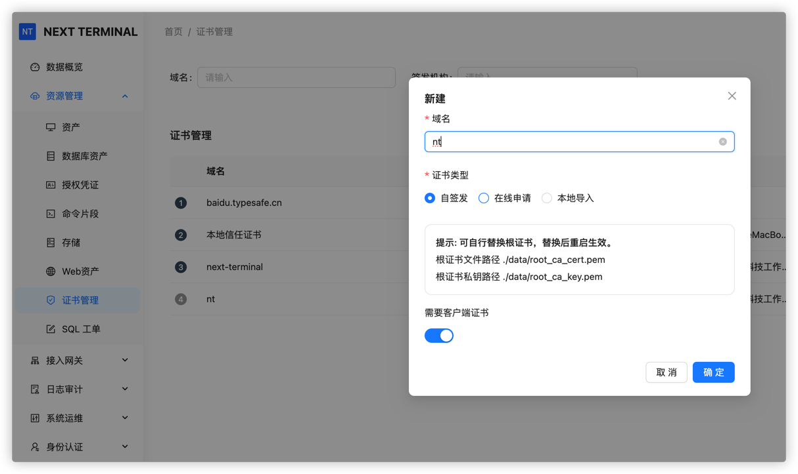
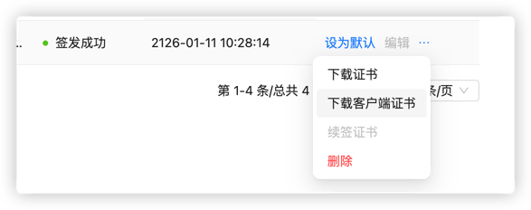
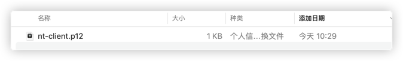
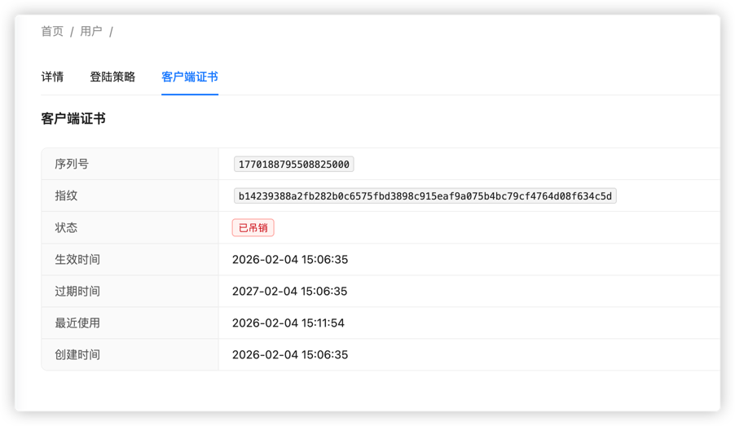
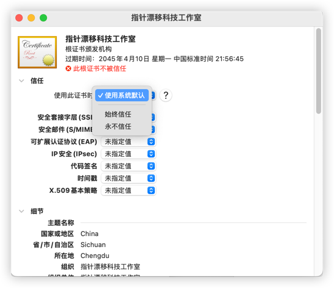
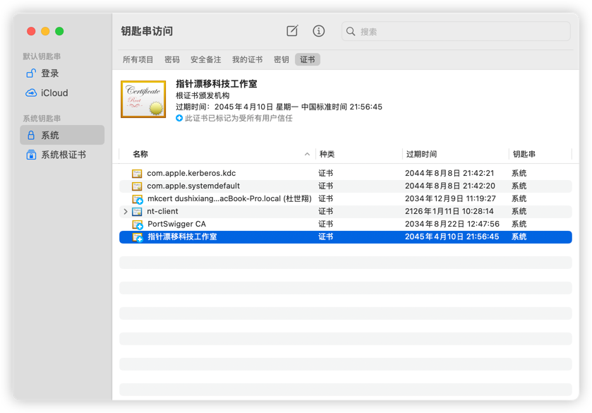
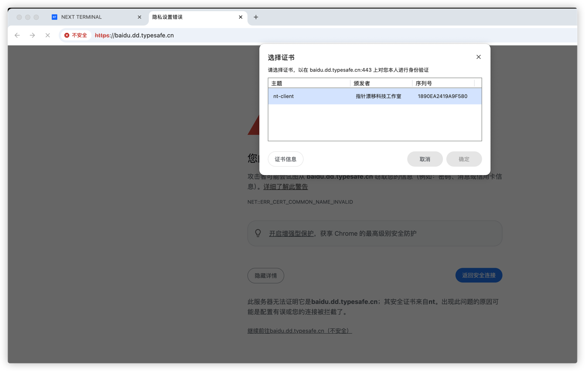
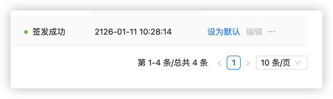

# mTLS 在 Next-Terminal 中的使用方式

双向证书认证代表了不光客户端要验证服务端的证书，服务端更是要验证客户端的合法性，除此之外的第三方完全无法访问到服务端，即使有漏洞也无法攻击。

今天介绍一下如何在 Next-Terminal 中使用 mTLS。

## 证书生成与信任

新建证书，选择自签发，勾选需要客户端证书

在个人中心下载证书，每个用户的证书名称是 `{用户名}-client.p12`, 在证书中包含了个人用户信息。

管理员可在用户详情页面查看和吊销证书，吊销的证书将无法访问。

打开钥匙串访问，把 p12 文件拖动到 系统 -> 证书中

双击证书选择信任

点击左上角关闭后就可以看到证书被信任了

## 配置证书

找到你添加的 web 资产自定义证书选择刚才的生成的证书

保存后访问测试

#### 可选步骤

如果你觉得单独配置太麻烦，可以将证书设置为默认，这样全部的 web 资产都需要认证客户端证书。

