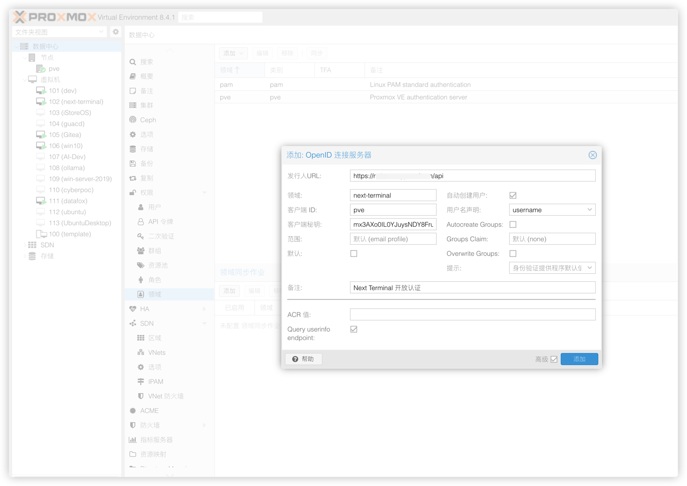

# 使用 Next Terminal OIDC 登录 Proxmox VE

本文演示如何配置 Proxmox VE 使用 Next Terminal 的 OIDC 服务进行身份认证。

> 前置条件：已在 Next Terminal 中启用 OIDC 服务器并创建客户端，参考 [OIDC 身份服务器使用文档](/usage/oidc_server.md)。

## 配置步骤

### 1. 添加 OpenID 认证

在 PVE 管理界面，进入「数据中心」→「权限」→「领域」→「添加」→「OpenID Connect 服务器」，填写配置：

- **Issuer URL**：`https://{next-terminal-host}/api`
- **领域**：`next-terminal`
- **Client ID**：从 Next Terminal 获取
- **Client Key**：从 Next Terminal 获取的 Client Secret
- **用户名声明**：`username`

### 2. 创建用户

在「数据中心」→「权限」→「用户」中添加用户：

- **用户名**：与 Next Terminal 用户名一致
- **领域**：选择 `next-terminal`

### 3. 配置权限

在「数据中心」→「权限」中为用户分配权限：

- **路径**：`/`
- **用户**：选择创建的 OIDC 用户
- **角色**：`Administrator`
- **传播**：勾选

### 4. 登录测试

访问 PVE 登录页面，在"领域"下拉框中选择 `next-terminal`，点击登录后会跳转到 Next Terminal 登录页面，使用 Next Terminal 账号登录即可。

