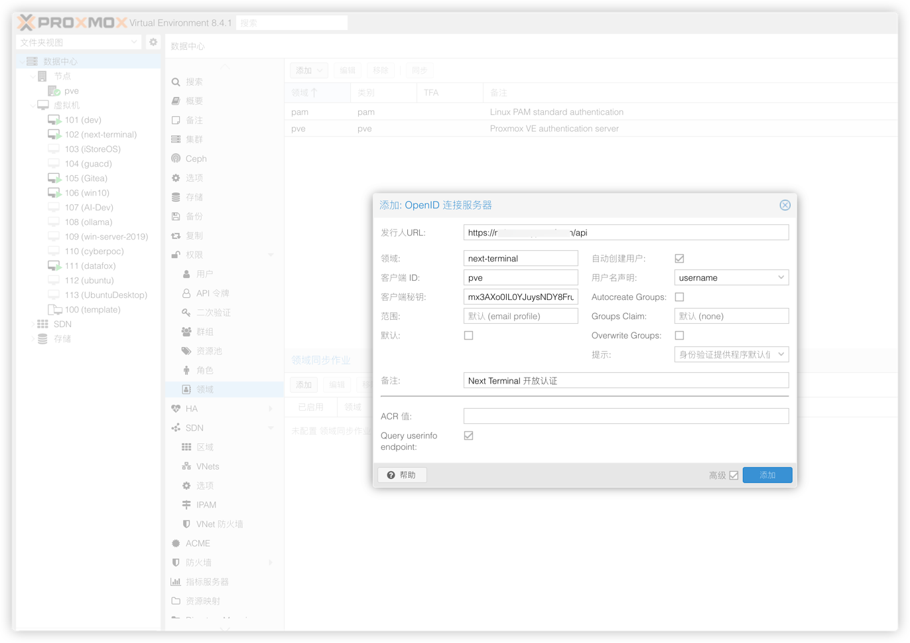
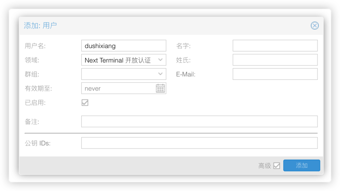
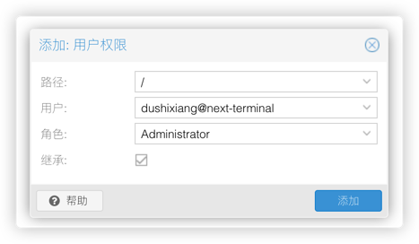
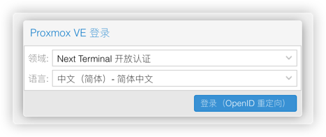

# Sign In to Proxmox VE with Next Terminal OIDC

This guide shows how to configure Proxmox VE to use Next Terminal OIDC for authentication.

> Prerequisite: OIDC Server is enabled in Next Terminal and an OIDC client has been created. See [OIDC Identity Server](/usage/oidc_server).

## Steps

### 1. Add OpenID realm

In PVE UI: `Datacenter -> Permissions -> Realms -> Add -> OpenID Connect Server`, then fill:

- **Issuer URL**: `https://{next-terminal-host}/api`
- **Realm**: `next-terminal`
- **Client ID**: from Next Terminal
- **Client Key**: Client Secret from Next Terminal
- **Username Claim**: `username`

### 2. Create user

In `Datacenter -> Permissions -> Users`, add user:

- **Username**: same as Next Terminal username
- **Realm**: select `next-terminal`

### 3. Assign permissions

In `Datacenter -> Permissions`, assign permissions:

- **Path**: `/`
- **User**: created OIDC user
- **Role**: `Administrator`
- **Propagate**: enabled

### 4. Login test

Open PVE login page, select `next-terminal` in Realm dropdown. After clicking login, you are redirected to Next Terminal login page. Sign in with your Next Terminal account.

