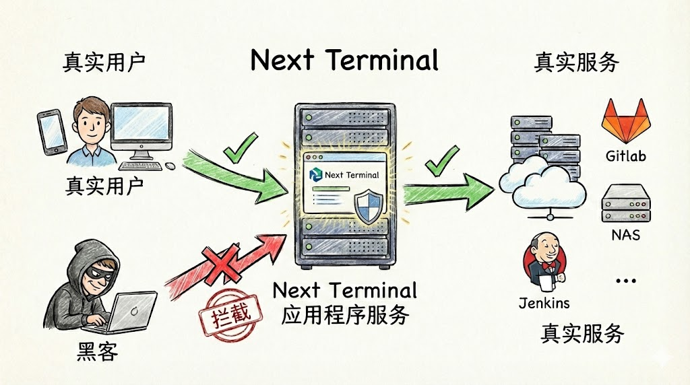

# Stop Exposing Internal Services Directly: A Safer and Cleaner Approach

## 1. Current Situation: Are your internal services exposed to the internet?

If you run a few cloud servers or a home NAS, you've probably tried intranet tunneling. But when you check `auth.log` or SSH logs, you quickly see constant malicious traffic:

- **Forwarding port 22 with frp**: thousands of brute-force attempts appear within minutes.
- **Directly exposed web services**: one unauthenticated vulnerability in GitLab/Jenkins can lead to full compromise.
- **VPN operational overhead**: WireGuard is fast, but account provisioning and client setup for non-technical users is a long-term burden.

What we really need is simple: **frp-level convenience + VPN-level security + browser-native experience**.

## 2. Why traditional approaches become painful

### frp: connectivity, not security boundary

frp is designed for connectivity. It moves traffic from A to B.

- **Risk**: it pushes internal services directly to public attack surface. Port changes and `sk` can reduce noise, but do not solve identity authentication and auditing.
- **Reality**: even non-default ports can still be identified by protocol fingerprinting.

### VPN: secure, but high friction

VPN is a strong wall, but entry/exit is operationally expensive.

- **Experience**: every phone/tablet/desktop needs a client. Reconnection and route conflicts are common.
- **Risk model**: often all-or-nothing network access. Once credentials leak, attackers may obtain broad internal access.

## 3. A modern approach: zero-trust style access with Next Terminal

When designing Next Terminal Web Asset proxying, we followed a zero-trust principle:

**Verify identity first, then establish access.**



### How it works

Before: requests to `gitlab.example.com` go directly to GitLab.

Now: Next Terminal acts as a security gateway:

1. **Traffic interception**: all requests to internal web services go through Next Terminal first.
2. **Identity check**: if user is not logged in, request is blocked before reaching GitLab.
3. **Dynamic authorization**: after login, system checks whether this user is allowed to access this specific asset.
4. **Transparent forwarding**: once verified, user reaches the original GitLab interface.

## 4. Practical setup: publish internal GitLab securely in 3 minutes

Assume internal GitLab is on `192.168.1.10:80`.

### Step 1: enable reverse proxy

Enable reverse proxy and HTTPS in Next Terminal config (wildcard certificate recommended):

```yaml
App:
  ReverseProxy:
    Enabled: true
    HttpsEnabled: true
    SelfDomain: "nt.yourdomain.com"
```

### Step 2: Add Web Asset

In Web UI, click **Add Asset**, fill internal IP and desired domain (for example `gitlab.yourdomain.com`).

### Step 3: authorize and access

Grant this asset to target user groups.

Then user experience becomes:

- Visiting `https://gitlab.yourdomain.com`
- **Not logged in?** Redirect to NT unified login
- **Logged in?** Enter GitLab directly
- **Need audit?** Access records are available in audit logs

> **Online demo**: [https://baidu.typesafe.cn](https://baidu.typesafe.cn)  
> (This demo simulates internal access flow. Login with `test/test` and observe seamless redirection.)

## 5. Advanced: one unified gateway across multi-cloud and multi-site

If you manage multiple environments (different cloud vendors, office, home lab), traditional solutions require complex routing tunnels.

Next Terminal provides **Security Gateway (Agent)** mode:

1. Deploy a lightweight agent in each internal network.
2. Agent builds reverse tunnels back to the NT main site.
3. When creating assets, select the corresponding gateway.

Result: regardless of service location, you get one unified entry point, without configuring router port mapping.

## Summary

| Requirement | frp | VPN | Next Terminal |
| --- | --- | --- | --- |
| **Access friction** | Very low (port scan reachable) | High (client required) | **Very low (browser only)** |
| **Security** | Weak | Strong | **Very strong (identity-first)** |
| **Permission control** | None | Coarse-grained | **Fine-grained (per-user/per-asset)** |
| **Ops cost** | Fragmented | Complex | **Unified console** |

If you are tired of daily SSH brute-force logs and VPN support overhead, try Next Terminal.
