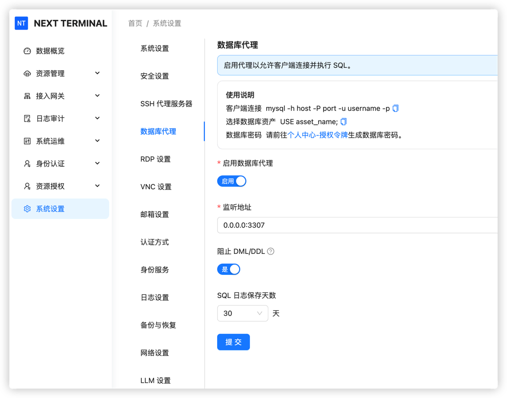
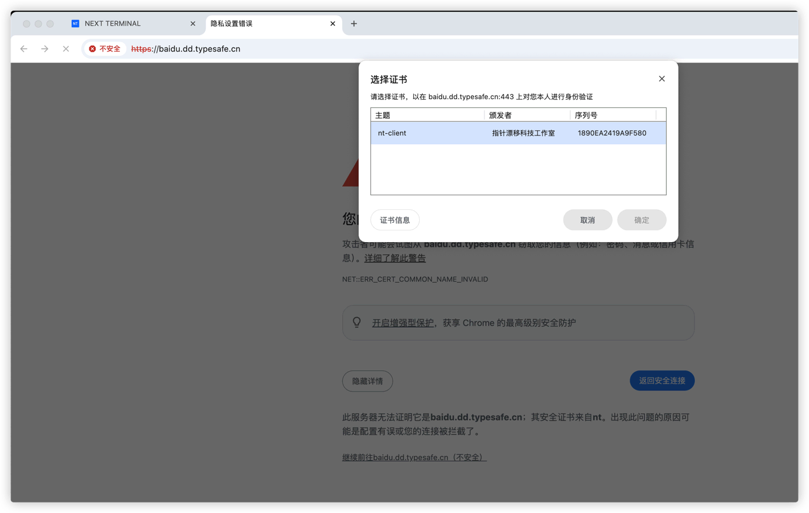

# Next Terminal v3.0 Is Live

Next Terminal v3.0 is officially released. This version focuses on better stability, clearer security controls, and more practical capabilities for day-to-day operations.

### Free Edition Limits

Starting from 3.0, Free Edition limits are:

| Item | Limit |
|--------|------|
| Users | 1 |
| Assets | 20 |
| Concurrency | 10 |
| Databases | 1 |

In addition to policy updates, v3.0 introduces multiple feature upgrades across database security, Web access control, and authentication.

## What's New

### 1. MySQL Database Proxy

New MySQL Database Proxy feature for enterprise-level database security:

- Protocol-level interception for INSERT/UPDATE/DELETE and DDL statements
- SQL Work Order creation and approval flow
- Full database operation audit logging

> Usage guide: https://docs.next-terminal.typesafe.cn/usage/database.html

### 2. Temporary Allowlist for Web Assets

New temporary allowlist for Web Assets:

- Add current IP to allowlist with one click
- Configurable expiration
- Auto-cleanup after expiration

### 3. HTTPS Mutual Authentication (mTLS)

Support HTTPS mutual TLS for stronger security:

- Generate unique client certificate per user
- Certificate issuance and revocation support
- Mutual authentication to prevent MITM attacks

> Usage guide: https://docs.next-terminal.typesafe.cn/usage/mtls.html

## Security Enhancements

### Stronger secondary authentication

For account safety, these sensitive operations now require secondary authentication:

- Unbind OTP
- Delete Passkey
- Passkey login (when required)
- Modify system settings (when required)

### SSH private key safety

- SSH proxy server private key is no longer echoed in UI

## Fixes

- Fixed incorrect menu width rendering
- Fixed session sharing requiring forced login

## Optimizations

### Asset management

- **Asset tree search** supports empty-string search (refresh behavior)
- **Asset alias**: direct SSH supports alias as target name
- **Quick IP copy**: one-click IP copy in terminal

### Access control

- **Geo restrictions** for Web Assets are improved with finer granularity

### SSH enhancements

- **Proxy authentication**: SSH proxy now supports manual username/password input for more flexible authentication
