# 资源管理

资源管理主要分为资产、授权凭证、指令、接入网关四个部分。其中资产支持RDP、SSH、VNC、Telnet、Kubernetes协议，可以自定义账户密码，也可以先创建授权凭证，添加资产时再选择该授权凭证，动态指令可以批量操作多台SSH资产，也可以在操作单台资产时单独使用已添加的指令，方便输入一些复杂指令，接入网关是使用SSH设备作为跳板机访问隐藏在该台设备后面的资产。

## 资产管理

支持使用名称、IP、标签、协议作为筛选条件进行查询。

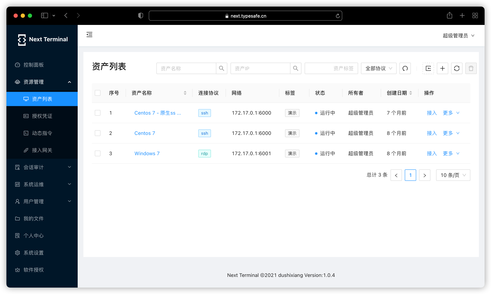

### RDP 资产
在新增RDP资产时，除了常见的账户密码外，还支持使用域作为身份认证的参数。

#### RemoteApp
RemoteApp 功能可以限制只允许访问目标资产上的某一个程序，但并不是任意 Windows 操作系统都支持的，另外开启 RemoteApp 方法较为复杂，推荐使用 [RemoteApp Tool](https://github.com/kimmknight/remoteapptool) 配置。

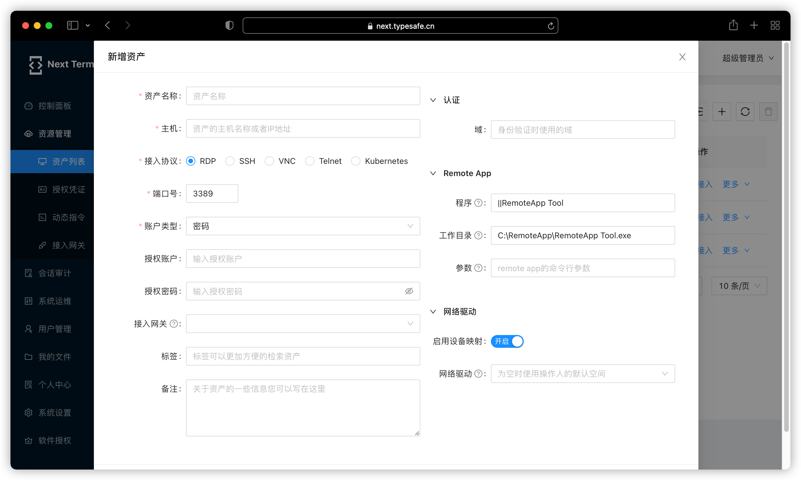

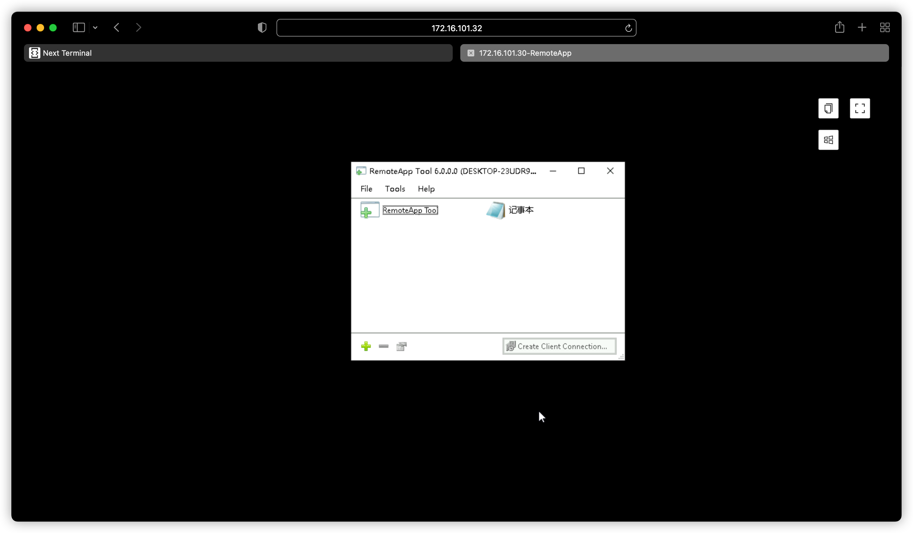

配置好RemoteApp之后，在添加资产时输入对应的参数：
- **程序** : 填写英文  `||`  加上可执行文件去掉后缀的名称。
- **工作目录** : 填写全路径加上可执行文件的全称。
- **参数** : 填写Remote App的命令行参数。

#### 网络驱动

由于无法做到像微软官方的远程桌面那样使用复制粘贴来传输文件，所以使用了网络挂载盘的方式来上传下载文件，开启此功能需要新增或修改资产时启用设备映射。

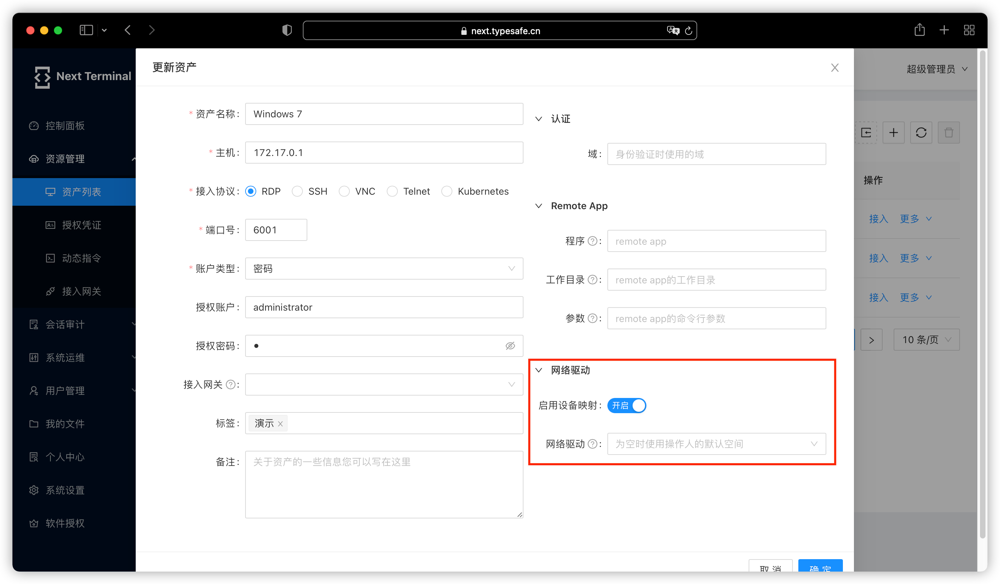
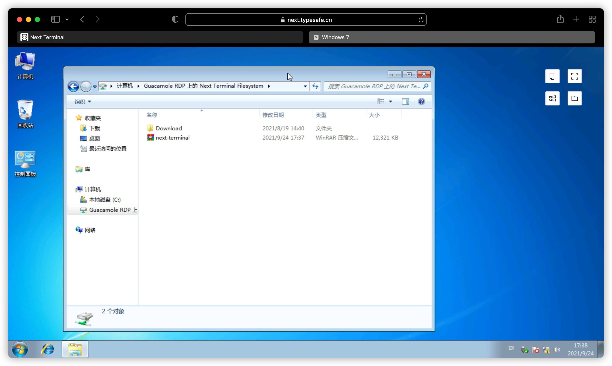
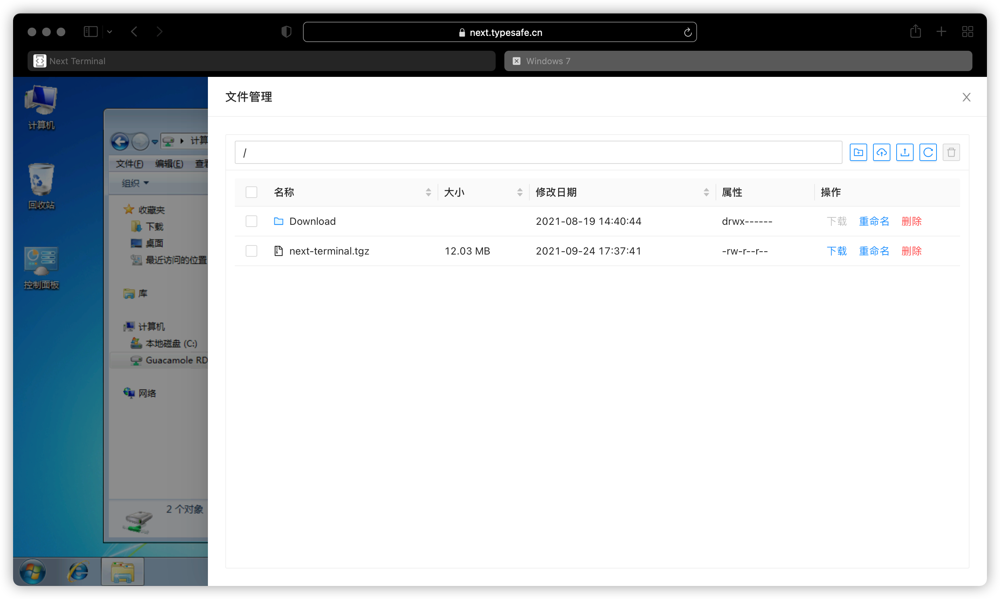

### SSH 资产

在新增RDP资产时，可以手动选择使用Guacd或者原生模式访问目标资产，原生模式是通过Next-Terminal直接访问目标资产，优点是占有资源小。

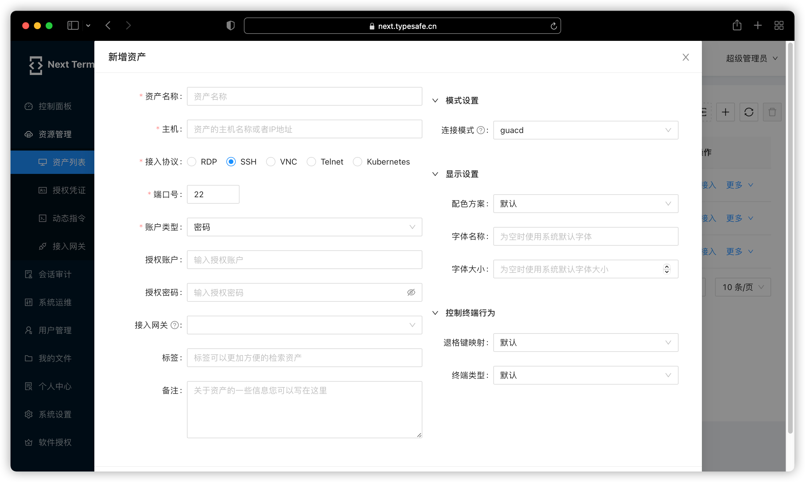

## 授权凭证

授权凭证是统一管理账号密码的功能，在添加授权凭证之后，新增资产时选择账户类型为：授权凭证，即可在下方的授权凭证处选择已添加好的账号密码，便于复用。

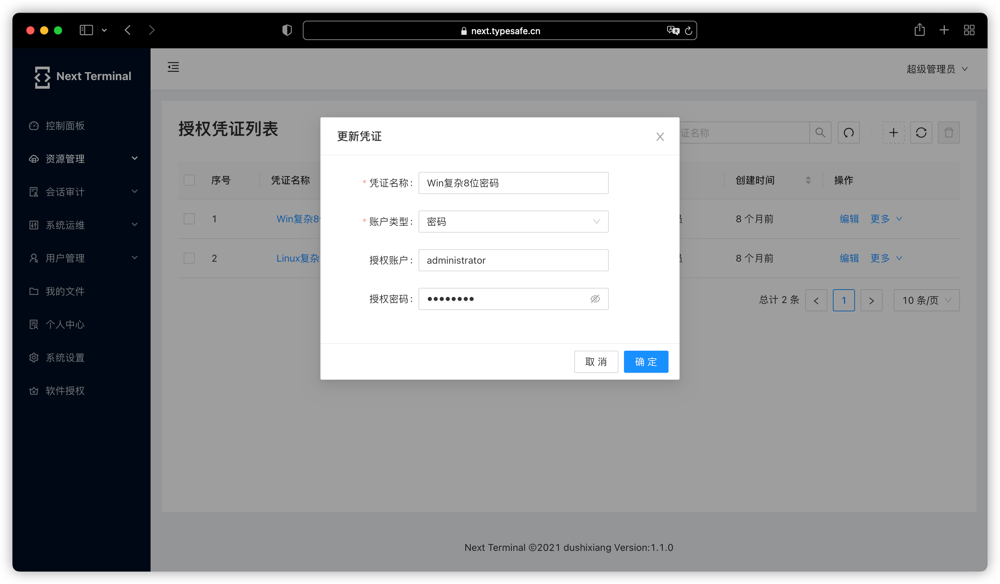
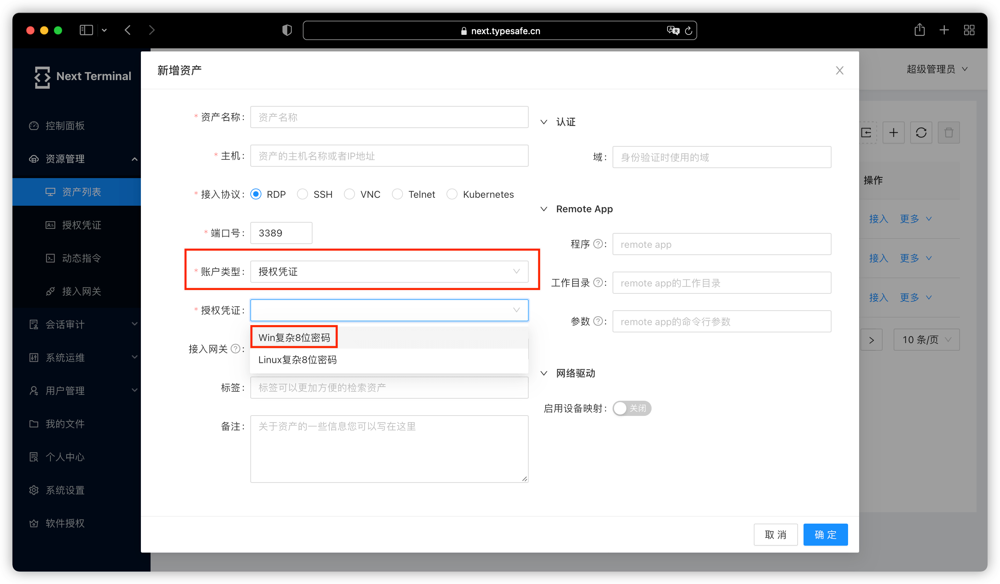

## 动态指令

动态指令可以批量执行并实时查看结果，不仅支持预先定义好的指令，并支持实时下发输入的指令。

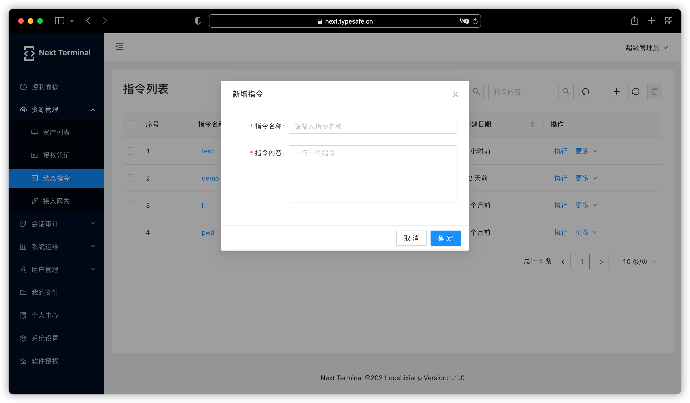
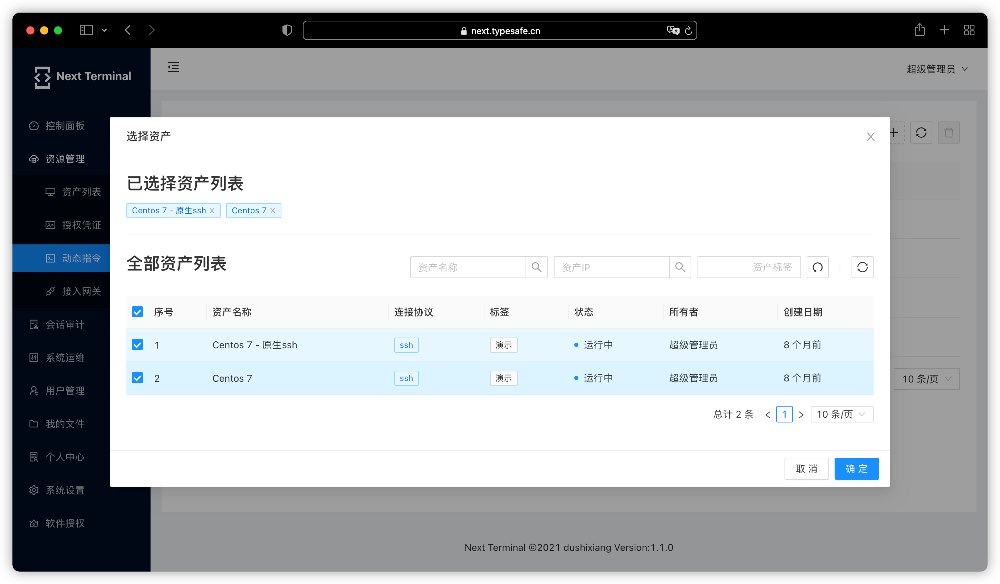
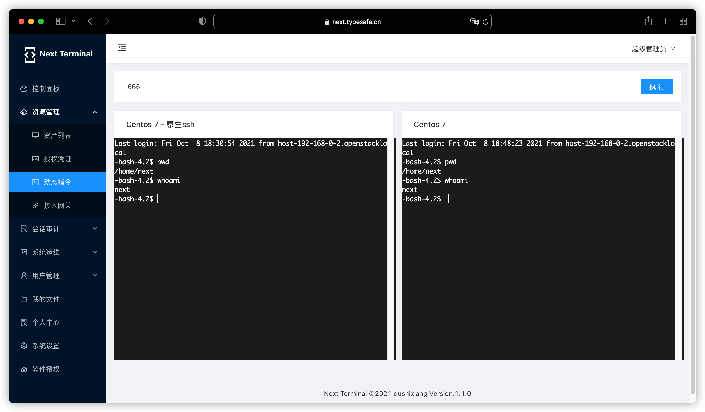

动态指令的另一种表现形式为在打开一个ssh终端后可以选择已录入指令进行执行。

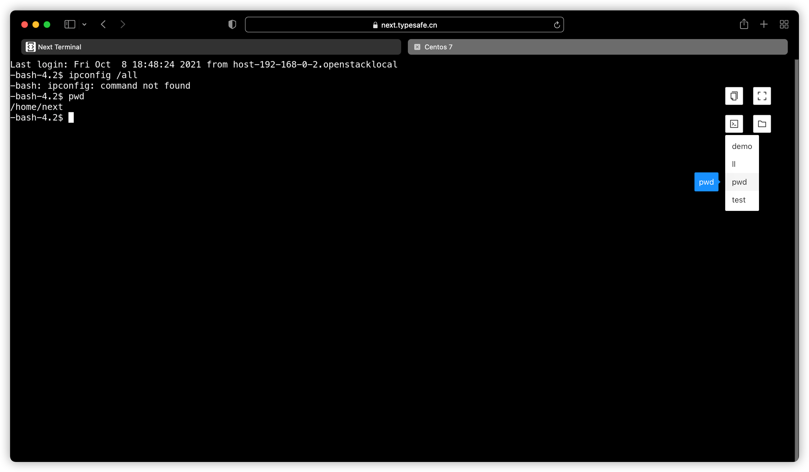

## 接入网关

接入网关是用于访问隐藏在某一个SSH主机后面的设备，Next Terminal所在服务器无法直接访问目标资产，只有这台SSH主机可以访问。

其原理是SSH隧道功能。

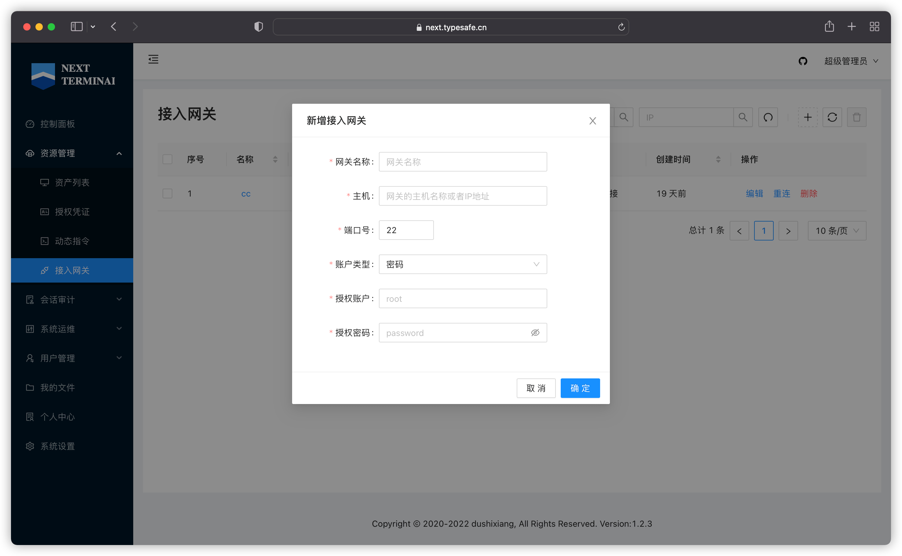
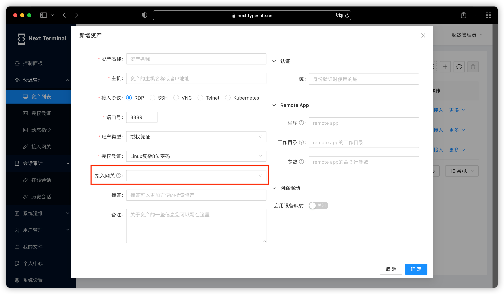
