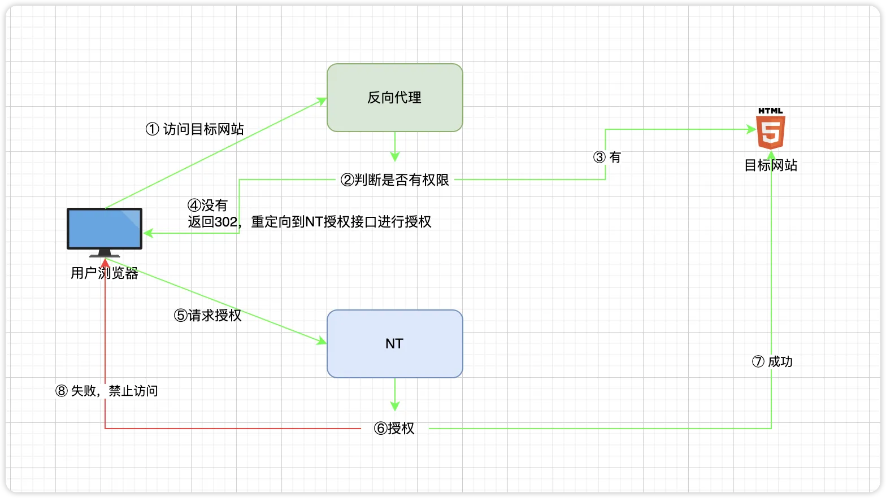

# 配置文件详解

本文档详细说明了 Next Terminal 的 `config.yaml` 配置文件中的各项参数，以帮助您更好地完成自定义配置。

::: tip 相关文档
如需了解反向代理和 Web 资产的详细配置和使用方法，请参考：
- [反向代理配置](./reverse-proxy.md)
- [Web 资产管理](../usage/website.md)
:::

::: code-group 

```yaml [config.yaml]
Database:
  Enabled: true
  Type: postgres 
  Postgres:
    Hostname: localhost
    Port: 5432
    Username: next-terminal
    Password: next-terminal
    Database: next-terminal
  ShowSql: false
Log:
  Level: debug # 日志等级  debug,info,waring,error
  Filename: ./logs/nt.log

Server:
  Addr: "0.0.0.0:8888"

App:
  Website:
    AccessLog: "./logs/access.log" # web 资产的访问日志路径
  Recording:
    Type: "local" # 录屏文件存储位置，可选 local, s3
    Path: "/usr/local/next-terminal/data/recordings"
  #    S3:
  #      Endpoint: "127.0.0.1:9000"
  #      AccessKeyId: minioadmin
  #      SecretAccessKey: miniopassword
  #      Bucket: recording
  #      UseSSL: false
  Guacd:
    Drive: "/usr/local/next-terminal/data/drive"
    Hosts:
      - Hostname: guacd
        Port: 4822
        Weight: 1

  # 下面的配置在 v2.6.0 及之后的版本生效
  ReverseProxy: # [!code ++]
    Enabled: true # 是否启用反向代理 [!code ++]
    HttpEnabled: true # 是否启用 http 反向代理 [!code ++]
    HttpAddr: ":80" # http 监听地址 [!code ++]
    HttpRedirectToHttps: false  # 是否强制 http 访问转为 https [!code ++]
    HttpsEnabled: true # 是否启用 https 反向代理 [!code ++]
    HttpsAddr: ":443" # https 监听地址 [!code ++]
    SelfProxyEnabled: true # 是否启用自代理 [!code ++]
    SelfDomain: "nt.yourdomain.com" # 自代理域名，SelfProxyEnabled 为 true 时生效 [!code ++]
    Root: "" # 系统根路径，SelfProxyEnabled 为 flase 时生效。示例：https://nt.yourdomain.com [!code ++]
    IpExtractor: "direct" # ip 提取方式，可选 direct, x-forwarded-for, x-real-ip [!code ++]
    IpTrustList: # 信任的IP地址列表 [!code ++]
      - "0.0.0.0/0" # [!code ++]
```
:::

---

## 反向代理配置 (ReverseProxy)

`ReverseProxy` 模块提供了强大的 Web 资产代理功能。以下是各参数的详细说明：

-   `Enabled`: 是否启用反向代理功能。
-   `HttpEnabled`: 是否启用 HTTP 反向代理。
-   `HttpAddr`: HTTP 监听地址，默认为 `:80`。
-   `HttpRedirectToHttps`: 是否将所有 HTTP 请求强制重定向到 HTTPS。
-   `HttpsEnabled`: 是否启用 HTTPS 反向代理。
-   `HttpsAddr`: HTTPS 监听地址，默认为 `:443`。
-   `SelfProxyEnabled`: 是否启用“自代理”。启用后，Next Terminal 将通过您指定的域名（`SelfDomain`）来代理自身。
-   `SelfDomain`: 用于访问 Next Terminal 自身的域名，仅在 `SelfProxyEnabled` 为 `true` 时生效。
-   `Root`: 当 `SelfProxyEnabled` 为 `false` 时，此项用于指定系统的根 URL，主要用于权限验证失败时的正确跳转。例如 `https://nt.yourdomain.com`。
-   `IpExtractor`: 获取客户端真实 IP 的策略。
-   `IpTrustList`: 信任的 IP 地址列表（CIDR 格式），用于配合 `IpExtractor` 策略。

### 授权流程

当用户访问一个受 Next Terminal 保护的 Web 资产时，系统会首先验证用户是否已登录且拥有访问权限。如果验证失败，用户将被重定向到 Next Terminal 的登录或授权页面。`SelfDomain` 或 `Root` 参数确保了系统能生成正确的重定向地址。



---

## 获取真实客户端 IP

在网络请求经过多层代理后，获取用户的真实 IP 地址变得至关重要。`IpExtractor` 提供了三种策略来应对不同的部署场景。

### 策略一：直接连接 (direct)

-   **适用场景**：客户端直接连接到 Next Terminal，中间没有反向代理（如 Nginx、HAProxy）。
-   **工作方式**：直接使用网络连接中的远端 IP 地址作为客户端 IP。
-   **配置**：
    ```yaml
    IpExtractor: "direct"
    ```
-   **风险**：如果 Next Terminal 前面实际上存在代理，此策略将获取到代理服务器的 IP，而非真实用户的 IP。

### 策略二：使用 X-Forwarded-For (x-forwarded-for)

-   **适用场景**：Next Terminal 前端至少有一个反向代理，并且该代理正确设置了 `X-Forwarded-For` 请求头。
-   **工作方式**：`X-Forwarded-For` (XFF) 头记录了请求经过的每一个代理服务器的 IP。此策略会从该头中提取 IP。
-   **配置**：
    ```yaml
    IpExtractor: "x-forwarded-for"
    IpTrustList:
      - "192.168.1.0/24"  # 信任您的代理服务器 IP 段
      - "10.0.0.1/32"       # 信任单个代理 IP
    ```
-   **安全警告**：`X-Forwarded-For` 头容易被客户端伪造。因此，**必须**配置 `IpTrustList`，仅信任您的边缘代理服务器。系统会从右至左遍历 XFF 头中的 IP，并返回第一个**不被信任**的 IP 作为真实客户端地址。

### 策略三：使用 X-Real-IP (x-real-ip)

-   **适用场景**：您的代理服务器（如 Nginx）配置为将客户端 IP 放入 `X-Real-IP` 头中。
-   **工作方式**：直接读取 `X-Real-IP` 请求头的值作为客户端 IP。
-   **配置**：
    ```yaml
    IpExtractor: "x-real-ip"
    IpTrustList:
      - "192.168.1.1/32" # 信任您的代理服务器 IP
    ```
-   **安全警告**：与 XFF 类似，`X-Real-IP` 也可能被伪造。您**必须**配置 `IpTrustList` 来指定哪些代理是可信的，同时确保您的边缘代理会覆盖（而不是追加）客户端传来的同名请求头。

### 安全配置核心要点

1.  **绝不盲目信任 HTTP 头**：除非请求来自您信任的代理，否则 `X-Forwarded-For` 和 `X-Real-IP` 都不可信。
2.  **配置边缘代理**：您的最外层代理（如 Nginx）应正确处理客户端 IP，并剥离或覆盖掉由客户端伪造的 IP 相关头部。
3.  **精确配置 `IpTrustList`**：`IpTrustList` 是确保 IP 提取安全的关键。请仅将您的反向代理服务器的 IP 地址或地址段加入此列表。

### 默认信任的私有地址

为方便常见内网部署，Next Terminal 默认信任以下私有 IP 地址范围。如果您的代理位于这些网段，您可能无需额外配置 `IpTrustList`。

-   **IPv4**: `10.0.0.0/8`, `172.16.0.0/12`, `192.168.0.0/16`
-   **IPv6**: `fc00::/7`