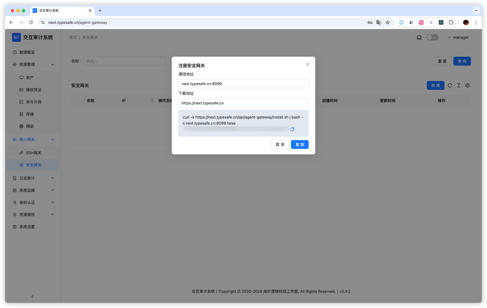

# 安全网关

安全网关作为一个代理，在安装之后会自动向服务端进行注册。借助安全网关，能够提升直接访问速度较慢的资产的访问效率，同时也可用于访问处于内网环境的资产。

### 安装步骤

**配置证书**

在安装安全网关之前，需要对证书进行配置。具体操作是修改 `config.yaml` 文件，添加以下配置内容：
```shell
app:
  rpc:
    addr: 0.0.0.0:8099 # 安全网关注册到服务端使用的地址
    tls:
      enabled: true 
      cert: "your_cert.pem"
      key: "your_key.pem"
```

推荐使用 https://github.com/FiloSottile/mkcert 工具来生成证书。

**重启服务**

完成证书配置后，需要重启服务以使配置生效。

### 注册流程

**复制注册命令**



**执行注册操作**

将复制的命令粘贴到终端并执行，安全网关将自动注册到服务端。

**查看帮助信息**

安装完成后，你可以使用 `nt-tunnel -h` 命令查看帮助信息，以了解更多使用方法。