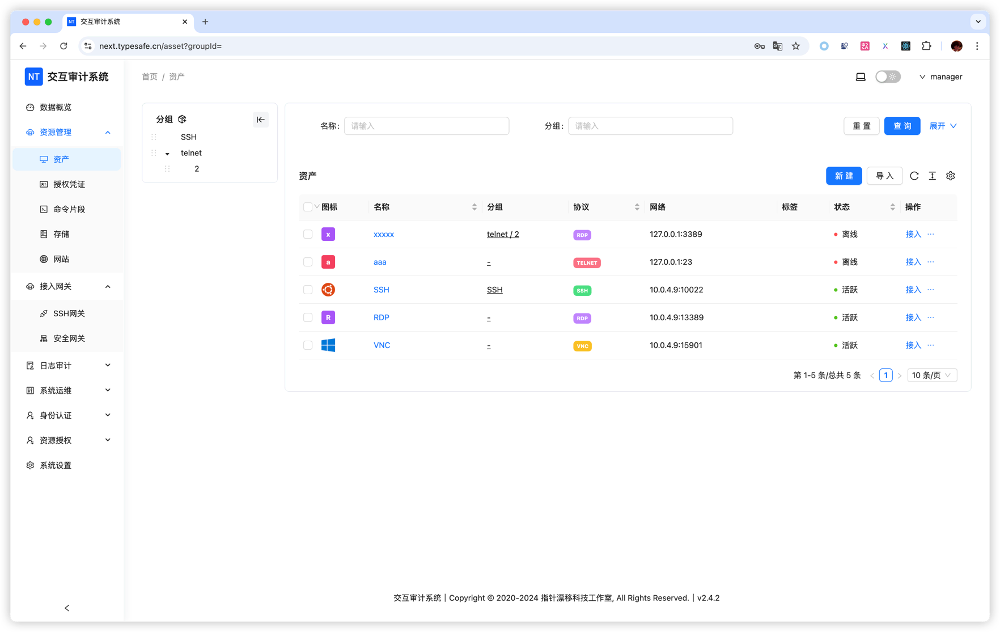
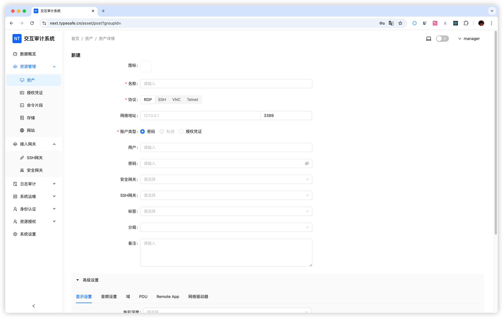
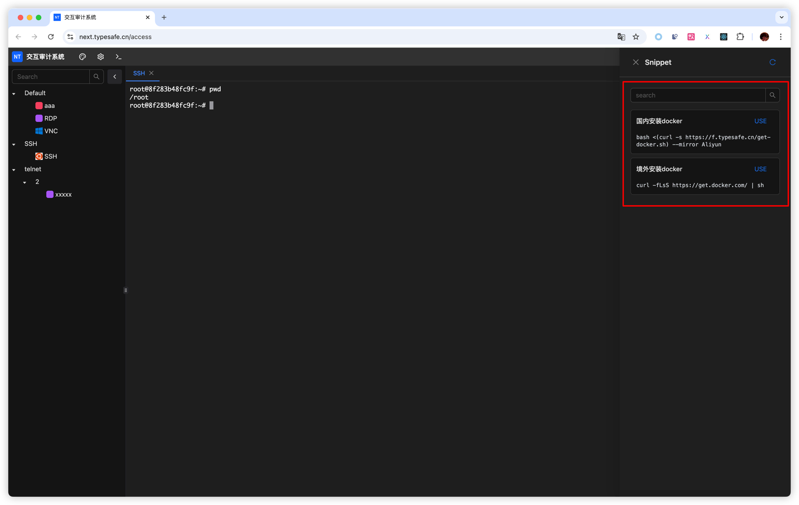

# 资产管理

资源管理主要分为资产、授权凭证、指令、接入网关四个部分。

### 资产

资产支持RDP、SSH、VNC、Telnet协议，可以自定义账户密码，也可以先创建授权凭证，添加资产时再选择该授权凭证。

根据提示填写信息。

存储管理用于作为访问RDP资产时的网络映射盘。

### 授权凭证

授权凭证是统一管理账号密码的功能，在添加授权凭证之后，新增资产时选择账户类型为：授权凭证，即可在下方的授权凭证处选择已添加好的账号密码，便于复用。

### 命令片段

命令片段用于记录一些复杂指令，在接入终端时直接使用。

