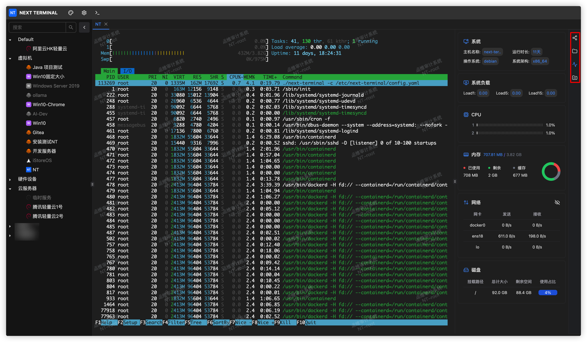
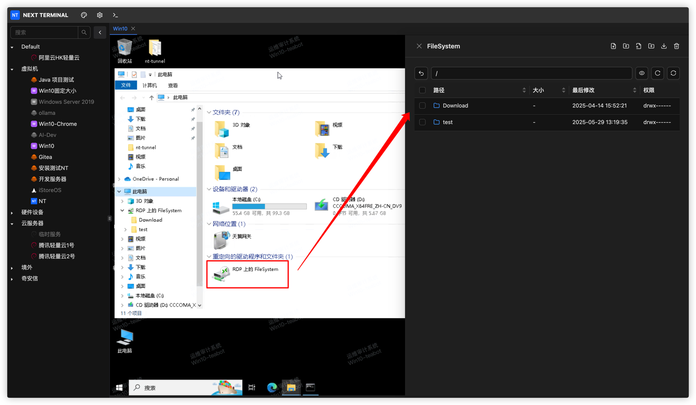

在一切准备就绪后，您可以访问资产了。

需要注意的是：只有 `SSH` 和 `RDP` 协议支持文件管理功能。

## SSH

右侧共有4个按钮，分别是

- **分享会话**：你可以把当前会话分享给其他人，对方不需要登陆即可访问到该会话，你们可以同时操作这个会话。
- **文件管理**：上传、下载、删除、创建等等，依赖 `sftp` 协议。
- **状态监控**：需要你的资产支持常见的 `/bin/cat`、`/bin/df`、`/bin/ip`等命令。
- **命令片段**：你可以保存常用的命令片段，方便下次使用。

## RDP

`RDP` 协议的文件管理需要使用`网络驱动器`中转，如下图所示：

也就意味着你想要下载文件的时候，需要先从其他磁盘复制到该 `网络驱动器`，上次文件需要先上传到 该 `网络驱动器`，然后再从这里复制到其他磁盘。

利用这个特性，你可以在自己的 `网络驱动器` 中保存一批常用的文件，在访问到RDP资产时，直接复制到其他磁盘进行使用。

