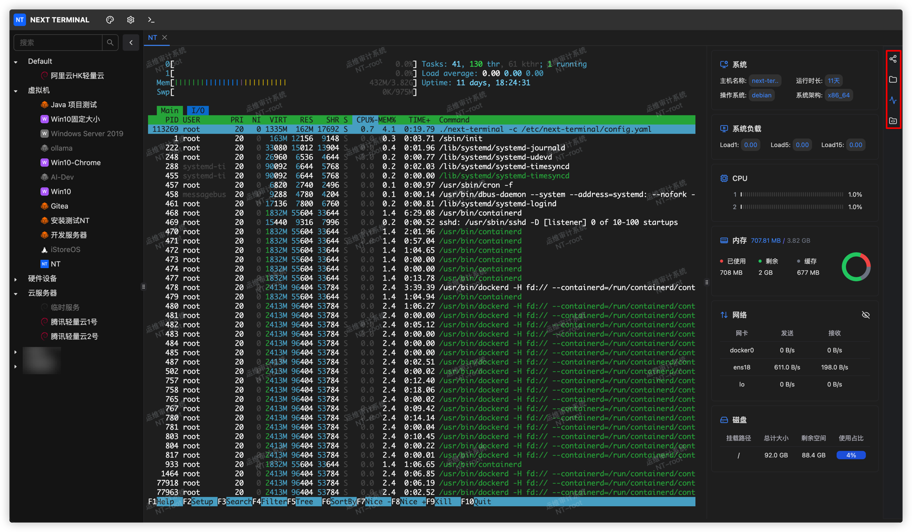
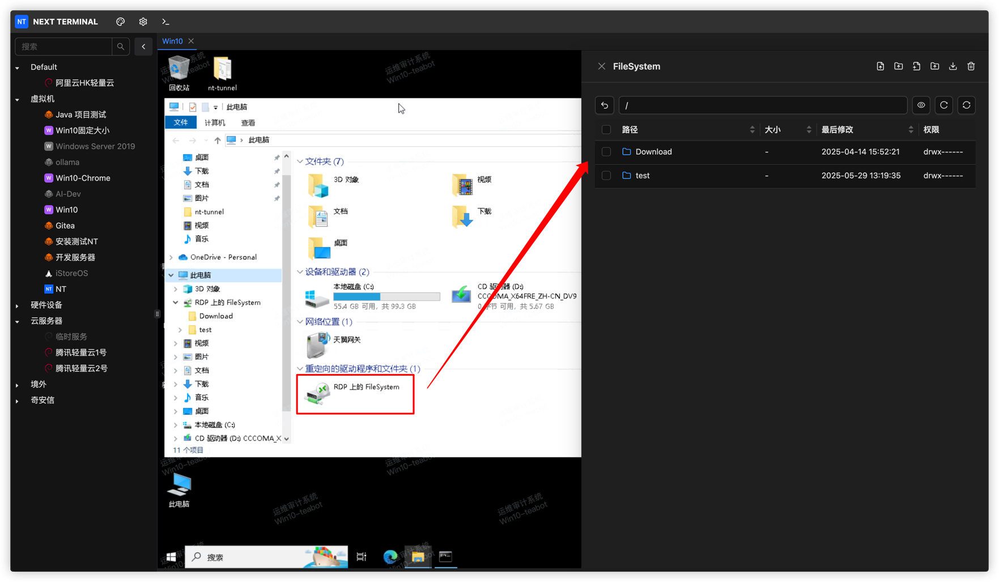

Once everything is ready, you can start accessing assets.

Note: file management is only supported for `SSH` and `RDP` protocols.

## SSH

There are four buttons on the right side:

- **Share Session**: Share the current session with others. They can access it without logging in, and both sides can operate in the same session.
- **File Manager**: Upload, download, delete, create files, and more. This depends on the `sftp` protocol.
- **Status Monitoring**: Requires your target host to support common commands such as `/bin/cat`, `/bin/df`, `/bin/ip`, etc.
- **Command Snippets**: Save frequently used command snippets for quick reuse.

## RDP

For the `RDP` protocol, file management is done through a `network drive` as shown below.

This means when downloading files, you first copy files from other disks to the `network drive`; when uploading files, upload to the `network drive` first, then copy them to the target disk.

Using this mechanism, you can keep a set of commonly used files in your own `network drive` and copy them directly when accessing RDP assets.

