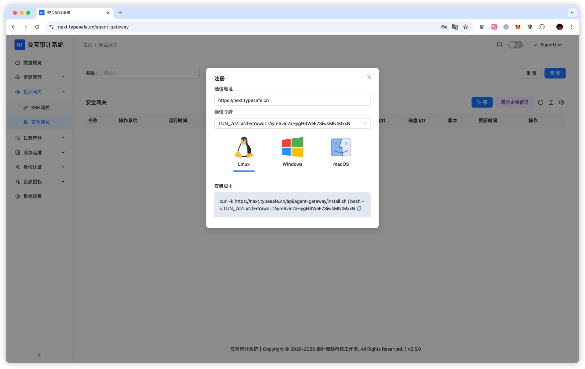

# 安全网关

## 概述

安全网关是 NextTerminal 的一种 agent，作为连接桥梁部署在目标网络环境中，采用 WebSocket 协议与服务端进行通信。

**工作原理**

1. 在内网环境中部署安全网关并注册到服务端
2. 在服务端添加资产时，选择对应的安全网关
3. 用户通过服务端访问资产时，流量将通过安全网关转发
4. 从而实现访问该设备所在网络环境中的 IP 和端口

安全网关安装完成后会自动向服务端注册，需确保能访问服务端的 Web 端口，加密通信依赖于服务端的 HTTPS 配置。

**主要优势**

- 突破网络隔离，访问内网环境中的资产
- 提升访问速度较慢资产的连接效率
- 提供安全的远程访问通道
- 无需在目标网络配置复杂的端口映射或 VPN

**应用场景**

- 访问企业内网中的服务器和设备
- 管理多个地域分布的网络环境
- 连接云服务商 VPC 内的私有资产
- 访问客户现场的内网设备


### 注册流程

**复制注册命令**



**执行注册操作**

将复制的命令粘贴到终端并执行，安全网关将自动注册到服务端。

**查看帮助信息**

安装完成后，可通过以下命令查看帮助信息：
```shell
nt-tunnel -h
```

### 使用流程

**1. 确认安全网关已注册**

在服务端的「安全网关」管理页面中，确认安全网关已成功注册并处于在线状态。

**2. 添加资产并关联安全网关**

在添加资产（SSH、RDP、VNC 等）时：
- 填写资产的 IP 地址（使用安全网关所在网络可访问的内网 IP）
- 在「安全网关」下拉框中选择对应的网关
- 填写其他必要的连接信息（端口、账号等）

**3. 通过安全网关访问资产**

添加完成后，用户访问该资产时，连接请求会自动通过选定的安全网关进行转发，实现对内网资产的访问。

**示例场景**

假设您有一台部署在公司内网的服务器 `192.168.1.100`：
1. 在公司内网的一台设备上安装并注册安全网关（例如命名为 "公司内网网关"）
2. 在服务端添加 SSH 资产时：
   - IP：192.168.1.100
   - 端口：22
   - 安全网关：选择 "公司内网网关"
3. 即使您在外网环境，也能通过该安全网关访问 `192.168.1.100:22`

## 服务管理
### Linux 服务管理

**查看服务状态**

```shell
systemctl status nt-tunnel
```

**常用操作**

- 启动服务：systemctl start nt-tunnel
- 停止服务：systemctl stop nt-tunnel
- 查看日志：tail -f /var/log/nt-tunnel.log


### macOS 服务管理

**查看服务状态**

```shell
sudo launchctl list nt-tunnel
```

正常运行的服务会显示类似以下信息：

```shell
{
	"StandardOutPath" = "/var/log/nt-tunnel.out.log";
	"LimitLoadToSessionType" = "System";
	"StandardErrorPath" = "/var/log/nt-tunnel.err.log";
	"Label" = "nt-tunnel";
	"OnDemand" = false;
	"LastExitStatus" = 0;
	"PID" = 63720;
	"Program" = "/Users/nobody/app/nt-tunnel";
	"ProgramArguments" = (
		"/Users/nobody/app/nt-tunnel";
		"run";
		"--endpoint";
		"https://next.typesafe.cn";
		"--token";
		"TUN_8qWs6xU6Vnhf8CewzFLtgVR3qSP8YKcoNPhPe5VThqbe";
	);
};
```

**常用操作**

- 启动服务：sudo launchctl start nt-tunnel
- 停止服务：sudo launchctl stop nt-tunnel
- 查看日志：tail -f /var/log/nt-tunnel.{out,err}.log