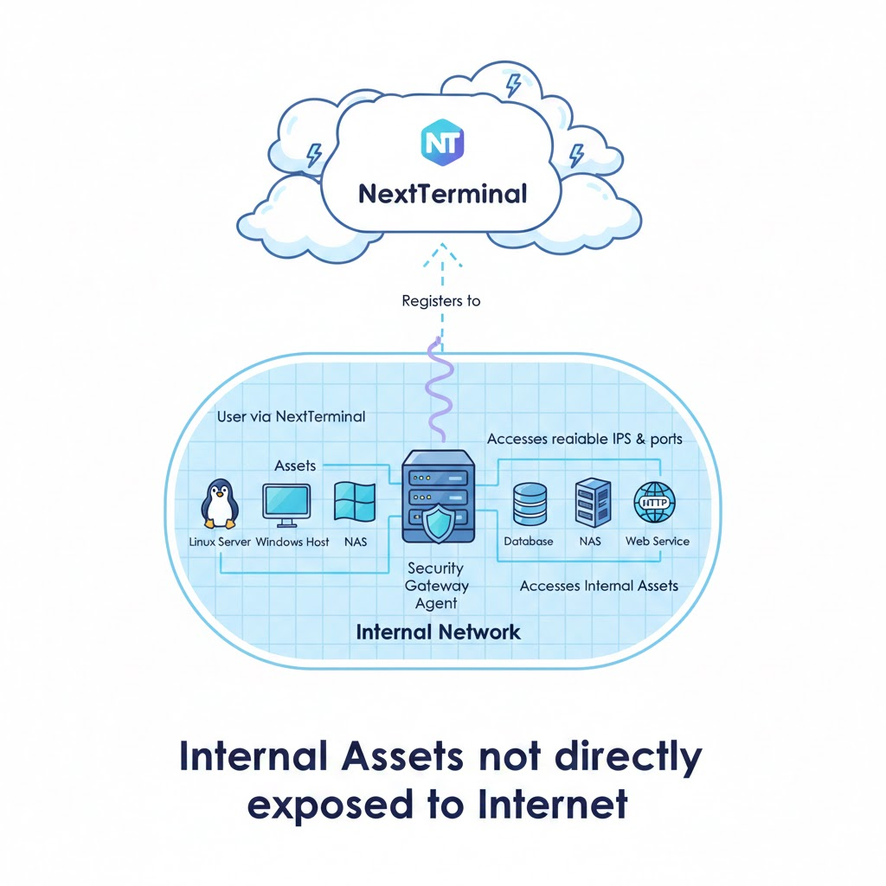
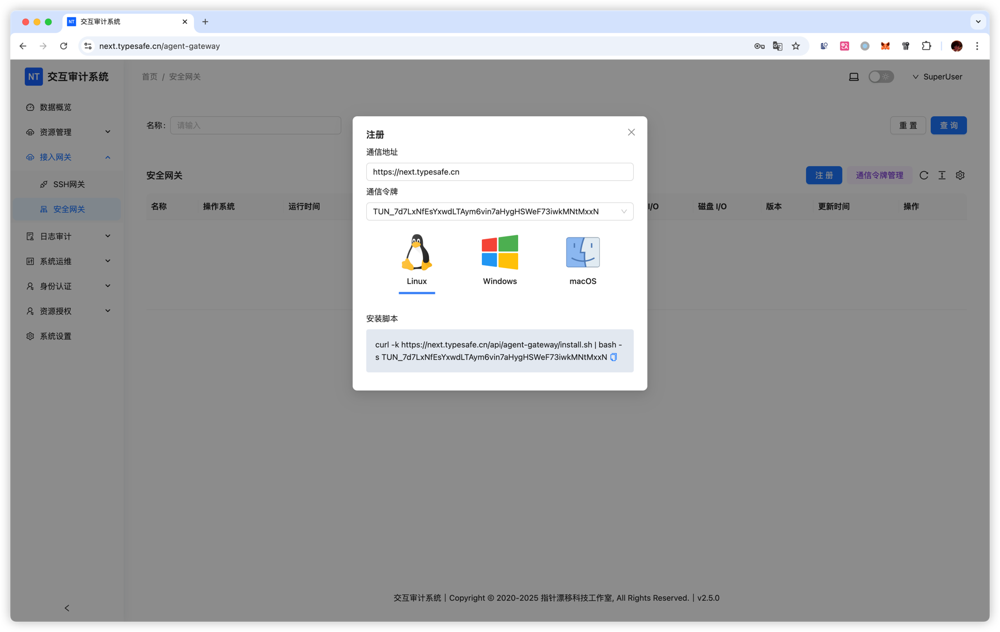

# Security Gateway

## Overview

Security Gateway is an agent component of Next Terminal. It is deployed inside target networks and communicates with the server through WebSocket.

**How it works**

1. Deploy Security Gateway in an internal network and register it to the server
2. Select the corresponding gateway when creating assets on the server
3. User traffic is forwarded through the selected gateway when accessing assets
4. This enables access to IPs and ports inside that network environment

After installation, the gateway registers automatically. It must be able to reach the server Web endpoint. Encrypted communication depends on HTTPS configuration on the server side.

**Main advantages**

- Break network isolation and access internal assets
- Improve connection performance for high-latency assets
- Provide secure remote access tunnels
- No complex port mapping or VPN setup in target networks

**Typical scenarios**

- Access servers and devices in enterprise internal networks
- Manage geographically distributed network environments
- Access private assets inside cloud VPCs
- Access customer on-site internal devices



### Registration Workflow

**Copy registration command**



**Run registration command**

Paste the copied command into terminal and run it. The gateway will register automatically.

**Show help**

After installation:

```shell
nt-tunnel -h
```

### Usage Workflow

**1. Verify gateway is online**

In the **Security Gateway** management page, confirm the gateway is registered and online.

**2. Add assets and bind gateway**

When adding assets (SSH/RDP/VNC etc.):

- Fill asset IP reachable from the gateway network
- Select the gateway in the **Security Gateway** dropdown
- Fill other required connection info (port/account etc.)

**3. Access assets through gateway**

After asset creation, user connections are forwarded via the selected gateway automatically.

**Example**

Suppose you have an internal server `192.168.1.100`:

1. Install and register a gateway on one machine inside that network (for example named `Office-LAN-Gateway`)
2. Add SSH asset on server:
   - IP: `192.168.1.100`
   - Port: `22`
   - Security Gateway: `Office-LAN-Gateway`
3. You can then access `192.168.1.100:22` from external networks through this gateway

## Service Management

### Linux

**Check status**

```shell
systemctl status nt-tunnel
```

**Common operations**

- Start: `systemctl start nt-tunnel`
- Stop: `systemctl stop nt-tunnel`
- Logs: `tail -f /var/log/nt-tunnel.log`

### macOS

**Check status**

```shell
sudo launchctl list nt-tunnel
```

A running service may look like:

```shell
{
	"StandardOutPath" = "/var/log/nt-tunnel.out.log";
	"LimitLoadToSessionType" = "System";
	"StandardErrorPath" = "/var/log/nt-tunnel.err.log";
	"Label" = "nt-tunnel";
	"OnDemand" = false;
	"LastExitStatus" = 0;
	"PID" = 63720;
	"Program" = "/Users/nobody/app/nt-tunnel";
	"ProgramArguments" = (
		"/Users/nobody/app/nt-tunnel";
		"run";
		"--endpoint";
		"https://next.typesafe.cn";
		"--token";
		"TUN_8qWs6xU6Vnhf8CewzFLtgVR3qSP8YKcoNPhPe5VThqbe";
	);
};
```

**Common operations**

- Start: `sudo launchctl start nt-tunnel`
- Stop: `sudo launchctl stop nt-tunnel`
- Logs: `tail -f /var/log/nt-tunnel.{out,err}.log`
