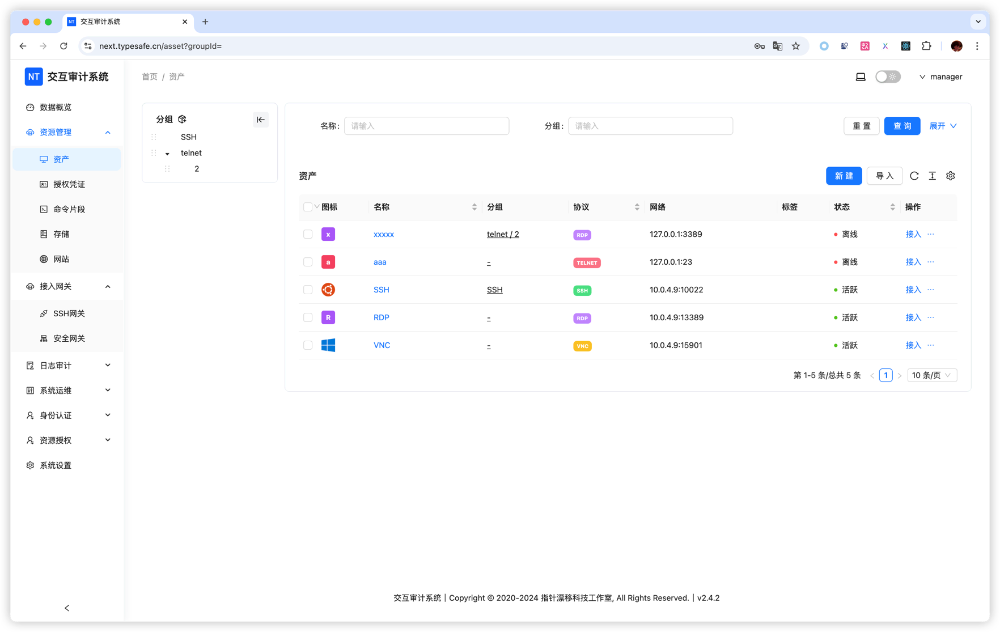
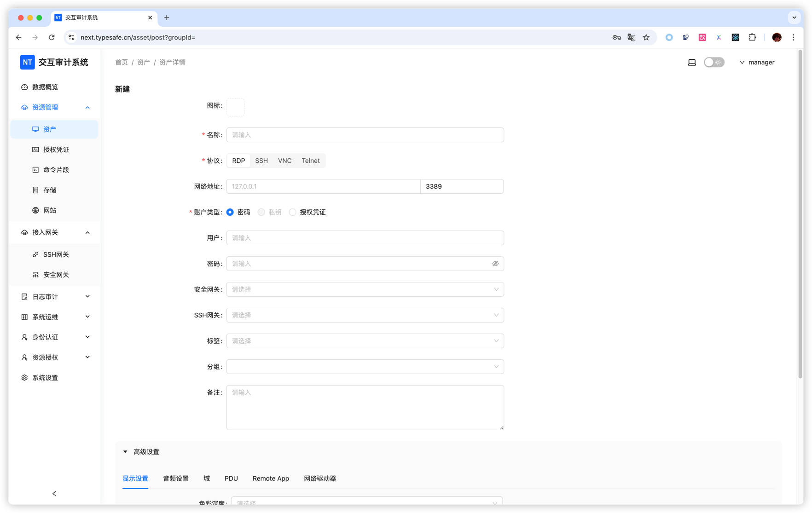
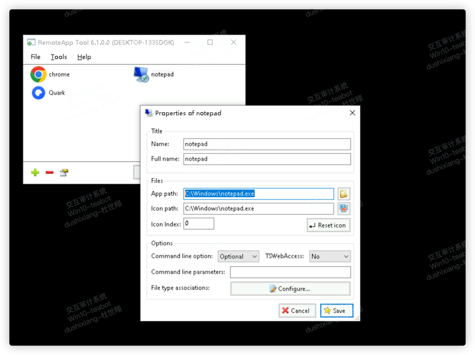
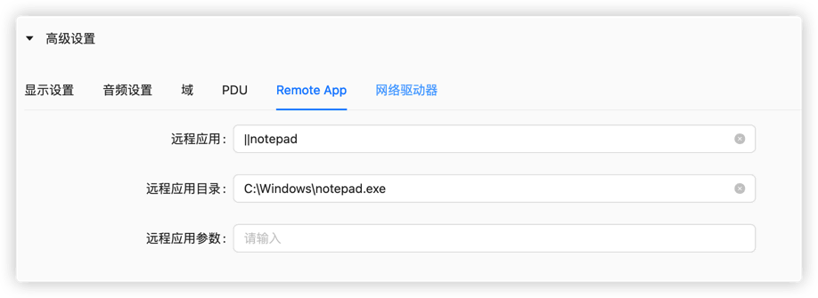
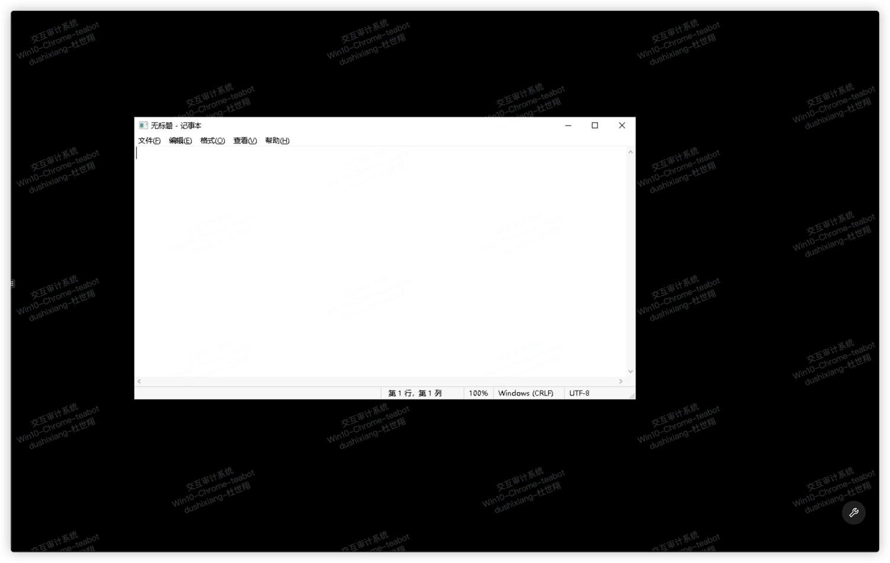
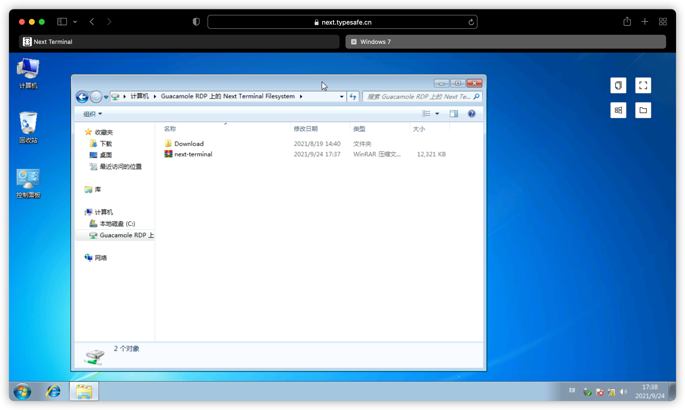
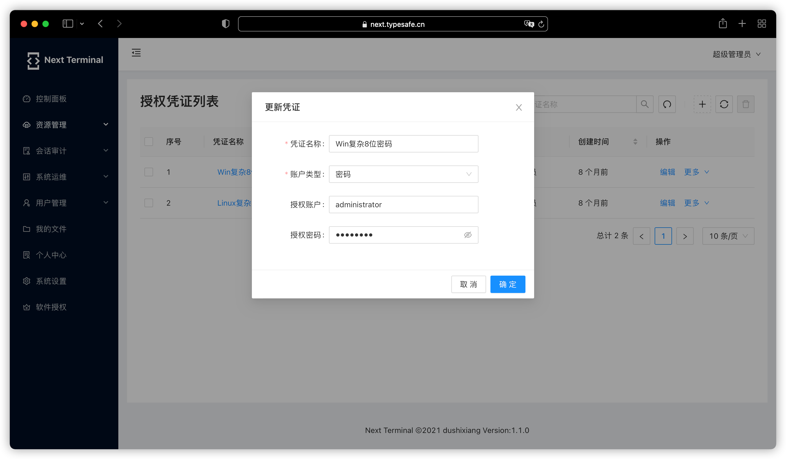
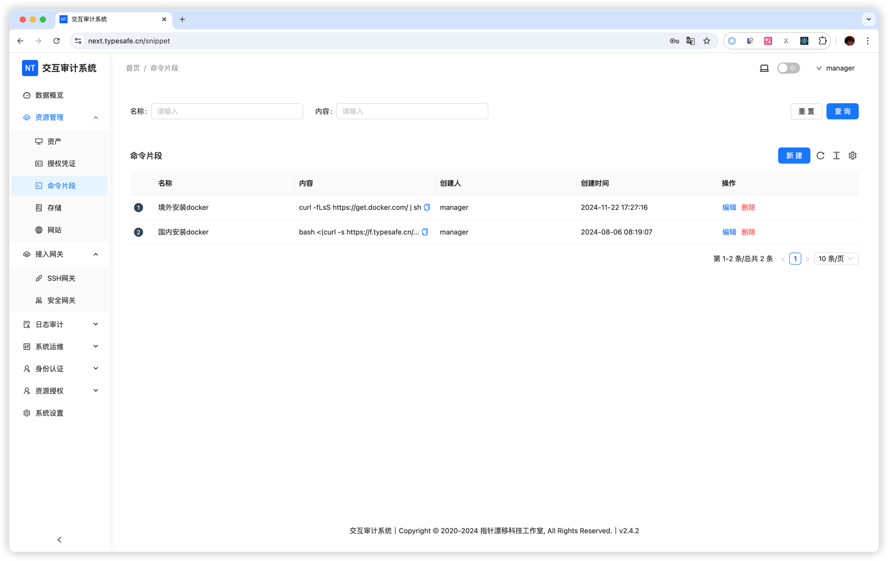
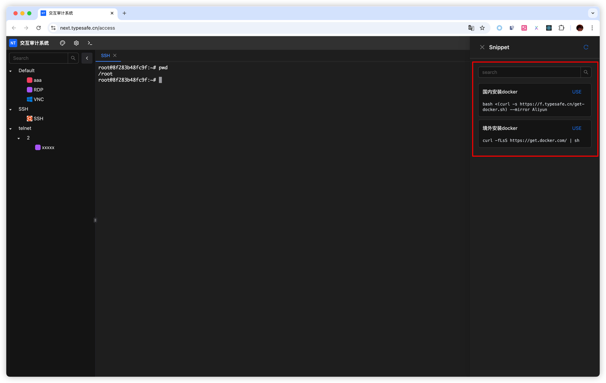

# Asset Management

### Supported Protocols
- RDP (Windows Remote Desktop)
- SSH (Secure shell for Linux/Unix)
- VNC (Graphical remote control)
- Telnet (Traditional terminal protocol)

### Add an Asset
1. Click **Add Asset**.
2. Select the protocol type.
3. Fill in connection information:
   - Enter username/password directly, or
   - Select pre-created credential records.
4. Save.

### Advanced Features

#### RemoteApp Configuration

1. Use [RemoteApp Tool](https://github.com/kimmknight/remoteapptool) to configure the server side.
2. In asset settings, fill in:
   - **Remote Application**: format `||application_name` (for example `||notepad`)
   - **Working Directory** (optional)
   - **Startup Parameters** (optional)

Windows example:

System parameter example:

After successful connection:

#### Network Drive

> **Purpose**: Solve RDP file transfer limitations.

How to enable:
1. Edit the asset.
2. Enable **Device Mapping**.
3. Configure storage as a mapped network drive.

### Credentials

Credentials provide centralized account/password management. After creating credentials, select account type **Credential** when creating assets, then choose the saved credential for reuse.

### Command Snippets

Command snippets are useful for saving complex commands and running them directly in terminal sessions.

