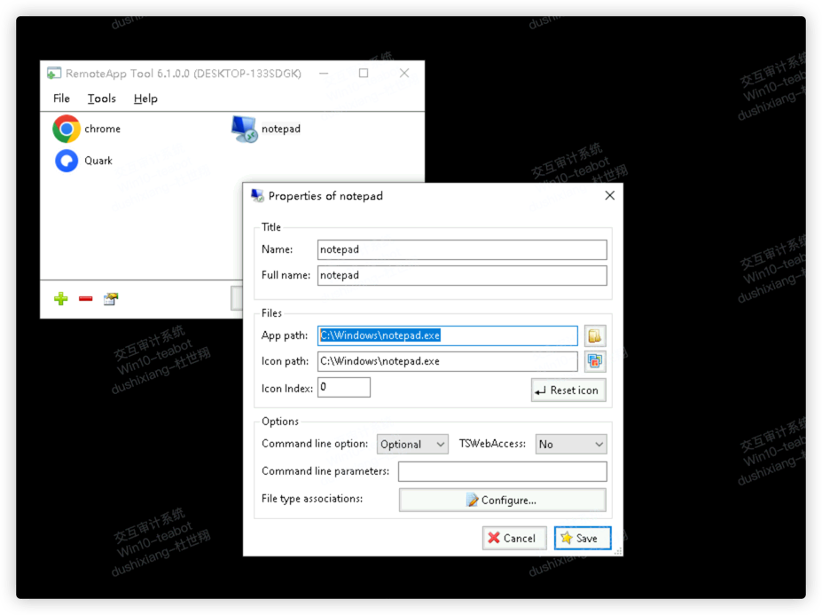
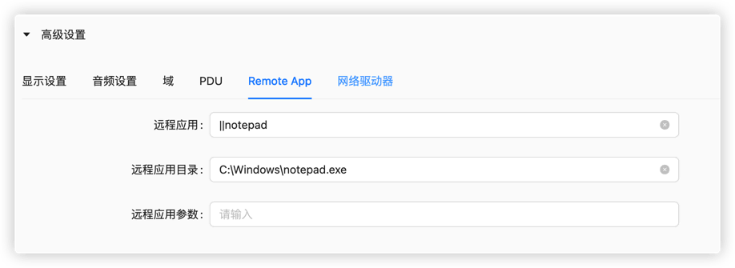
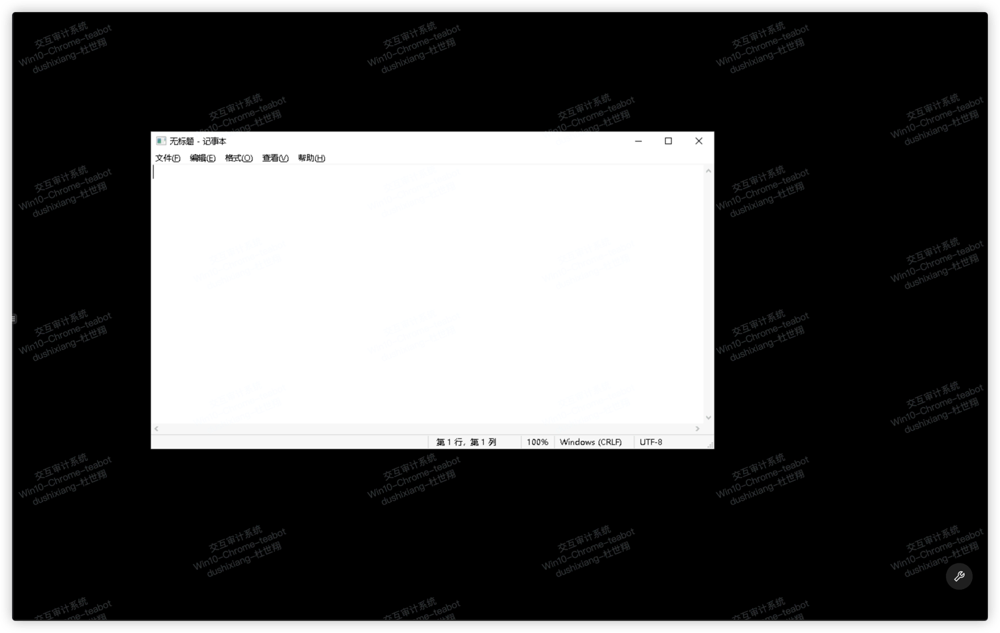
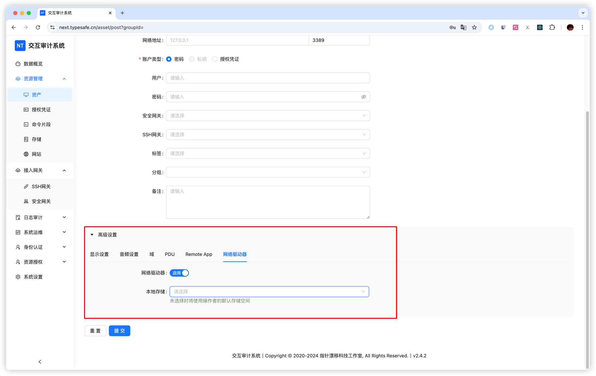

# 资产管理

### 支持协议
- RDP (Windows远程桌面)
- SSH (Linux/Unix安全连接)
- VNC (图形界面远程控制)
- Telnet (传统终端协议)

### 添加资产
1. 点击"新增资产"按钮
2. 选择协议类型
3. 填写连接信息：
    - 直接输入账户密码
    - 或选择预先创建的授权凭证
4. 保存配置

### 高级功能

#### RemoteApp配置

1. 使用 [RemoteApp Tool](https://github.com/kimmknight/remoteapptool) 配置服务端
2. 在资产配置中填写：
    - **远程应用**：格式为`||应用程序名`（如`||notepad`）
    - **工作目录**（可选）
    - **启动参数**（可选）

Windows配置示例：

系统参数示例：

连接成功后：

#### 网络驱动

> **解决**：RDP文件传输限制问题

启用方法：
1. 编辑资产配置
2. 启用"设备映射"选项
3. 配置存储管理作为网络映射盘

### 授权凭证

授权凭证是统一管理账号密码的功能，在添加授权凭证之后，新增资产时选择账户类型为：授权凭证，即可在下方的授权凭证处选择已添加好的账号密码，便于复用。

### 命令片段

命令片段用于记录一些复杂指令，在接入终端时直接使用。

