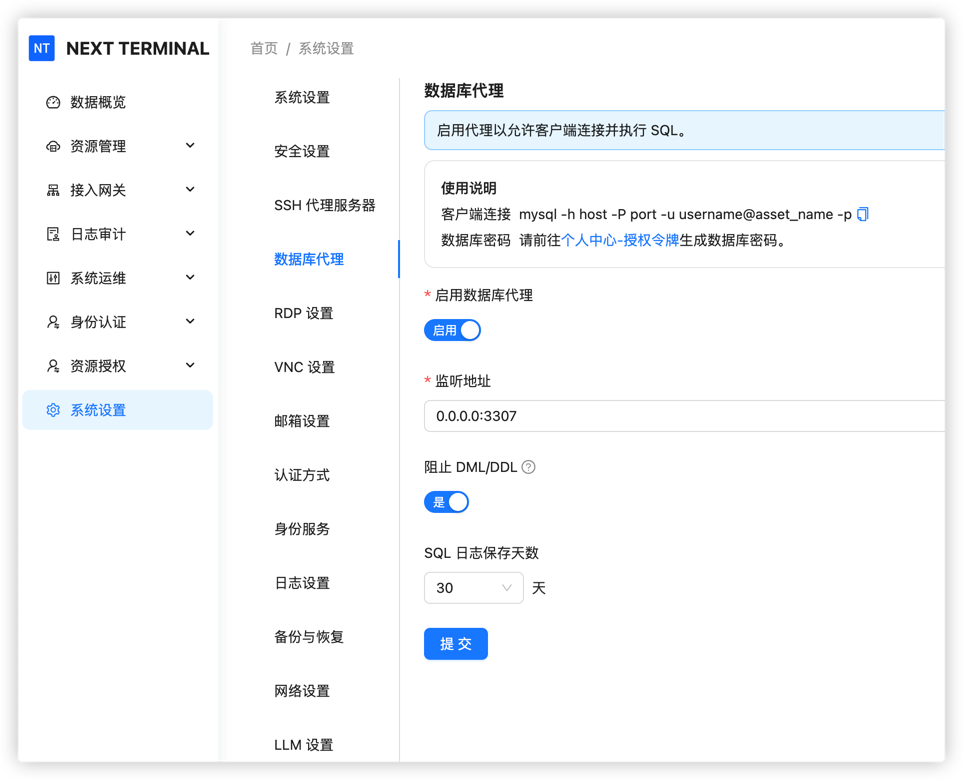
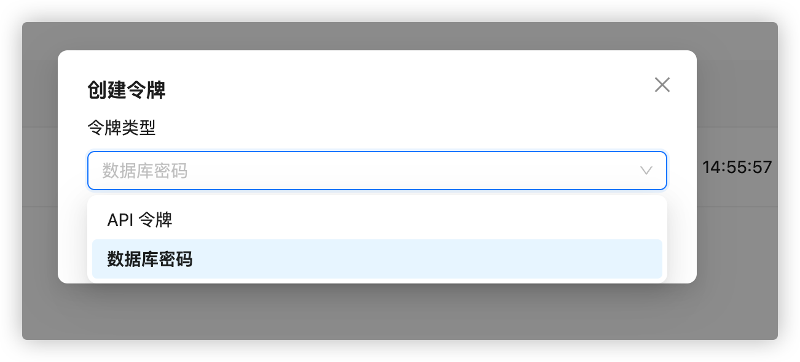
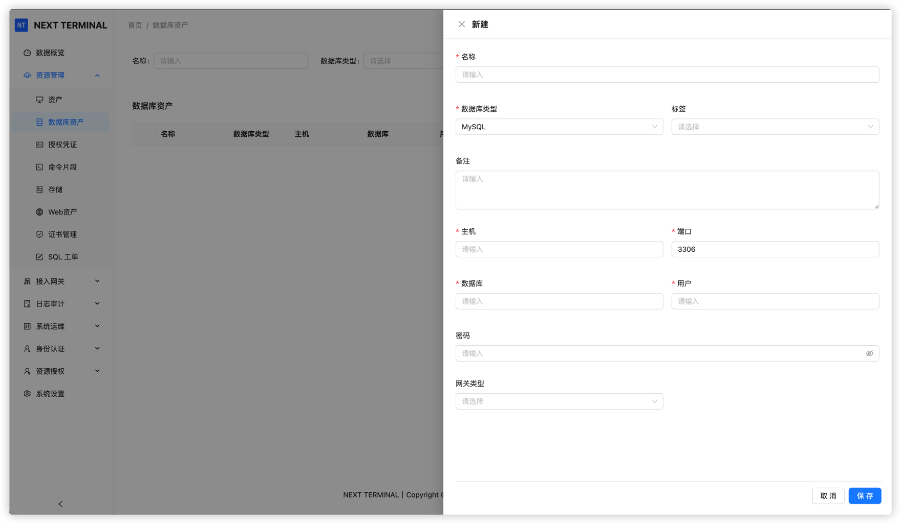
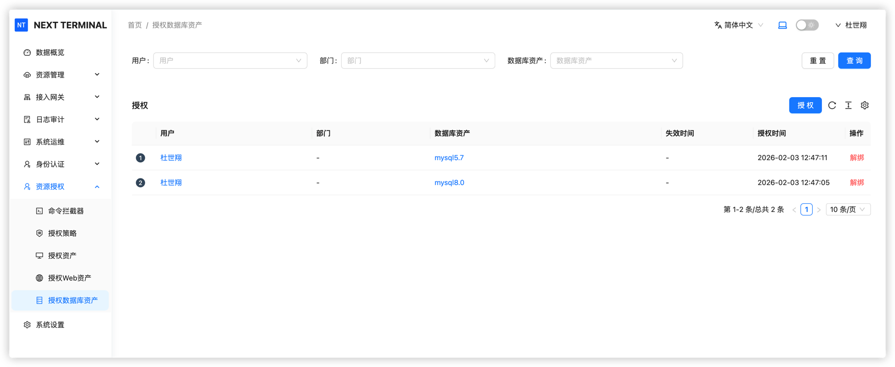
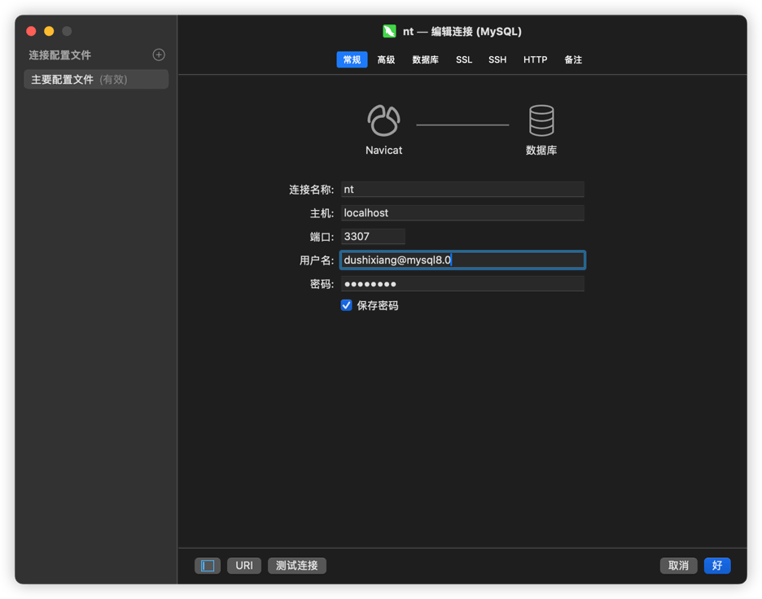
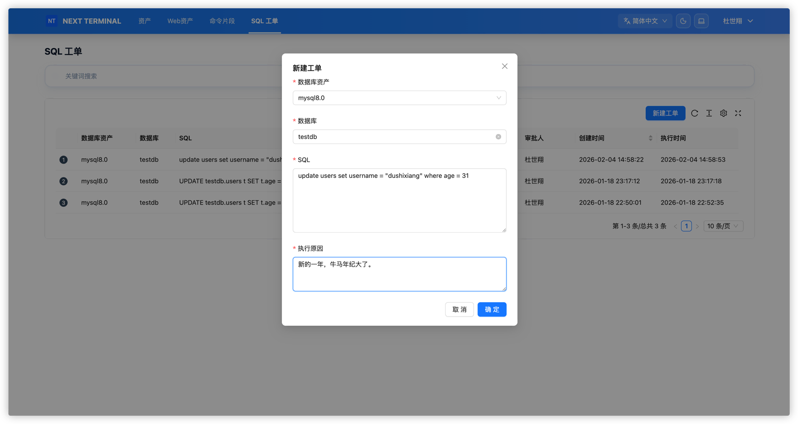
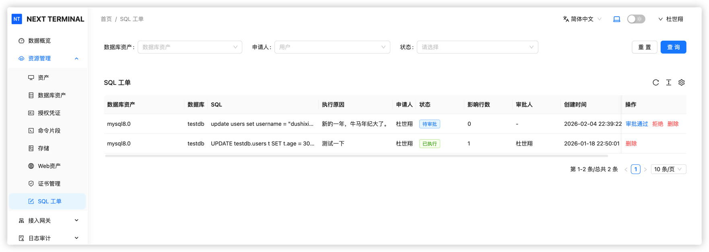
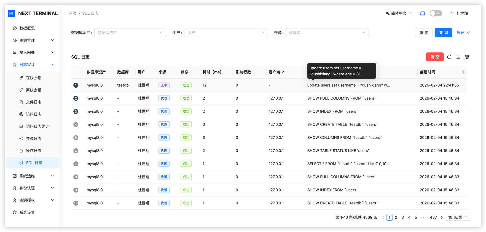

# Database Audit

## Overview

Starting from v3.0.0, Next Terminal introduces MySQL protocol-level audit capabilities for enterprise-grade database security management.

### Core Features

- **Protocol-level interception** of DML/DDL statements
- **Query passthrough**: all SELECT statements are allowed by default
- **Work Order approval flow** for risky changes (INSERT/UPDATE/DELETE/DDL)
- **Complete operation logs** for audit traceability

## Configuration Steps

### 1. Enable Database Proxy

Go to system settings and enable the Database Proxy option.

### 2. Create database password

In Personal Center, create a token and choose database password.

### 3. Add database asset

Create a database asset in Asset Management:

- Fill connection info (host, port, database name, etc.)
- Gateway-based access is supported

### 4. Configure user permissions

Configure authorization in resource permissions:

- Grant permissions per user
- Grant permissions by department

## Daily Usage

### Connect to database

Use any MySQL client tool (Navicat, DataGrip, MySQL Workbench, etc.).

> mysql -h host -P port -u username@asset_name -p

- `host`: IP of the Next Terminal server
- `port`: Database Proxy port configured in the web console
- `u`: `next_terminal_username@asset_name`  
  (Use account, not display nickname.)
- `p`: database password configured in Personal Center  
  (Each user has a different password.)

### Run queries

All SELECT statements are allowed with no restriction.

### Run change operations

When executing DDL (`CREATE`, `ALTER`, `DROP`) or DML (`INSERT`, `UPDATE`, `DELETE`), the operation is blocked and a Work Order is required.

## Work Order Flow

### Create Work Order

When data changes are required, create an SQL Work Order:

1. Select target database
2. Enter SQL statement
3. Add change description and reason
4. Submit for approval

### Approval and execution

- **Admin review**: administrator reviews Work Order content
- **Automatic execution**: SQL runs automatically after approval
- **Execution feedback**: result is sent back to requester

## Audit Logs

### View execution records

System records all SQL execution logs, including:

- **Execution time**
- **Executing user**
- **SQL statement**
- **Result** (success, failure, intercepted)
- **Affected rows**

Admins can use these logs for security auditing and incident tracing.

## Security Benefits

With database audit, Next Terminal provides:

- ✅ **Protection against accidental operations**
- ✅ **Permission isolation**: normal users query only, changes need approval
- ✅ **Full traceability**
- ✅ **Compliance support** for enterprise database operations
