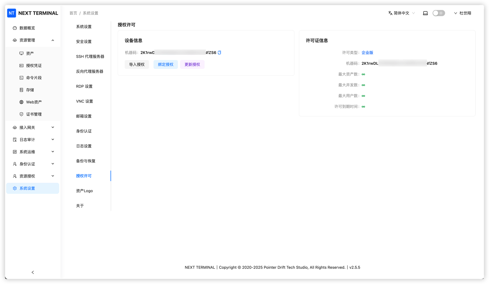
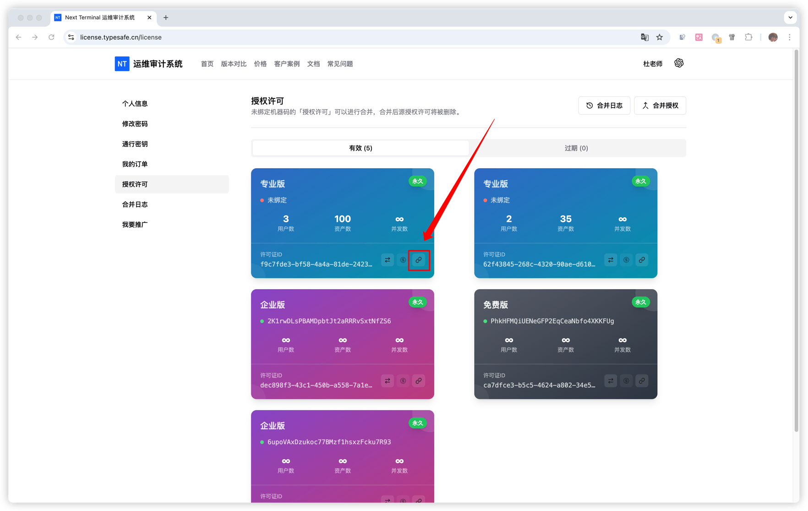

# License Binding

1. Open **System Settings -> License**, copy the machine code.

2. Open **My Licenses** page: https://license.typesafe.cn/license

3. Follow the page instructions to bind the license.
4. Return to **System Settings -> License**, click **Refresh License**.
