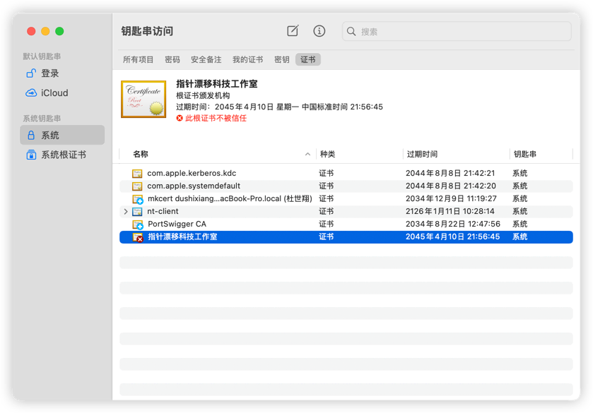
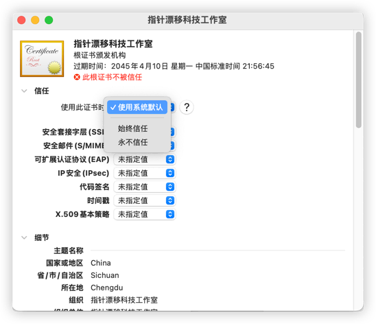
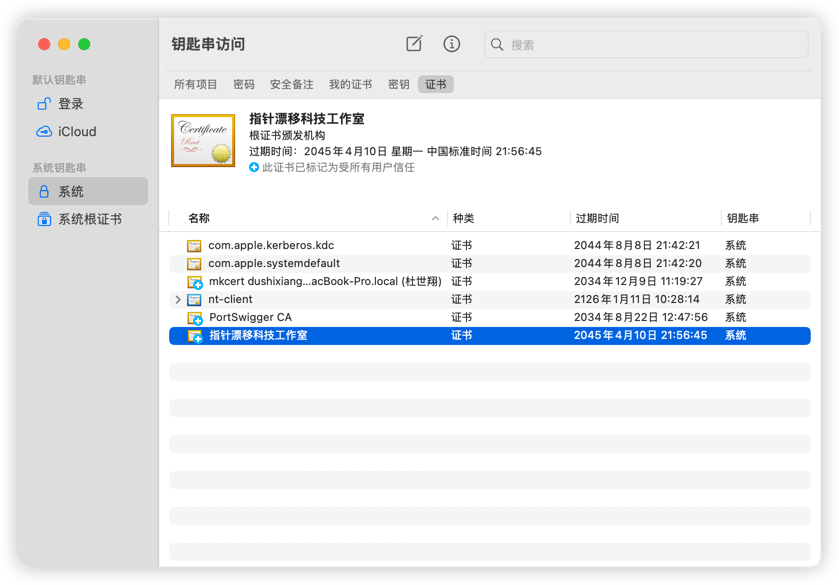
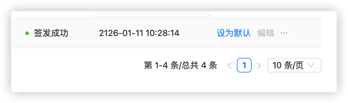

# mTLS 双向认证

## 什么是 mTLS

mTLS（Mutual TLS，双向传输层安全协议）是一种增强的安全认证机制，相比传统的单向 TLS：

- **传统 TLS**：仅客户端验证服务端证书（如访问 HTTPS 网站）
- **mTLS**：客户端和服务端相互验证证书，双向认证身份

### 安全优势

- ✅ **双向身份验证**：确保通信双方都是可信的
- ✅ **零信任架构**：未持有有效客户端证书的第三方完全无法访问
- ✅ **防中间人攻击**：加密通道无法被劫持或伪造
- ✅ **漏洞防护**：即使服务存在漏洞，攻击者没有证书也无法利用

本文将介绍如何在 Next Terminal 中启用和使用 mTLS。

## 配置步骤

### 1. 生成服务端证书

管理员在证书管理中创建新证书：

1. 选择**自签发**方式
2. 勾选**需要客户端证书**选项
3. 填写证书信息（域名、有效期等）
4. 保存生成证书

### 2. 下载客户端证书

每个用户在个人中心可以下载专属的客户端证书：

- 证书文件名格式：`{用户名}-client.p12`
- 证书包含用户的身份信息
- 每个用户的证书是唯一的，不可共享

### 3. 证书管理

管理员可以在用户详情页面进行证书管理：

- **查看证书**：查看用户的客户端证书信息
- **吊销证书**：立即禁用某个用户的证书
- **重新颁发**：为用户生成新的证书

> ⚠️ **注意**：证书一旦被吊销，该用户将无法访问启用 mTLS 的资源，需要重新颁发证书。

### 4. 安装客户端证书（macOS 示例）

#### 4.1 导入证书到钥匙串

1. 打开"钥匙串访问"应用
2. 将下载的 `.p12` 文件拖动到"系统"→"证书"中
3. 输入证书密码（如果设置了密码）

#### 4.2 信任证书

1. 双击刚导入的证书
2. 展开"信任"选项
3. 将"使用此证书时"设置为"始终信任"
4. 关闭窗口，输入系统密码确认

#### 4.3 验证证书状态

证书配置完成后，可以看到证书显示为"此证书已被标记为受所有用户信任"。

> 💡 **其他操作系统**：
> - **Windows**：双击 `.p12` 文件，使用证书导入向导导入到"个人"证书存储
> - **Linux**：使用浏览器（Firefox/Chrome）的证书管理功能导入

### 5. 为 Web 资产配置证书

在资产管理中，为需要启用 mTLS 的 Web 资产配置证书：

1. 编辑 Web 资产
2. 在"自定义证书"选项中选择刚才生成的证书
3. 保存配置

### 6. 访问测试

配置完成后，访问该 Web 资产时：

- 浏览器会提示选择客户端证书
- 选择刚才安装的证书进行认证
- 认证成功后即可正常访问

## 高级配置

### 设置默认证书

如果希望所有 Web 资产都启用 mTLS，可以将证书设置为默认：

1. 在证书管理中找到目标证书
2. 点击"设置为默认"
3. 所有未单独配置证书的 Web 资产将自动使用该证书

> ⚠️ **注意**：设置默认证书后，所有用户访问 Next Terminal 的 Web 资产都需要客户端证书，请确保所有用户都已正确安装证书。

## 最佳实践

1. **定期更新证书**：建议定期更换服务端证书，提升安全性
2. **及时吊销证书**：员工离职时及时吊销其客户端证书
3. **证书有效期管理**：合理设置证书有效期，避免过长或过短
4. **分级管理**：对于不同安全级别的资产，可以使用不同的证书策略
5. **日志审计**：定期检查证书使用日志，发现异常访问行为