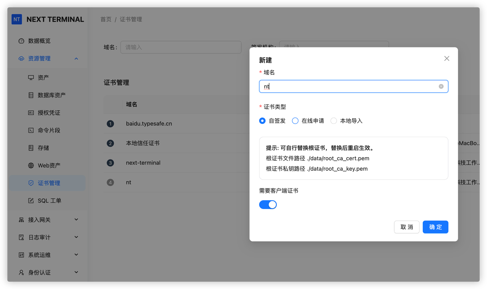
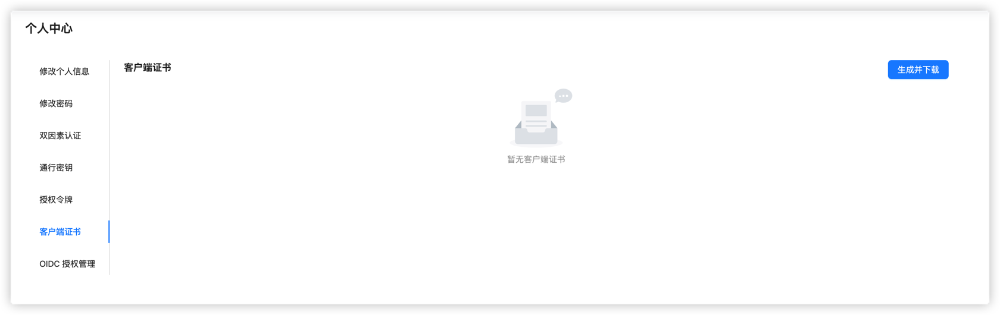
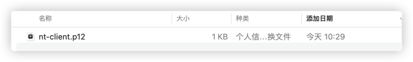
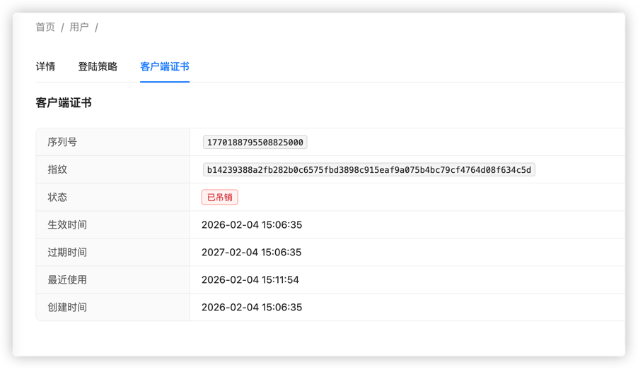
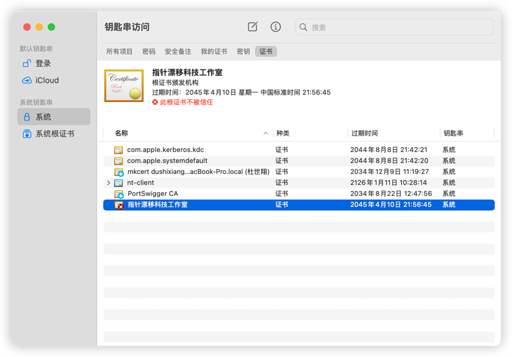
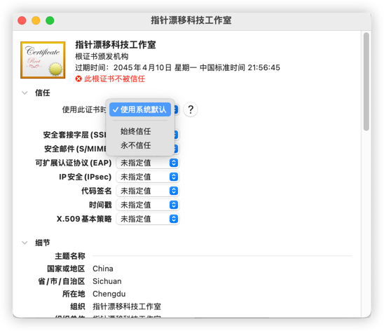
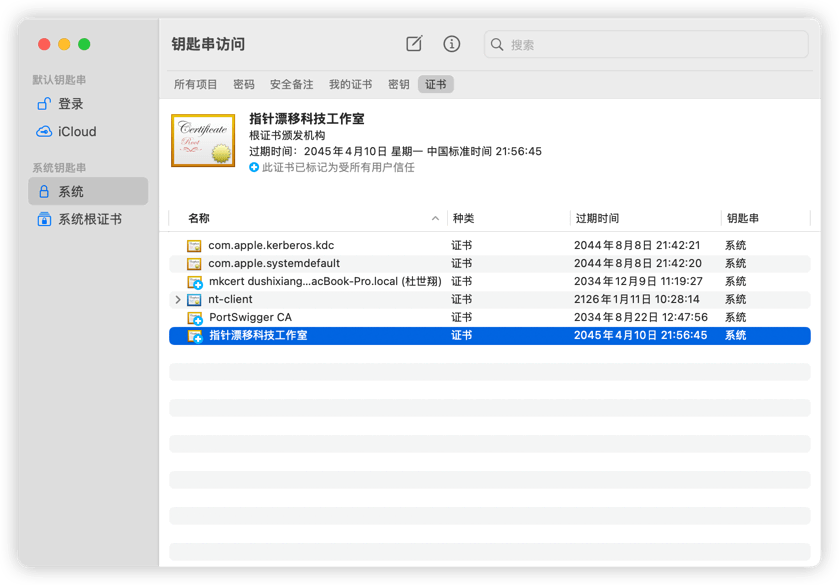
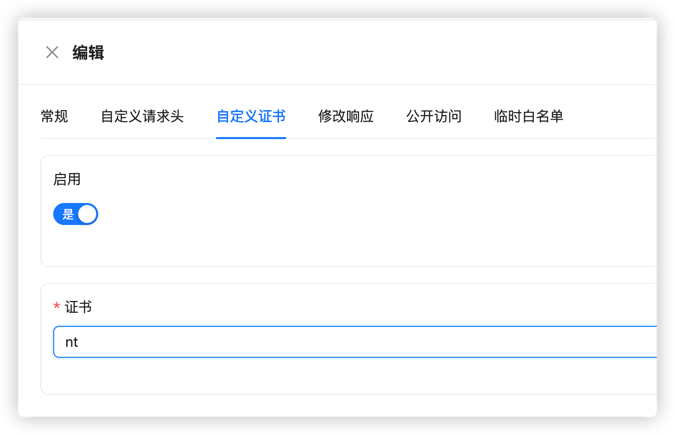
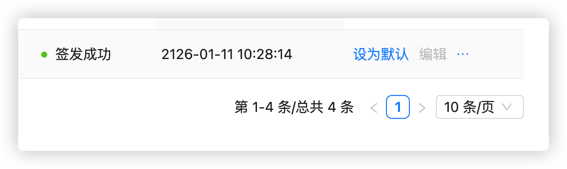

# mTLS (Mutual TLS)

## What is mTLS?

mTLS (Mutual TLS) is an enhanced authentication mechanism compared with traditional one-way TLS:

- **Traditional TLS**: only the client verifies the server certificate (for example browsing HTTPS websites)
- **mTLS**: both client and server verify each other's certificates

### Security Benefits

- ✅ **Mutual identity verification**
- ✅ **Zero-trust style access control**: no valid client certificate, no access
- ✅ **Protection against man-in-the-middle attacks**
- ✅ **Defense in depth**: even if a service has vulnerabilities, attackers cannot access it without valid certificates

This document explains how to enable and use mTLS in Next Terminal.

## Configuration Steps

### 1. Generate server certificate

As administrator, create a certificate in Certificate Management:

1. Choose **Self-signed**
2. Check **Require client certificate**
3. Fill certificate information (domain, validity period, etc.)
4. Save

### 2. Download client certificate

Each user can download a personal client certificate from Personal Center:

- File naming format: `{username}-client.p12`
- Certificate includes user identity info
- Each certificate is unique and should not be shared

### 3. Certificate management

Administrators can manage user certificates on the user details page:

- **View certificate**
- **Revoke certificate**
- **Re-issue certificate**

> ⚠️ **Note**: once revoked, the user cannot access mTLS-protected resources until a new certificate is issued.

### 4. Install client certificate (macOS example)

#### 4.1 Import certificate into Keychain

1. Open **Keychain Access**
2. Drag `.p12` file into **System -> Certificates**
3. Enter certificate password (if set)

#### 4.2 Trust certificate

1. Double-click the imported certificate
2. Expand **Trust**
3. Set **When using this certificate** to **Always Trust**
4. Close window and confirm with system password

#### 4.3 Verify certificate status

After setup, the certificate should show as trusted.

> 💡 **Other operating systems**
> - **Windows**: double-click `.p12`, import into **Personal** store via Certificate Import Wizard
> - **Linux**: import with browser certificate manager (Firefox/Chrome)

### 5. Bind certificate to Web Asset

In Asset Management, assign the certificate to the Web Asset that requires mTLS:

1. Edit Web Asset
2. In **Custom Certificate**, choose the generated certificate
3. Save

### 6. Access test

After configuration:

- Browser prompts for client certificate selection
- Select the installed certificate
- Access is granted after verification

## Advanced Configuration

### Set default certificate

If you want mTLS enabled for all Web Assets by default:

1. Open Certificate Management
2. Find target certificate
3. Click **Set as Default**

Then all Web Assets without explicit certificate assignment will use this certificate.

> ⚠️ **Note**: after setting a default certificate, all users must have valid client certificates installed to access Web Assets.

## Best Practices

1. **Rotate certificates regularly**
2. **Revoke certificates promptly** for departed employees
3. **Set reasonable validity periods**
4. **Apply different certificate policies** by asset sensitivity
5. **Audit certificate usage logs** periodically
