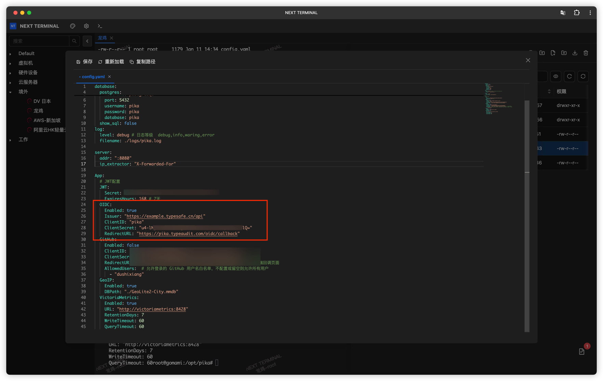

# OIDC 身份服务器

## 什么是 OIDC

OIDC（OpenID Connect）是一个现代化的身份认证标准协议，建立在 OAuth 2.0 之上。

### 核心概念

- **身份认证层**：在 OAuth 2.0 的授权基础上，添加了用户身份认证功能
- **标准化协议**：被广泛采用的行业标准，支持单点登录（SSO）
- **用户信息获取**：除了授权令牌，还能获取用户的身份信息
- **安全性高**：使用 JWT（JSON Web Token）传输身份信息

### Next Terminal 的 OIDC 能力

Next Terminal 内置了完整的 OIDC 服务器实现，可以作为身份提供商（Identity Provider）为第三方应用提供统一的身份认证服务。

**使用场景**：
- 为企业内部多个系统提供统一登录入口
- 集中管理用户账号和权限
- 简化第三方应用的用户认证流程
- 实现跨系统的单点登录（SSO）

## 配置步骤

### 1. 启用 OIDC 服务器

在 Next Terminal 中启用 OIDC 服务器功能：

1. 进入「系统设置」→「身份服务」
2. 找到「OIDC Server」配置项
3. 配置 **Issuer URL**：`https://{host}/api`
   - `{host}` 替换为 Next Terminal 的实际访问地址
   - 例如：`https://nt.example.com/api`
4. 保存配置

> 💡 **提示**：Issuer URL 是 OIDC 服务的标识符，第三方应用将通过这个地址发现 OIDC 服务的配置信息。

### 2. 创建 OIDC 客户端

为每个需要接入的第三方应用创建独立的 OIDC 客户端：

1. 进入「OIDC 客户端管理」
2. 点击「添加客户端」
3. 填写客户端信息：
   - **名称**：客户端应用的显示名称（可以使用中文）
   - **Client ID**：客户端的唯一标识符
     - 必须是唯一的英文字符
     - 建议使用小写字母和连字符，如：`pika-monitor`
4. 保存后，系统会自动生成 **Client Secret**

> ⚠️ **重要**：Client Secret 只会在创建时显示一次，请妥善保存。如果丢失，需要重新生成。

### 3. 配置第三方应用

将第三方应用配置为使用 Next Terminal 的 OIDC 服务进行身份认证。

#### 配置示例：皮卡监控

以 [皮卡监控](https://github.com/dushixiang/pika) 为例，演示如何配置 OIDC 认证：

1. 在皮卡监控的配置文件中启用 OIDC 认证
2. 填写 OIDC 配置信息：
   - **Client ID**：从 Next Terminal 创建的客户端 ID
   - **Client Secret**：从 Next Terminal 获取的客户端密钥
   - **Issuer URL**：Next Terminal 的 Issuer URL（`https://{host}/api`）
   - **Redirect URI**：根据应用说明配置回调地址
3. 保存配置并重启应用

## 使用流程

### 用户登录流程

当用户访问配置了 OIDC 认证的第三方应用时：

1. **发起认证**：应用将用户重定向到 Next Terminal 登录页面
2. **用户登录**：用户在 Next Terminal 输入账号密码（或使用 OTP、Passkey）
3. **授权确认**：用户确认授权该应用访问其身份信息
4. **返回应用**：Next Terminal 将用户重定向回应用，并携带授权码
5. **获取令牌**：应用使用授权码向 Next Terminal 换取访问令牌
6. **获取用户信息**：应用使用访问令牌获取用户身份信息
7. **登录成功**：应用创建用户会话，完成登录

### 用户信息映射

Next Terminal 的 OIDC 服务器会提供以下用户信息：

- `sub`：用户唯一标识符（User ID）
- `name`：用户显示名称
- `preferred_username`：用户名
- `email`：用户邮箱（如果已配置）
- `email_verified`：邮箱是否已验证

## 安全建议

### 1. 使用 HTTPS

⚠️ **必须使用 HTTPS**：OIDC 协议要求使用 HTTPS 传输，以保护敏感信息（如令牌、用户信息）不被窃取。

### 2. 保护 Client Secret

- 不要在前端代码或公开仓库中暴露 Client Secret
- 定期轮换 Client Secret
- 为不同的应用使用不同的客户端

### 3. 限制 Redirect URI

- 为每个客户端配置明确的重定向 URI 白名单
- 不要使用通配符或过于宽泛的 URI 模式

### 4. 审计日志

- 定期检查 OIDC 登录日志
- 监控异常的登录行为
- 及时撤销可疑客户端的访问权限

## 常见问题

### 1. 如何测试 OIDC 配置是否正确？

可以访问 `https://{host}/api/.well-known/openid-configuration` 查看 OIDC 服务的配置信息。如果能正常返回 JSON 配置，说明 OIDC 服务已正确启用。

### 2. 忘记 Client Secret 怎么办？

Client Secret 只在创建时显示一次。如果丢失，需要在客户端管理页面重新生成新的 Secret。

### 3. 支持哪些认证方式？

Next Terminal 的 OIDC 服务器支持多种认证方式：
- 用户名密码
- OTP（一次性密码）
- Passkey（通行密钥）
- 双因素认证

### 4. 可以对接哪些应用？

支持所有遵循 OIDC 标准的应用，包括但不限于：
- Grafana
- Harbor
- MinIO
- GitLab
- Nextcloud
- 自研应用

## 相关文档

- [OAuth 2.0 官方文档](https://oauth.net/2/)
- [OpenID Connect 规范](https://openid.net/connect/)
- [OIDC Discovery 规范](https://openid.net/specs/openid-connect-discovery-1_0.html)

#### 通用配置参数

大多数支持 OIDC 的应用需要以下配置参数：

| 参数 | 值 | 说明 |
|------|-----|------|
| Issuer / Discovery URL | `https://{host}/api` | OIDC 服务发现地址 |
| Client ID | 从 NT 获取 | 客户端唯一标识 |
| Client Secret | 从 NT 获取 | 客户端密钥 |
| Authorization Endpoint | `https://{host}/api/oauth2/authorize` | 授权端点（通常自动发现） |
| Token Endpoint | `https://{host}/api/oauth2/token` | 令牌端点（通常自动发现） |
| UserInfo Endpoint | `https://{host}/api/oauth2/userinfo` | 用户信息端点（通常自动发现） |
| Redirect URI | 由应用决定 | 认证成功后的回调地址 |

> 💡 **提示**：大多数 OIDC 客户端支持服务发现（Discovery），只需配置 Issuer URL 即可自动获取其他端点地址。