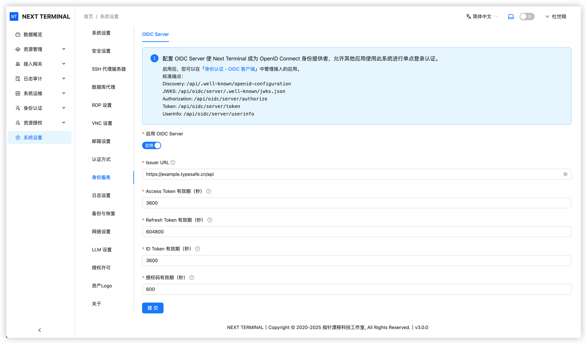
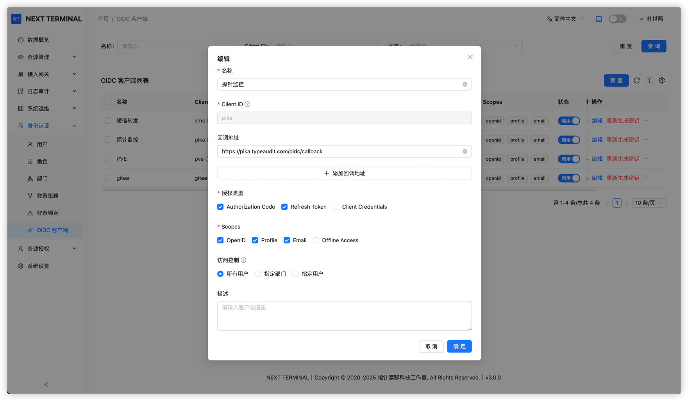
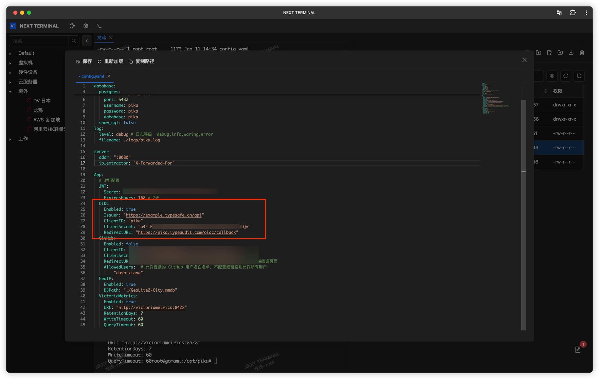

# OIDC Identity Server

## What is OIDC?

OIDC (OpenID Connect) is a modern identity authentication standard built on top of OAuth 2.0.

### Core Concepts

- **Identity layer**: adds user authentication on top of OAuth 2.0 authorization
- **Standard protocol**: widely adopted, supports SSO
- **User info access**: in addition to tokens, user identity claims are available
- **Strong security**: identity information is carried with JWT (JSON Web Token)

### OIDC capability in Next Terminal

Next Terminal includes a full OIDC Server implementation and can act as an Identity Provider for third-party applications.

**Use cases**:
- Unified login entry for multiple internal systems
- Centralized user/account management
- Simpler third-party authentication integration
- Cross-system SSO

## Configuration Steps

### 1. Enable OIDC Server

In Next Terminal:

1. Go to **System Settings -> Identity Service**
2. Find **OIDC Server**
3. Set **Issuer URL** to: `https://{host}/api`
   - Replace `{host}` with your Next Terminal address
   - Example: `https://nt.example.com/api`
4. Save

> 💡 **Tip**: Issuer URL is the unique identifier of your OIDC service. Third-party apps use it for discovery.

### 2. Create OIDC client

Create an independent OIDC client for each application:

1. Go to **OIDC Client Management**
2. Click **Add Client**
3. Fill client information:
   - **Name**: display name (Chinese is allowed)
   - **Client ID**: unique client identifier
     - must be unique and English-friendly
     - recommended format: lowercase + hyphen, for example `pika-monitor`
4. Save, then system generates **Client Secret**

> ⚠️ **Important**: Client Secret is shown only once at creation. Save it securely.

### 3. Configure third-party app

Configure your application to use Next Terminal OIDC service.

#### Example: Pika Monitor

Using [Pika Monitor](https://github.com/dushixiang/pika):

1. Enable OIDC in application config
2. Fill OIDC settings:
   - **Client ID**: from Next Terminal
   - **Client Secret**: from Next Terminal
   - **Issuer URL**: `https://{host}/api`
   - **Redirect URI**: according to app requirements
3. Save and restart app

## Login Flow

When user visits an OIDC-enabled app:

1. **Auth request**: app redirects user to Next Terminal login page
2. **User login**: user signs in via password/OTP/Passkey
3. **Authorization consent**: user grants identity access to app
4. **Redirect back**: Next Terminal redirects user with authorization code
5. **Token exchange**: app exchanges code for access token
6. **User info fetch**: app requests user claims with token
7. **Login completed**: app creates session

### User Claims Mapping

Next Terminal OIDC Server returns claims such as:

- `sub`: unique user identifier (User ID)
- `name`: display name
- `preferred_username`: username
- `email`: user email (if configured)
- `email_verified`: whether email is verified

## Security Recommendations

### 1. Use HTTPS

⚠️ **HTTPS is mandatory** for OIDC to protect tokens and user claims.

### 2. Protect Client Secret

- Never expose Client Secret in frontend code or public repositories
- Rotate Client Secret regularly
- Use different clients for different apps

### 3. Restrict Redirect URI

- Configure strict Redirect URI allowlist per client
- Avoid overly broad wildcard patterns

### 4. Audit logs

- Review OIDC login logs regularly
- Monitor suspicious sign-in behavior
- Revoke suspicious clients promptly

## FAQ

### 1. How can I verify OIDC setup quickly?

Open `https://{host}/api/.well-known/openid-configuration`. If JSON is returned, discovery works and OIDC Server is enabled properly.

### 2. What if I forget Client Secret?

Client Secret is shown once at creation. If lost, regenerate it from client management.

### 3. Which authentication methods are supported?

Next Terminal OIDC Server supports:
- Username/password
- OTP
- Passkey
- Multi-factor authentication

### 4. Which apps can integrate?

Any standards-compliant OIDC client application, including:
- Grafana
- Harbor
- MinIO
- GitLab
- Nextcloud
- Custom applications

## Related Docs

- [OAuth 2.0](https://oauth.net/2/)
- [OpenID Connect](https://openid.net/connect/)
- [OIDC Discovery](https://openid.net/specs/openid-connect-discovery-1_0.html)

#### Common Configuration Parameters

Most OIDC-enabled apps need these parameters:

| Parameter | Value | Description |
|------|-----|------|
| Issuer / Discovery URL | `https://{host}/api` | OIDC discovery address |
| Client ID | Get from NT | Unique client ID |
| Client Secret | Get from NT | Client secret |
| Authorization Endpoint | `https://{host}/api/oauth2/authorize` | Authorization endpoint (usually auto-discovered) |
| Token Endpoint | `https://{host}/api/oauth2/token` | Token endpoint (usually auto-discovered) |
| UserInfo Endpoint | `https://{host}/api/oauth2/userinfo` | User info endpoint (usually auto-discovered) |
| Redirect URI | Application-defined | Callback URL after successful authentication |

> 💡 **Tip**: Most OIDC clients support Discovery. In many cases, only Issuer URL is needed.
