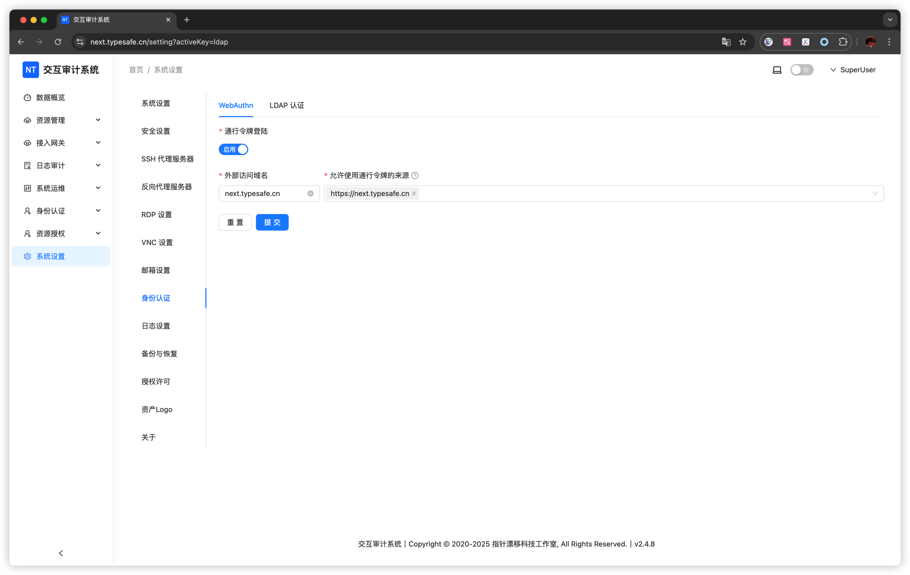
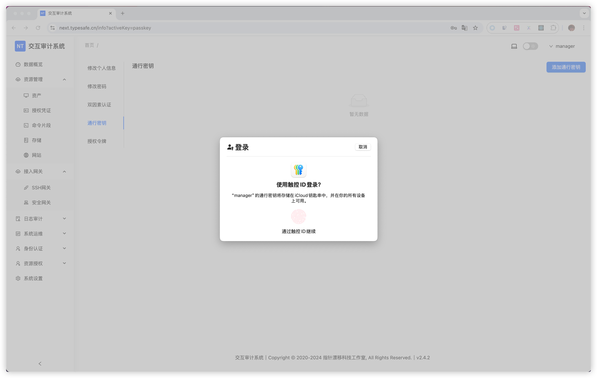

# 通行密钥

> Passkey 通过公私钥加密提供了比传统密码更安全、更便捷的身份认证方式，有效防止密码泄露、钓鱼和中间人攻击，同时提升用户体验，是未来身份认证的发展趋势。

首先在设置页面开启

::: tip 注意
域名不包含协议和端口，例如：`next.typesafe.cn`

来源不包含地址后面的 `/`，例如：`https://next.typesafe.cn`
:::

在个人中心添加一个密钥

之后在登陆时就会自动选择通行密钥登陆。