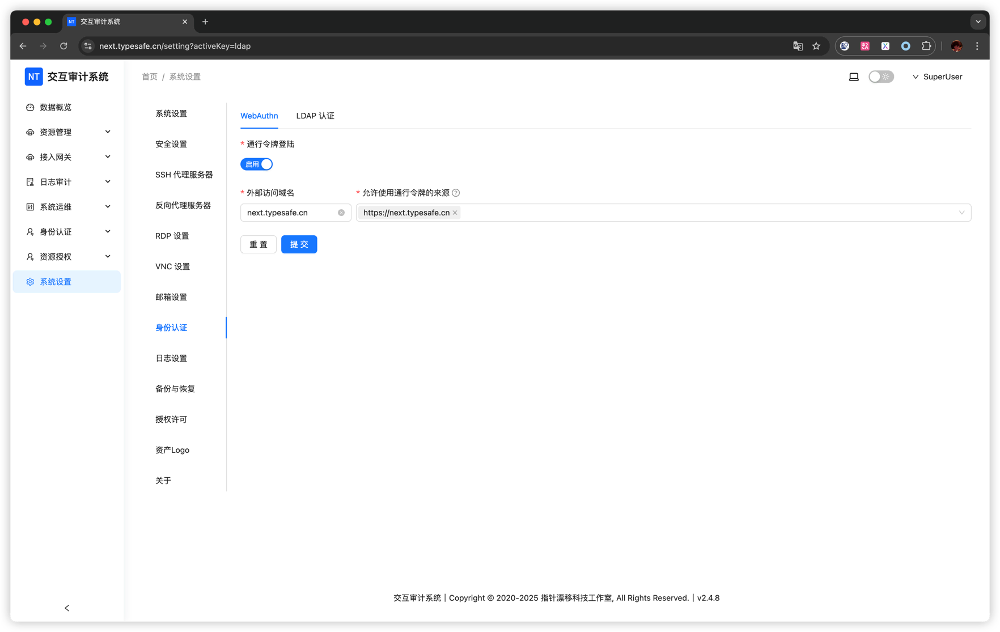
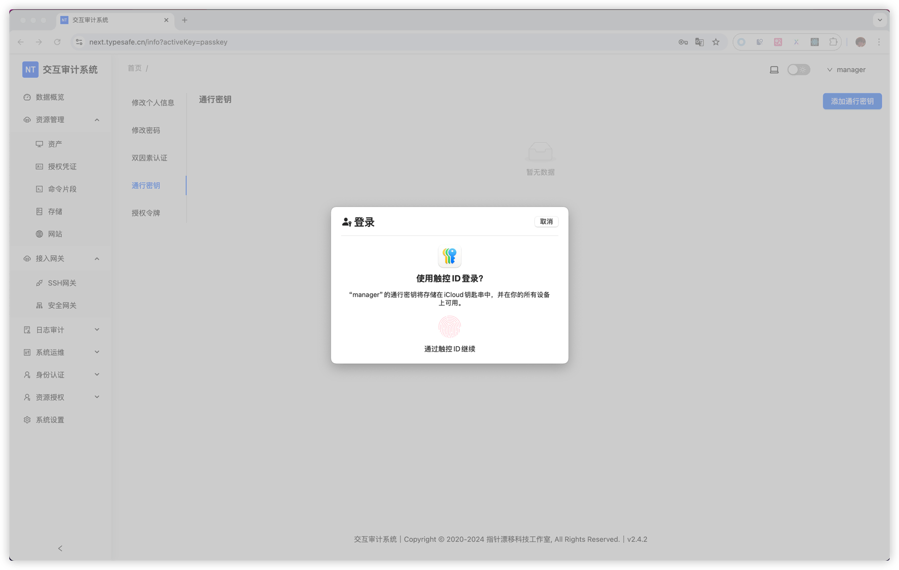

# Passkey

> Passkey provides stronger and more convenient authentication than traditional passwords through public/private-key cryptography. It helps prevent credential leaks, phishing, and man-in-the-middle attacks.

::: tip Note
**HTTPS is required for this feature.**

Domain should not include protocol or port, for example: `next.typesafe.cn`

Origins should not include trailing path slash, for example: `https://next.typesafe.cn`
:::

First, enable passkey in Settings:

Then add a passkey in Personal Center:

After that, login can use passkey automatically.
