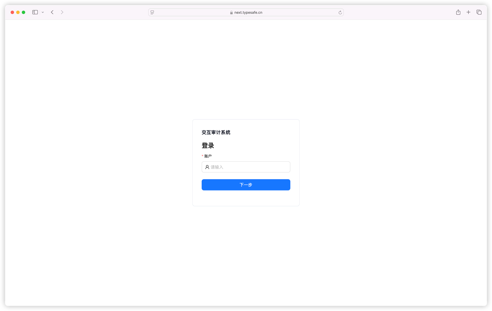
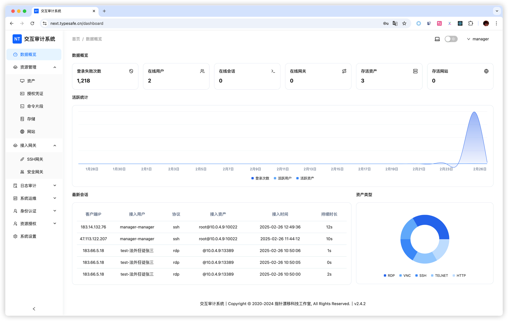

# 快速开始

## 登录系统

使用默认账户密码 admin/admin 登录系统。

普通登录有效时间为2小时，在此期间使用系统会自动续期，在无操作2小时之后再使用需重新登录系统。

记录登录有效时间为14天，其他逻辑与普通登录一致。

在连续登录失败5次后，系统会对账号进行锁定5分钟，在此期间该账户无法进行登录。

## 控制面板

控制面板页面展示了在线会话、资产数量、授权凭证、在线会话等数据信息。

