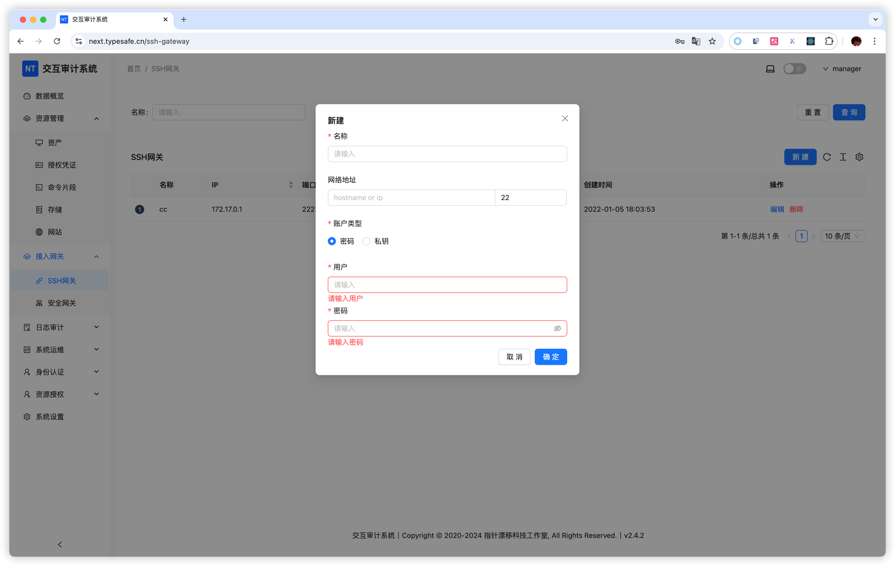

# SSH Gateway

## Overview

SSH Gateway is used to accelerate access to overseas assets without installing additional programs. It relies on SSH port forwarding of a jump host.

**How it works**

1. Next Terminal actively connects to a jump host (SSH Server)
2. Select this SSH gateway when creating assets
3. Traffic is forwarded through SSH port forwarding on the jump host

**Typical scenarios**

- Accelerate access to overseas servers
- Improve cross-region connection performance

## Usage

### 1. Add SSH gateway

In **SSH Gateway** management, configure jump host info:

- Name: for example `Overseas Jump Host`
- Address: jump host IP or domain
- Port: SSH port (default 22)
- Username: SSH account
- Password or key: authentication credential

### 2. Add asset and bind gateway

When adding overseas assets:

- Fill target asset IP/domain
- Select jump host in **SSH Gateway** dropdown
- Fill other connection settings

### 3. Access asset

Traffic is routed through SSH gateway and connection speed is improved.

**Example**

Suppose direct access from China to `us-server.example.com` is slow. You can use jump host `us-jump.example.com`:

1. Add SSH gateway with address `us-jump.example.com`
2. Add asset `us-server.example.com` and select this gateway
3. Access traffic is relayed through the US jump host

## Notes

- Ensure SSH Server allows port forwarding (`AllowTcpForwarding` in `sshd_config`)
- Ensure jump host has good connectivity to target assets
