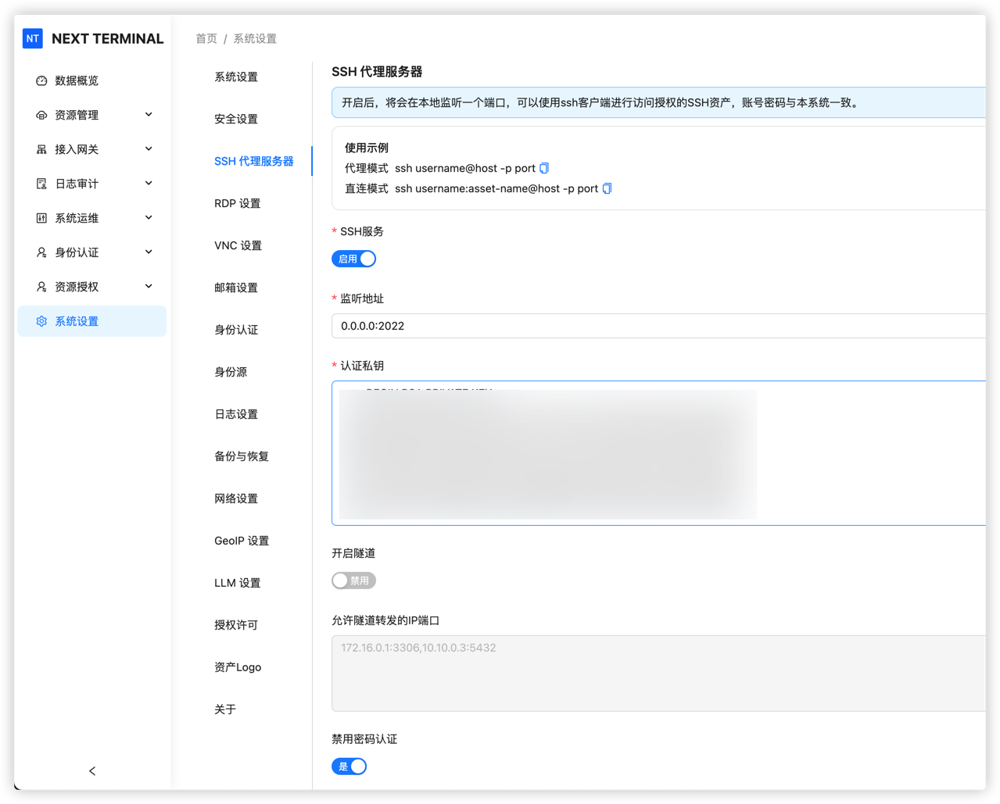
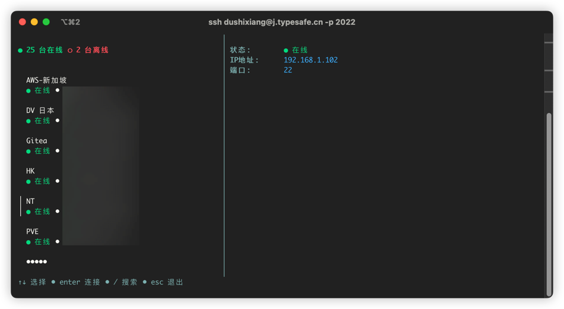
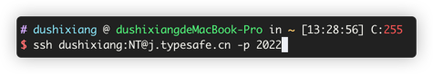
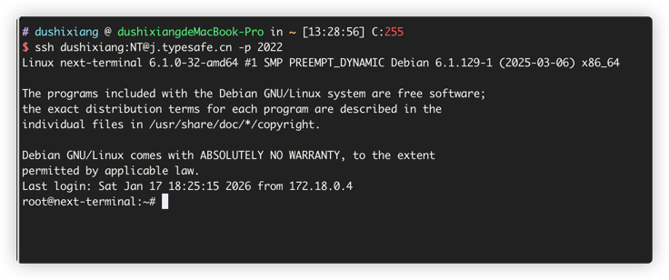
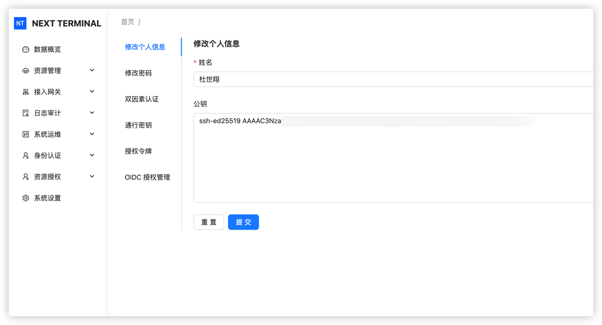

# SSH 代理服务器

## 使用方式

### 在系统设置开启 SSH 代理服务器

认证私钥是 SSH Server 和 SSH 客户端认证过程中必要的参数，点击下方的「生成私钥」自动填空即可。

### 使用 ssh 命令连接代理服务器

**1. 代理模式** ssh username@host -p port

访问后会先跳转到 NT 自定义的 UI 界面，手动选择服务器进行连接。

**2. 直连模式** ssh username:asset-name@host -p port

直接访问到真实的服务器地址

### 配置免密码登录 SSH 代理服务器

先找到你的公钥 `.pub` 结尾

在个人中心保存你的公钥

