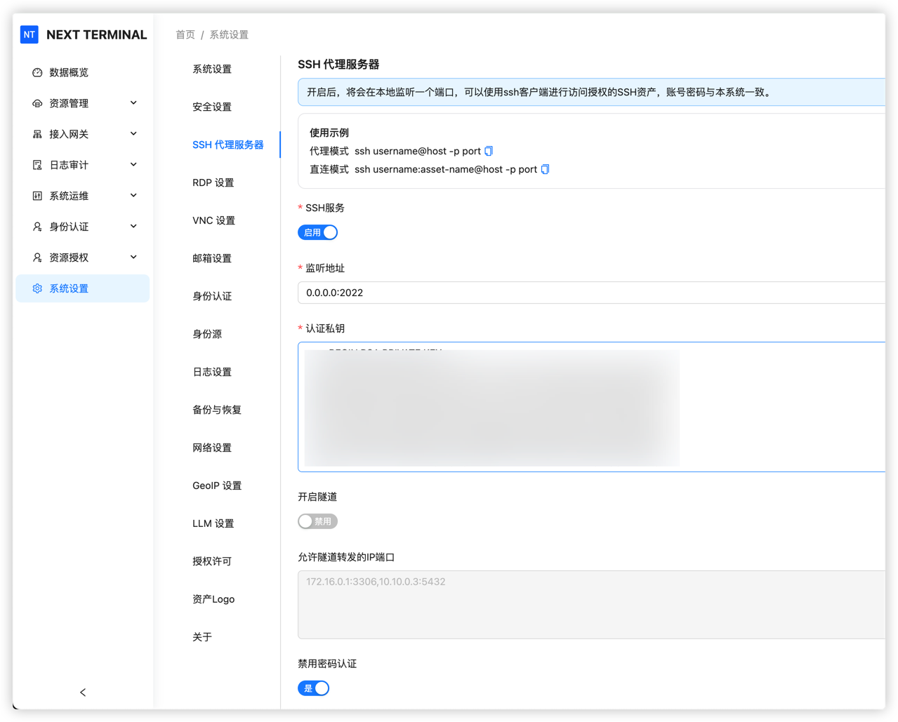
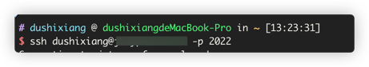
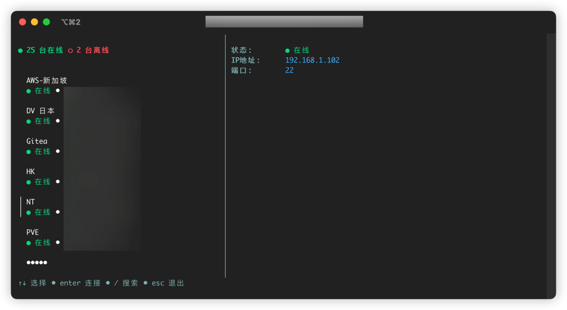
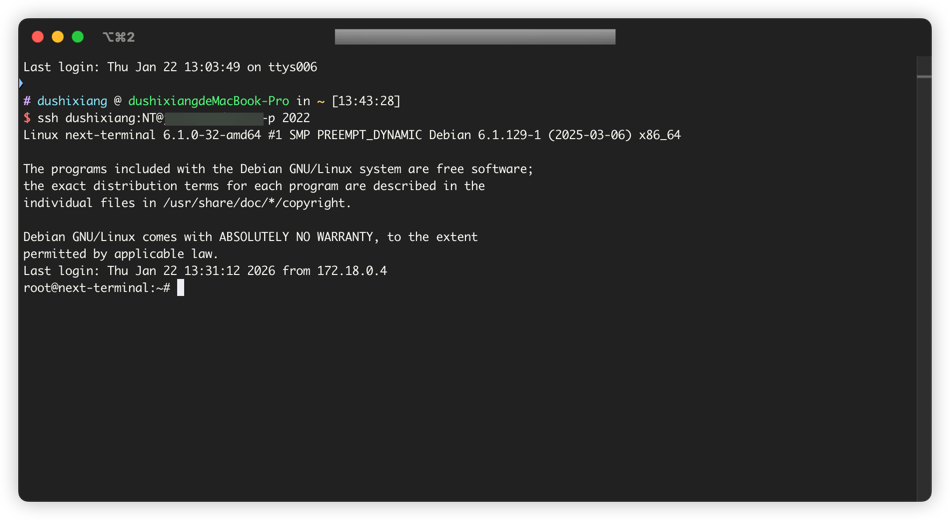
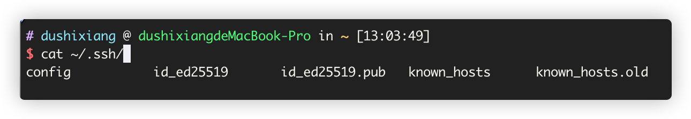
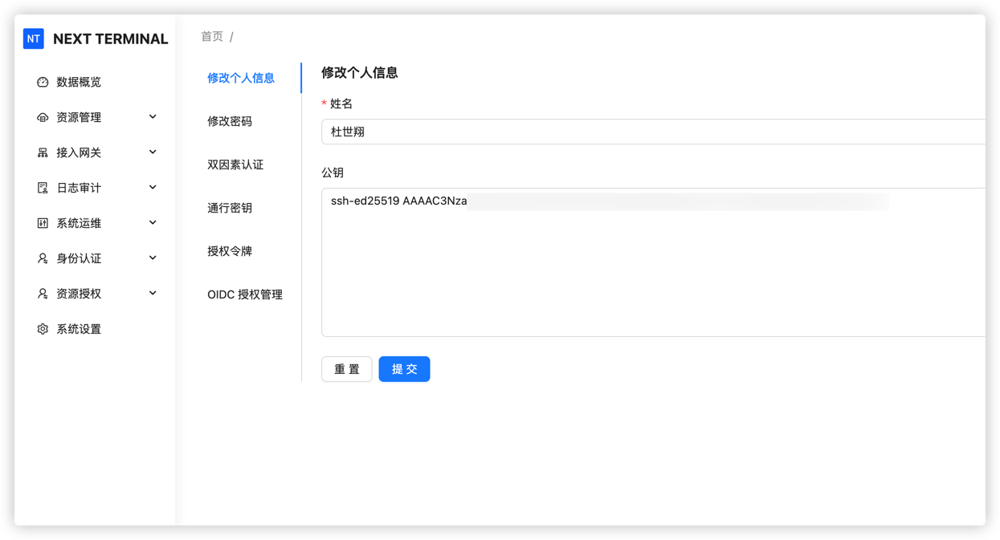

# SSH Proxy Server

SSH Proxy Server is a convenient feature in Next Terminal. It allows users to connect to Next Terminal with standard SSH clients and then access managed assets. No dedicated client is required.

## Key Features

- **Standard SSH protocol**: fully compatible with common SSH clients
- **Two connection modes**: interactive selection and direct connect
- **Public key authentication**: passwordless login with SSH public keys
- **Unified entry point**: access all assets through one SSH endpoint
- **Security auditing**: all connection activities are auditable

## Usage

### Step 1: Enable SSH Proxy Server in system settings



In SSH Proxy Server settings:

- **Listen Address**: SSH proxy listening address and port, default `0.0.0.0:2022`
- **Private Key**: the SSH proxy server's own private key used to prove the server identity and establish an encrypted connection. It is the server's identity key, not the user's login key. Click **Generate Key** to auto-generate it.
- **Enable Tunnel**: whether to allow SSH port forwarding. When enabled, users can create SSH tunnels to access databases, internal websites, and other private services. When disabled, normal SSH login still works, but port forwarding is blocked.

::: tip Tip
Ensure the configured port is not occupied and is open in firewall/security groups.
:::

::: tip Further Reading
If you want a deeper explanation of what this private key does in SSH authentication and at what stage username/password authentication happens, see: [What Is the "Authentication Private Key" in SSH, and What Does It Actually Authenticate?](/blog/ssh-authentication)
:::

### Step 2: Connect with SSH command

Two connection modes are available.

#### Mode 1: Proxy mode (interactive)

```bash
ssh username@host -p port
```

- `username`: Next Terminal username
- `host`: Next Terminal server address
- `port`: SSH proxy port (default 2022)

After connecting, you enter an interactive menu to choose target asset:




#### Mode 2: Direct mode

If you already know the target asset name:

```bash
ssh username:asset-name@host -p port
```

- `username`: Next Terminal username
- `asset-name`: target asset name
- `host`: Next Terminal server address
- `port`: SSH proxy port

Direct mode skips interactive menu and connects immediately:



::: tip Use cases
- **Proxy mode**: when you need to browse/select assets
- **Direct mode**: when asset name is known and fast/scripted access is needed
:::

### Step 3: Configure passwordless login (optional)

To avoid entering password every time, configure SSH public key authentication.

#### 3.1 Get local public key

```bash
cat ~/.ssh/id_rsa.pub
```

If key file does not exist, generate key pair first:

```bash
ssh-keygen -t rsa -b 4096
```

Copy the public key content (`.pub` file):



#### 3.2 Add public key in Next Terminal

In Personal Center, paste the public key into key settings:



After configuration, SSH login can proceed without password.

## FAQ

### Troubleshooting connection failures

If connection fails, check:

1. **Port exposure**: ensure port is open in firewall/security group
2. **Service status**: ensure Next Terminal service is running
3. **Credentials**: verify username/password or key
4. **Network connectivity**: test with `telnet` or `nc`

```bash
# Test port connectivity
telnet host 2022
# or
nc -zv host 2022
```

### Difference from SSH Gateway

- **SSH Proxy Server**: built-in SSH service of Next Terminal, used by SSH clients to access managed assets
- **SSH Gateway**: independent jump host that forwards traffic to internal assets
