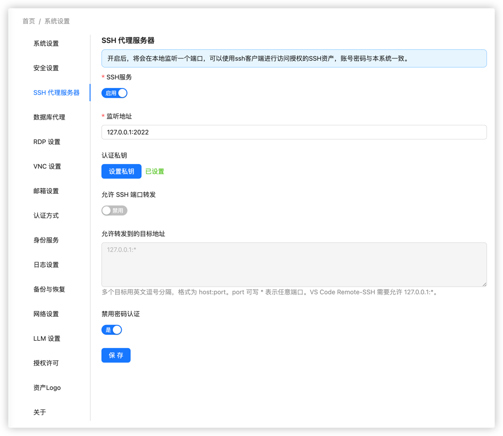
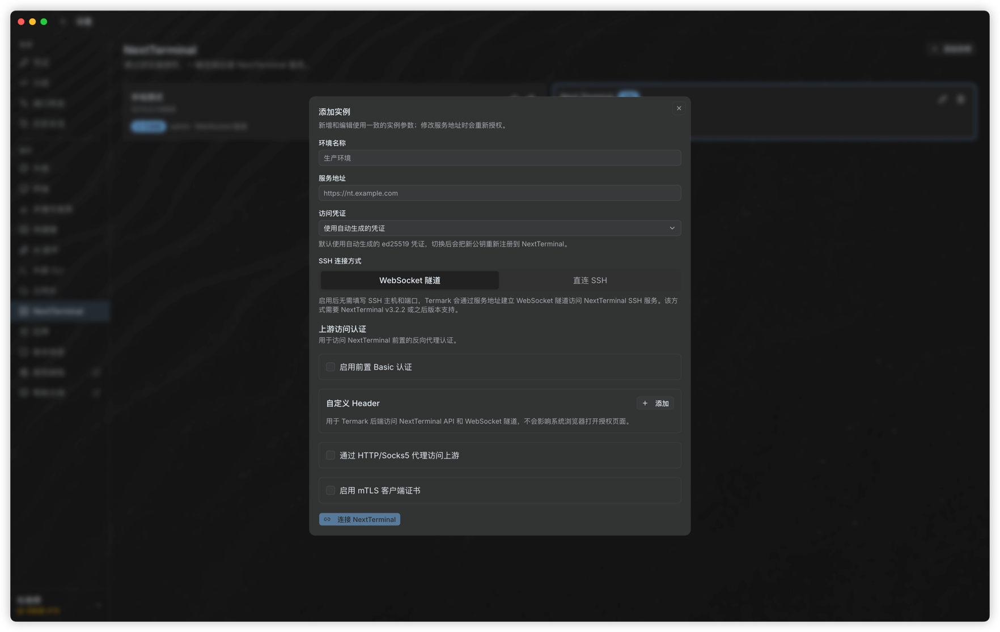
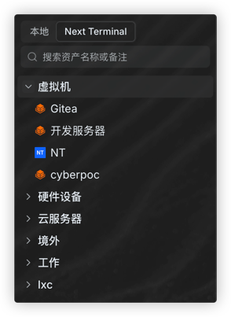

# Use Termark to Access Next Terminal SSH Assets

**Termark** is a local SSH client for Next Terminal. It can sync SSH assets authorized to your Next Terminal account and let you open bastion-hosted SSH sessions from your desktop, similar to tools such as XShell or MobaXterm.

::: tip Version Requirement
WebSocket tunnel mode requires Next Terminal later than `v3.2.2`.
:::

## Before You Start

Before configuring Termark, make sure:

- Termark is installed. Download: [https://www.termark.app](https://www.termark.app).
- SSH assets have been added in Next Terminal, and your account has access permission.
- Termark can reach the Next Terminal web service URL.
- If you want to use direct SSH mode, Termark must also be able to reach the SSH Proxy Server listen address.

## 1. Enable Next Terminal SSH Proxy Server

Log in to Next Terminal and open **System Settings** > **SSH Proxy Server**. Configure it as follows:

- **SSH Service**: enable it.
- **Listen Address**: start with `127.0.0.1:2022` when using WebSocket tunnel mode. This avoids exposing the SSH proxy port separately.
- **Private Key**: click **Set Key** to generate or configure the SSH proxy server private key.
- **Disable Password Authentication**: recommended, especially if the SSH proxy port may be exposed later.

Click **Save** after updating the settings.

::: tip Note
The private key here is the server identity key used by the SSH Proxy Server. It is not an asset credential and not the user's local SSH private key.
:::

## 2. Add a Next Terminal Instance in Termark

Open Termark, go to **Settings** > **NextTerminal**, and click **Add Instance**.

Fill in the basic instance information:

- **Environment Name**: a local name used to distinguish environments, for example `Production` or `Staging`.
- **Service URL**: the web URL of Next Terminal, for example `https://nt.example.com`.
- **Access Credential**: the default auto-generated credential is recommended. When connecting for the first time or switching credentials, follow Termark's authorization prompt.

Then choose the SSH connection mode based on your network environment.

## 3. Choose a Connection Mode

### Option 1: WebSocket Tunnel

WebSocket tunnel mode is recommended for most deployments. It connects through the Next Terminal web service URL and tunnels traffic to the SSH Proxy Server, so you usually do not need to expose port `2022` separately. It is also suitable when Next Terminal is behind a reverse proxy, HTTPS gateway, or tunneling service.

In **SSH Connection Mode**, select **WebSocket Tunnel**, then click **Connect NextTerminal**.

Use WebSocket tunnel mode when:

- Termark can access only the Next Terminal web URL, not the SSH Proxy Server port directly.
- Next Terminal is deployed behind a reverse proxy.
- You want to reduce exposed public ports.

### Option 2: Direct SSH

If the Termark client network can directly reach the Next Terminal SSH Proxy Server, you can choose **Direct SSH**. This mode has one fewer forwarding hop than WebSocket tunnel mode, so latency is lower and terminal interaction may feel smoother.

Before using direct SSH, make sure the SSH Proxy Server listen address is reachable from the Termark client:

- Next Terminal is usually deployed on a server or inside a container, while Termark runs on the user's desktop. You cannot use `127.0.0.1:2022` from Termark to directly reach the SSH proxy running on the server.
- Change the SSH Proxy Server listen address to an address reachable by the client, such as `0.0.0.0:2022` or the server's private IP.
- If Next Terminal is deployed in a container, make sure port `2022` is mapped from the container to the host.
- If the server has a firewall or cloud security group, allow access to the corresponding port.

In Termark, select **Direct SSH** and fill in:

- **SSH Host**: the host where the Next Terminal SSH Proxy Server is reachable. The hostname from the service URL can be used by default if it points to the same server.
- **SSH Port**: the SSH Proxy Server port, for example `2022`.

Click **Connect NextTerminal** after completing the settings.

::: warning Security Recommendation
If you change the listen address to `0.0.0.0:2022`, the SSH Proxy Server may become reachable from external networks. Use firewall rules, cloud security groups, or access control policies to allow only trusted sources.
:::

## 4. View and Connect to Assets

After the connection succeeds, return to the Termark home page and switch to the corresponding Next Terminal instance tab. You will see the SSH assets authorized to the current account.

If no assets are displayed, check:

- Whether the current account has access permission to the assets.
- Whether the assets in Next Terminal are SSH assets and their connection settings are correct.
- Whether the service URL and access credential in Termark belong to the expected account.
- Whether the SSH Proxy Server is enabled and the settings have been saved.

## FAQ

### WebSocket Tunnel Connection Fails

Check the following in order:

1. The service URL configured in Termark can be opened in a browser.
2. Next Terminal is later than `v3.2.2`.
3. The reverse proxy supports WebSocket forwarding.
4. The Next Terminal SSH Proxy Server is enabled.

### Direct SSH Connection Fails

Check the following in order:

1. The SSH Proxy Server listen address is reachable from the Termark client.
2. The SSH port matches the port configured in Next Terminal.
3. For container deployments, the SSH Proxy Server port is mapped to the host.
4. The firewall or cloud security group allows access to the port.
5. If the listen address is still `127.0.0.1:2022`, the Termark desktop client cannot directly reach that port from the user's computer. Use WebSocket tunnel mode or change the listen address.

### Assets Are Not Displayed

Termark only displays SSH assets authorized to the current Next Terminal account. Confirm that the assets exist in Next Terminal, the authorization is valid, and the access credential used in Termark belongs to the correct account.
