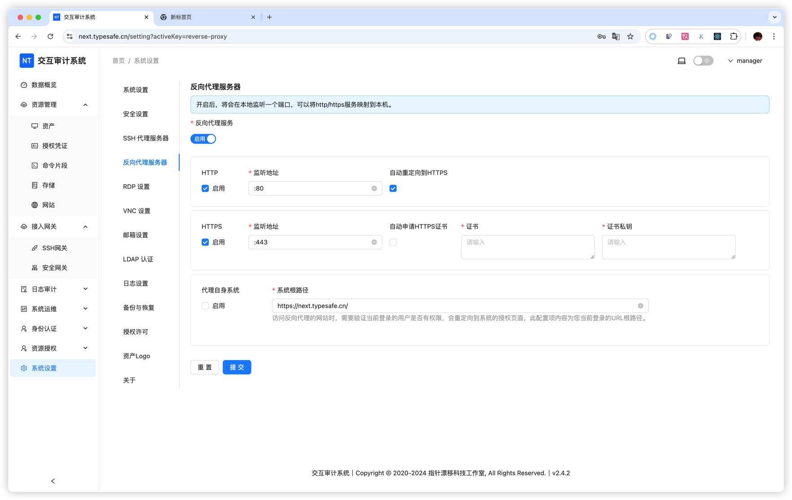
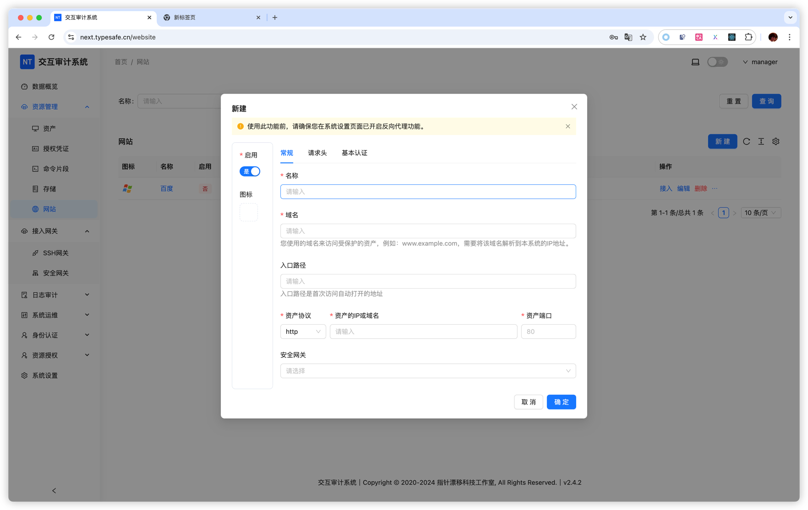

# Web 资产

Web 资产功能旨在为您提供一种安全的方式来保护内部网站。相较于将网站直接暴露于公网，此功能具有两大显著优势：

1.  **强化认证**：用户必须先登录 NextTerminal，然后才能访问目标网站，为您的网站安全增添一层额外保障。
2.  **精准授权**：您可以将网站的访问权限精确授予指定用户，确保只有授权人员才能访问，从而实现对访问范围的有效控制。

## 适用场景

### 场景一：限制公网 IP 网站的访问

-   **问题**：您的网站拥有公网 IP，但您不希望任何人都能随意访问。同时，由于用户使用动态 IP 地址，您无法通过传统的 IP 白名单进行访问控制。
-   **方案**：将目标网站配置为仅允许来自 NextTerminal 服务器的 IP 访问。然后，通过 NextTerminal 代理该网站，并将访问权限授予指定用户。您还可以结合 LDAP/OIDC 进行统一身份管理。

### 场景二：统一访问多云环境下的内网系统

-   **问题**：您的内网网站分布在多个云或数据中心，您担心将其暴露在公网会带来安全风险。
-   **方案**：在您的内网中部署安全网关并注册到 NextTerminal。通过 NextTerminal 代理网站，并为其选择对应的内网安全网关。最后，将访问权限授予指定用户，实现从统一入口安全访问。

### 场景三：访问互联网隔离区的内部服务

-   **问题**：在政务云等特殊网络环境中，内网服务器沒有互联网访问权限，通常需要通过跳板机进行管理和运维，操作不便且难以审计。
-   **方案**：在可访问内网的跳板机上部署安全网关，通过 NextTerminal 统一访问内网的 SSH、Web 等服务，实现便捷、安全且可审计的管理。

## 使用指南

### 步骤一：配置反向代理服务器

启用反向代理服务器后，它会在本地监听指定端口。如果您使用 Docker 部署，请确保已正确映射该端口。

::: warning Docker 用户请注意
如果您通过 Docker Compose 部署，修改反向代理服务器的监听端口后，必须同步更新 `docker-compose.yml` 文件中的端口映射设置，然后重启容器，否则将导致服务无法访问。
:::

-   **HTTPS 证书**：若要使用自动申请 HTTPS 证书功能，服务器需要监听 `443` 端口，并且必须拥有公网 IP。(如果使用DNS验证则不需要)
-   **代理自身系统**：此选项用于通过反向代理来访问 NextTerminal 自身。填写域名后，系统会自动识别根路径。
-   **系统根路径**：当用户访问一个通过反向代理的网站时，NextTerminal 需要验证其访问权限。正确的根路径能确保用户被重定向到正确的授权页面。

::: tip 配置文件说明
自 v2.6.0 版本起，反向代理的设置已移至配置文件中。详细配置参数请参考 [配置文件说明](../install/config-desc.md#反向代理配置)。
:::

### 步骤二：添加网站资产

#### 1. 添加 DNS 解析

首先，将您准备用于访问的域名解析到 NextTerminal 服务器的 IP 地址。

::: tip 技巧
如果您的网站资产较多，可以配置泛域名解析（例如 `*.your-domain.com`），以简化未来增删网站时的 DNS 配置。
:::

#### 2. 配置网站信息

::: warning 重要提示
每个 Web 资产都必须使用唯一的域名，该域名不能与 NextTerminal 系统自身或其他 Web 资产的域名重复，因为系统依赖域名来区分不同的访问请求。
:::

-   **名称**：为您的网站资产设置一个易于识别的名称。
-   **域名**：用户通过反向代理访问此网站时所使用的域名。在内网环境，您也可以使用自定义的 DNS 服务。
-   **入口路径**：网站打开后默认跳转的路径，通常为 `/`，也可留空。
-   **资产协议**：目标网站使用的协议，即 `HTTP` 或 `HTTPS`。
-   **资产 IP**：目标网站的内网 IP 地址或域名。请确保 NextTerminal 服务器或所选的安全网关能够访问此地址。
-   **资产端口**：目标网站的端口，通常为 `80` 或 `443`。
-   **安全网关**：如果目标网站位于无法直接访问的内网，请选择一个已配置的安全网关。

