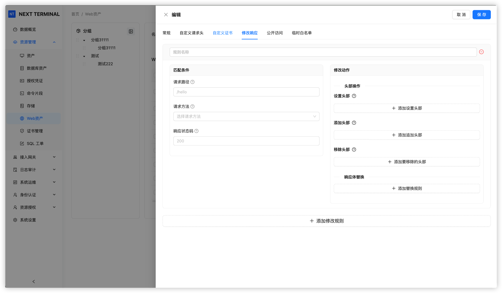
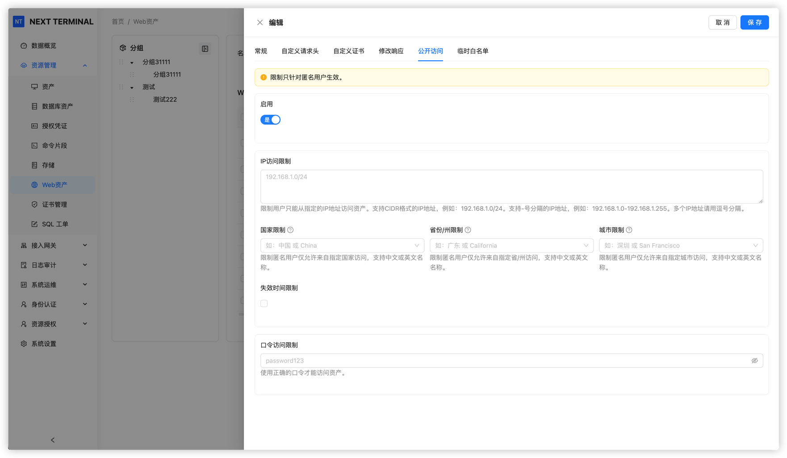
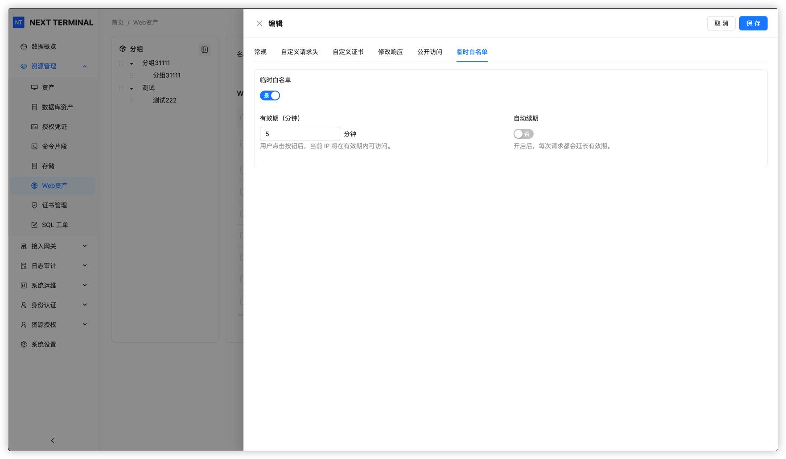
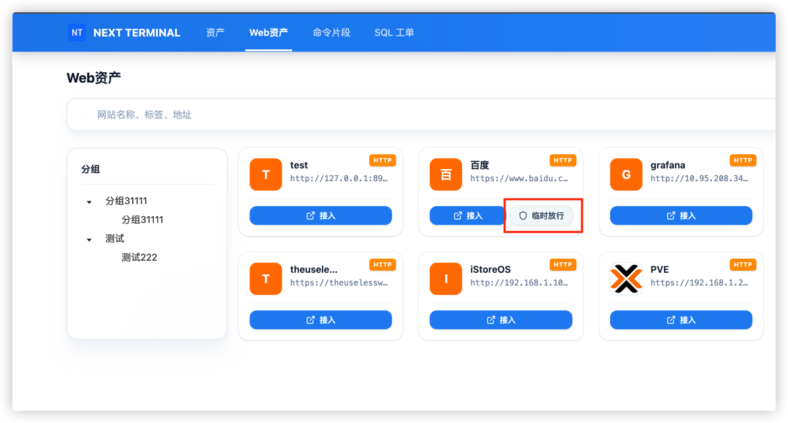

# Web Assets

A Web Asset attaches an internal or restricted website to NextTerminal. Instead of hitting the target website directly, users go to NextTerminal's reverse proxy entry point. NextTerminal performs login and authorization checks, then forwards the request to the real site.

Typical flow:

```text
User browser
  → opens https://gitlab.example.com
  → DNS points to the NextTerminal server
  → NextTerminal verifies login and Web asset authorization
  → forwards to internal site http://192.168.1.10:80
```

## Two Addresses People Confuse

| Name | Example | Meaning |
| --- | --- | --- |
| **Web asset domain** | `gitlab.example.com` | The domain users type in the browser. **Must resolve to the NextTerminal server**, not the internal site itself. |
| **Asset address (Asset IP + port)** | `192.168.1.10:80` | The address NextTerminal actually forwards to on the backend. |

::: warning
The "Domain" field on a Web asset is the reverse proxy entry domain — not the internal site's real address.
This is the single most common mistake when creating a Web asset.
:::

## Built-in Reverse Proxy vs External Reverse Proxy

In this guide, "reverse proxy" refers to **NextTerminal's built-in Web asset reverse proxy** — it accepts requests for `gitlab.example.com`, `wiki.example.com`, etc., and forwards them to the corresponding internal site.

That is **not** the same thing as an external reverse proxy like Nginx, a CDN, or a load balancer:

| Type | Path | Purpose |
| --- | --- | --- |
| Built-in reverse proxy | User → NextTerminal → Internal site | Web asset access control |
| External reverse proxy | User → Nginx / CDN / Load balancer → NextTerminal | Unified entry point, TLS termination, load balancing for NextTerminal itself |

If your path is just **User → NextTerminal → Internal site**, the configuration in this guide is enough.

If it is **User → Nginx / CDN / Load balancer → NextTerminal → Internal site**, also read [Get the Real Client IP](../install/real-ip), or access logs and IP-based controls will show the wrong IP.

## When to Use Web Assets

### Restrict access to a public-IP website

Your site has a public IP but should not be open to everyone. Configure the target site to **only allow the NextTerminal server's IP**, then attach it as a Web asset. Users must log into NextTerminal and have authorization before they can reach it.

### Unified access across multiple clouds or networks

Internal sites are scattered across multiple clouds, regions, or isolated networks. Deploy a Security Gateway in each network and register them with NextTerminal. When creating a Web asset, pick the matching gateway — every internal site becomes reachable from a single entry.

### Access services in isolated zones

In government clouds, dedicated networks, or air-gapped zones, internal servers can't be exposed to the public internet. Deploy a Security Gateway on a jump host that can reach the internal site, and use NextTerminal as the unified entry point for SSH/Web access with full auditing.

## Prerequisites

- NextTerminal is deployed and the admin UI is reachable.
- You own a domain whose **DNS records you can edit**.
- The target website is up and running.
- The NextTerminal server (or the Security Gateway you'll select) can reach the target website.
- Port `80` and/or `443` on the NextTerminal server is reachable by users.

## Video Tutorial

<div style="position: relative; padding-bottom: 56.25%; height: 0; overflow: hidden; max-width: 100%; height: auto; margin-bottom: 1.5rem;">
    <iframe src="//player.bilibili.com/player.html?isOutside=true&aid=115360288214738&bvid=BV1vb4uzBEea&cid=33014547884&p=1" scrolling="no" border="0" frameborder="no" framespacing="0" allowfullscreen="true" style="position: absolute; top: 0; left: 0; width: 100%; height: 100%;"></iframe>
</div>

## 5-Minute Minimal Working Example

This walkthrough exposes an internal GitLab through `gitlab.example.com`. Once finished, opening `https://gitlab.example.com` will require a NextTerminal login before reaching GitLab.

### Example Environment

| Item | Value |
| --- | --- |
| NextTerminal server public IP | `1.2.3.4` |
| NextTerminal admin domain | `nt.example.com` |
| Web asset domain | `gitlab.example.com` |
| Internal GitLab address | `http://192.168.1.10:80` |

### 1. Configure DNS

Add the following records at your DNS provider:

| Host | Type | Value |
| --- | --- | --- |
| `nt` | A | `1.2.3.4` |
| `gitlab` | A | `1.2.3.4` |

So that:

```text
nt.example.com      → 1.2.3.4
gitlab.example.com  → 1.2.3.4
```

::: tip Wildcard DNS
For many Web assets, set a wildcard record like `*.example.com → 1.2.3.4`. New assets such as `wiki.example.com` or `jenkins.example.com` will work without any further DNS change.
:::

### 2. Enable the Reverse Proxy in `config.yaml`

Open `config.yaml` and add or edit `ReverseProxy` under `App`:

```yaml
App:
  ReverseProxy:
    Enabled: true
    HttpEnabled: true
    HttpAddr: ":80"
    HttpRedirectToHttps: true
    HttpsEnabled: true
    HttpsAddr: ":443"
    SelfProxyEnabled: true
    SelfDomain: "nt.example.com"
    Root: ""
    IpExtractor: "direct"
    IpTrustList: []
```

Field reference:

| Field | Example | Meaning |
| --- | --- | --- |
| `Enabled` | `true` | Enable the Web asset reverse proxy |
| `HttpEnabled` | `true` | Enable the HTTP listener |
| `HttpAddr` | `":80"` | HTTP listen address |
| `HttpRedirectToHttps` | `true` | Force HTTP requests to redirect to HTTPS |
| `HttpsEnabled` | `true` | Enable the HTTPS listener |
| `HttpsAddr` | `":443"` | HTTPS listen address |
| `SelfProxyEnabled` | `true` | Serve the NextTerminal admin UI through the reverse proxy domain too |
| `SelfDomain` | `nt.example.com` | NextTerminal admin domain |
| `Root` | `""` | Leave empty when `SelfProxyEnabled: true` |
| `IpExtractor` | `direct` | Default; see [Get the Real Client IP](../install/real-ip) |
| `IpTrustList` | `[]` | Empty means use the built-in private-range trust list |

::: tip Real client IP
If NextTerminal sits behind Nginx, a CDN, a WAF, or a load balancer, `direct` will record the proxy IP in your access logs. See [Get the Real Client IP](../install/real-ip) for the correct values.
:::

### 3. Configure the HTTPS Certificate

With `HttpsEnabled: true`, the built-in reverse proxy needs a certificate to terminate `https://gitlab.example.com` and `https://nt.example.com`. Certificates are managed in the admin UI:

Go to **Certificate Management** → **New Certificate**. Three certificate types are supported:

- **Self-signed**: for internal testing only; browsers will show a warning.
- **Imported**: upload a PEM certificate and private key you already have.
- **Auto-issued (ACME)**: request and renew automatically via Let's Encrypt or a similar ACME provider.

The Common Name (CN) must cover both `nt.example.com` and `gitlab.example.com`, or use a wildcard certificate such as `*.example.com`.

### 4. Map Ports 80 / 443

When deploying with Docker Compose, map the reverse proxy ports in `docker-compose.yml`:

```yaml
services:
  next-terminal:
    ports:
      - "8088:8088" # NextTerminal admin UI
      - "2022:2022" # SSH Server (optional)
      - "80:80"     # Web asset HTTP reverse proxy
      - "443:443"   # Web asset HTTPS reverse proxy
```

Restart:

```shell
docker compose down
docker compose up -d
```

### 5. Add a Web Asset

In the admin UI, create a new Web asset.


Fill in:

| Field | Example | Notes |
| --- | --- | --- |
| Name | `Internal GitLab` | Display name |
| Domain | `gitlab.example.com` | The domain users type; must resolve to the NextTerminal server |
| Entry Path | `/` | Default path, usually `/` or empty |
| Protocol | `HTTP` | Protocol of the internal site itself |
| Asset IP | `192.168.1.10` | Internal IP, or an internal hostname NextTerminal can resolve |
| Asset Port | `80` | Internal site port |
| Security Gateway | none | Only pick a gateway if NextTerminal can't reach the internal site directly |

::: warning
- The Web asset domain must be **unique**. It cannot collide with `SelfDomain` or another Web asset.
- For example, `nt.example.com` is the admin domain and `gitlab.example.com` is the GitLab Web asset — **don't swap them**.
:::

### 6. Authorize and Open

Grant access to the new Web asset for users or user groups.

After authorization, users open:

```text
https://gitlab.example.com
```

Unauthenticated users are redirected to the NextTerminal login page. After login and authorization checks, the request is forwarded to the internal GitLab.

## SelfProxyEnabled, SelfDomain, and Root Explained

These three fields decide **where unauthenticated users are redirected to log in** when they hit a protected Web asset.


### Recommended: SelfProxyEnabled = true

```yaml
App:
  ReverseProxy:
    SelfProxyEnabled: true
    SelfDomain: "nt.example.com"
    Root: ""
```

The NextTerminal admin UI is served through the built-in reverse proxy too. Unauthenticated Web asset visitors are redirected to `https://nt.example.com` to sign in.

Best for:

- You already have a domain for NextTerminal.
- You want the admin UI and Web assets to share a unified domain entry.
- You want a clean, consistent login redirect flow.

::: tip Real IP note
With `SelfProxyEnabled: true`, admin UI requests pass through the built-in reverse proxy before reaching the admin handler. If the **admin** login log or audit shows `127.0.0.1` or a container gateway address, see [Get the Real Client IP — Scenario 2](../install/real-ip#scenario-2-selfproxyenabled-only-no-external-proxy).
:::

### Alternative: SelfProxyEnabled = false

```yaml
App:
  ReverseProxy:
    SelfProxyEnabled: false
    SelfDomain: ""
    Root: "https://1.2.3.4:8088"
```

The admin UI keeps using the address from `Root`. Unauthenticated Web asset visitors are redirected there to sign in.

Best for:

- No domain assigned to NextTerminal yet.
- You still want to access the admin UI via IP:port.

## Use a Security Gateway for Internal Sites

When the NextTerminal server itself can't reach the target website (different cloud, different region, isolated network), use a Security Gateway.

Path:

```text
User browser
  → NextTerminal
  → Security Gateway
  → Internal site
```

Steps:

1. Deploy a Security Gateway in a network that can reach the internal site.
2. Make sure the gateway is registered with NextTerminal and online.
3. When creating the Web asset, pick that gateway in the **Security Gateway** field.
4. Fill in **Asset IP** and **Asset Port** with the internal address that's reachable **from the gateway's network**.

For example, an internal site only reachable via the gateway at `10.10.0.20:8080`:

| Field | Value |
| --- | --- |
| Protocol | `HTTP` |
| Asset IP | `10.10.0.20` |
| Asset Port | `8080` |
| Security Gateway | the matching gateway |

## Advanced Features

### Modify Response

Some sites hard-code their original domain, IP, or paths in HTML, API responses, or redirects. Going through a reverse proxy then breaks styles, breaks API calls, or redirects the user to an internal address.



Common uses:

- Replace `http://192.168.1.10` with `https://gitlab.example.com` in pages.
- Replace internal hostnames with the Web asset domain in API responses.
- Fix hard-coded redirect locations.

### Public Access Policy

For Web assets that genuinely need public access but shouldn't be wide open, the Public Access policy combines IP, geolocation, and passphrase rules to limit reach.



### Temporary Allowlist

For users without a fixed IP, the Temporary Allowlist exposes a one-click link from the Web asset's **Public Access** page. Clicking it adds the user's current IP to the allowlist, the entry expires automatically, and continued use extends its validity.





## FAQ

### The Web asset domain doesn't respond at all

Check, in order:

- The Web asset domain resolves to the NextTerminal server's public IP.
- The server's security group / firewall allows `80` / `443`.
- Docker Compose maps `80:80` and `443:443`.
- `ReverseProxy.Enabled` is `true` in `config.yaml`.
- `HttpEnabled` or `HttpsEnabled` is on.
- NextTerminal was restarted after editing `config.yaml`.

### I land on the wrong site

Usually a domain or DNS mistake:

- `SelfDomain` is for the admin UI only (e.g. `nt.example.com`).
- A Web asset domain is for that specific asset (e.g. `gitlab.example.com`).
- The Web asset domain must not collide with `SelfDomain`.
- Two Web assets can't share the same domain.

### Browser shows a certificate warning

Make sure **Certificate Management** has a certificate that covers the Web asset domain. Self-signed certificates always trigger warnings — use Let's Encrypt or a real CA in production.

### "Permission denied" after login

Make sure the user or group is authorized to access this Web asset.

### The page loads but styles, APIs, or redirects break

The target site likely hard-codes internal addresses or absolute URLs. Check failing requests in browser DevTools, then use [Modify Response](#modify-response) to rewrite the offending content.

### NextTerminal can't reach the internal site

Confirm the NextTerminal server can hit the target IP and port (e.g. `curl http://192.168.1.10:80`). If not, deploy and select a [Security Gateway](#use-a-security-gateway-for-internal-sites).

### Wrong client IP in Web asset access logs

If anything (Nginx, CDN, WAF, load balancer) sits in front of NextTerminal, configure `IpExtractor` and `IpTrustList` in `config.yaml` according to [Get the Real Client IP](../install/real-ip).

### Wrong IP in admin login logs

Admin client IP **is not configured in `config.yaml`**. Configure it under **System Settings → Network Settings**. See [Get the Real Client IP](../install/real-ip).
