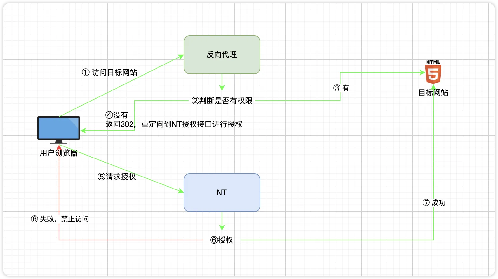

# Web 资产

Web 资产功能旨在为您提供一种安全的方式来保护内部网站。相较于将网站直接暴露于公网，此功能具有两大显著优势：

1.  **强化认证**：用户必须先登录 NextTerminal，然后才能访问目标网站，为您的网站安全增添一层额外保障。
2.  **精准授权**：您可以将网站的访问权限精确授予指定用户，确保只有授权人员才能访问，从而实现对访问范围的有效控制。

## 适用场景

### 场景一：限制公网 IP 网站的访问

-   **问题**：您的网站拥有公网 IP，但您不希望任何人都能随意访问。同时，由于用户使用动态 IP 地址，您无法通过传统的 IP 白名单进行访问控制。
-   **方案**：将目标网站配置为仅允许来自 NextTerminal 服务器的 IP 访问。然后，通过 NextTerminal 代理该网站，并将访问权限授予指定用户。您还可以结合 LDAP/OIDC 进行统一身份管理。

### 场景二：统一访问多云环境下的内网系统

-   **问题**：您的内网网站分布在多个云或数据中心，您担心将其暴露在公网会带来安全风险。
-   **方案**：在您的内网中部署安全网关并注册到 NextTerminal。通过 NextTerminal 代理网站，并为其选择对应的内网安全网关。最后，将访问权限授予指定用户，实现从统一入口安全访问。

### 场景三：访问互联网隔离区的内部服务

-   **问题**：在政务云等特殊网络环境中，内网服务器沒有互联网访问权限，通常需要通过跳板机进行管理和运维，操作不便且难以审计。
-   **方案**：在可访问内网的跳板机上部署安全网关，通过 NextTerminal 统一访问内网的 SSH、Web 等服务，实现便捷、安全且可审计的管理。

## 前提条件

- 您已成功部署 NextTerminal。
- 您拥有一个域名，并可以配置 DNS 解析。
- 您准备要代理的内部网站已正常运行。

## 配置指南

### 视频教程

<div style="position: relative; padding-bottom: 56.25%; height: 0; overflow: hidden; max-width: 100%; height: auto; margin-bottom: 1.5rem;">
    <iframe src="//player.bilibili.com/player.html?isOutside=true&aid=115360288214738&bvid=BV1vb4uzBEea&cid=33014547884&p=1" scrolling="no" border="0" frameborder="no" framespacing="0" allowfullscreen="true" style="position: absolute; top: 0; left: 0; width: 100%; height: 100%;"></iframe>
</div>

整个配置过程分为两大步：

1.  **启用并配置 NextTerminal 的反向代理服务。**
2.  **添加您想要通过 NextTerminal 访问的网站资产。**

---

### 步骤一：启用反向代理服务

此步骤在 NextTerminal 的服务器上完成，用于开启反向代理功能。

#### 1. 修改配置文件 `config.yaml`

打开 `config.yaml` 文件，在 `App` 部分下添加 `ReverseProxy` 配置块。

```yaml
App:
  # ... (此处省略其他配置)
  ReverseProxy: # [!code ++]
    Enabled: true # 启用反向代理功能 [!code ++]
    HttpEnabled: true # 监听 HTTP (80端口) [!code ++]
    HttpAddr: ":80" # [!code ++]
    HttpRedirectToHttps: false  # [!code ++]
    HttpsEnabled: true # 监听 HTTPS (443端口) [!code ++]
    HttpsAddr: ":443" # [!code ++]
    SelfProxyEnabled: true # [!code ++]
    SelfDomain: "nt.yourdomain.com" # [!code ++]
    Root: "" # [!code ++]
    IpExtractor: "direct" # [!code ++]
    IpTrustList: # [!code ++]
      - "0.0.0.0/0" # [!code ++]
```

**关键配置说明**

`SelfProxyEnabled`、`SelfDomain` 和 `Root` 是本功能的核心配置，它决定了当用户访问一个需要授权的网站时，浏览器如何正确地跳转到 NextTerminal 的登录页面。

-   **推荐方式 (`SelfProxyEnabled: true`)**
    -   **设置**：将 `SelfProxyEnabled` 设为 `true`，并配置 `SelfDomain` 为您计划访问 NextTerminal 的域名（例如 `nt.yourdomain.com`）。
    -   **效果**：您将通过这个域名来访问 NextTerminal 的 Web 界面。
    -   **优势**：配置简单，认证流程统一。当用户访问受保护的网站但未登录时，系统会自动跳转到 `https://nt.yourdomain.com` 进行登录，体验顺畅。

-   **备用方式 (`SelfProxyEnabled: false`)**
    -   **设置**：将 `SelfProxyEnabled` 设为 `false`，并配置 `Root` 为您 NextTerminal 的访问地址（例如 `https://1.2.3.4:8088`）。
    -   **效果**：您继续通过 IP 和端口访问 NextTerminal。
    -   **用途**：当您不想为 NextTerminal 本身配置域名时使用。`Root` 参数确保了在需要认证时，系统能生成正确的跳转链接。

**授权流程**

无论您选择哪种方式，最终目的都是为了实现下图所示的授权流程。当用户访问受保护的 Web 资产时，反向代理会先检查用户的登录和授权状态。如果验证失败，系统将根据您的配置，将用户重定向到正确的登录页面（第 4 步）。



#### 2. 开放端口（Docker Compose）

如果您使用 Docker Compose 部署，请修改 `docker-compose.yml` 文件，将反向代理需要监听的 80 和 443 端口映射出来。

```yaml
# ... (在 docker-compose.yml 文件中)
services:
  # ...
  next-terminal:
    # ... (其他配置)
    ports:
      - "8088:8088" # Web管理界面
      - "2022:2022" # SSH Server 端口 (可选)
      - "80:80"     # [!code ++]
      - "443:443"   # [!code ++]
    # ... (其他配置)
```

#### 3. 重启服务

保存以上修改后，请重启 NextTerminal 以使配置生效。

使用 Docker Compose 的用户，请执行以下命令：

```shell
docker compose down
docker compose up -d
```

---

### 步骤二：添加并访问 Web 资产

反向代理服务启动后，现在您可以添加希望保护的内部网站了。

#### 1. 配置 DNS 解析

将您计划用于访问内部网站的域名，解析到 NextTerminal 服务器的公网 IP。

例如，您要代理内部的 GitLab (`192.168.1.10`)，可以将域名 `gitlab.yourdomain.com` 解析到您的 NextTerminal 服务器。

::: tip 技巧
如果您的网站资产较多，可以配置泛域名解析（例如 `*.yourdomain.com`），这样未来新增网站时就无需再调整 DNS 设置了。
:::

#### 2. 在 NextTerminal 中添加资产

进入 NextTerminal 界面，添加一个新的 Web 资产。


**字段填写说明：**

-   **名称**：资产的别名，方便识别（例如 `内部GitLab`）。
-   **域名**：**用户在浏览器中访问的域名**（例如 `gitlab.yourdomain.com`）。
    ::: warning 重要提示
    此域名必须是唯一的，不能和 NextTerminal 自身（`SelfDomain`）或其他 Web 资产的域名重复。反向代理依赖此域名来区分请求。
    :::
-   **入口路径**：网站的默认路径，通常为 `/` 或留空。
-   **资产协议**：您内部网站所使用的协议，即 `HTTP` 或 `HTTPS`。
-   **资产 IP**：您内部网站的 IP 地址或内部域名（例如 `192.168.1.10`）。
-   **资产端口**：您内部网站的端口（例如 `80`）。
-   **安全网关**：如果您的内部网站无法被 NextTerminal 服务器直接访问（例如位于不同的内网），请在此处选择对应的安全网关。

#### 3. 授权与访问

1.  为用户或用户组**授权**访问您刚刚创建的 Web 资产。
2.  授权后，用户就可以在浏览器中直接输入您配置的域名（例如 `gitlab.yourdomain.com`）来访问内部网站了。NextTerminal 会自动处理登录和权限验证。


## 高级功能

某些网站返回了固定的链接地址，可以使用「修改响应」功能来修改内容。


对于某些需要公网访问的网站，我们提供了多种方式来减少暴露范围，如 IP 地址、地理位置、口令。


针对没有固定 IP 的客户端，我们提供了临时白名单功能，配置后只需要点击一次就可以临时添加 IP 地址，过期自动失效，持续访问会自动延长有效期。


