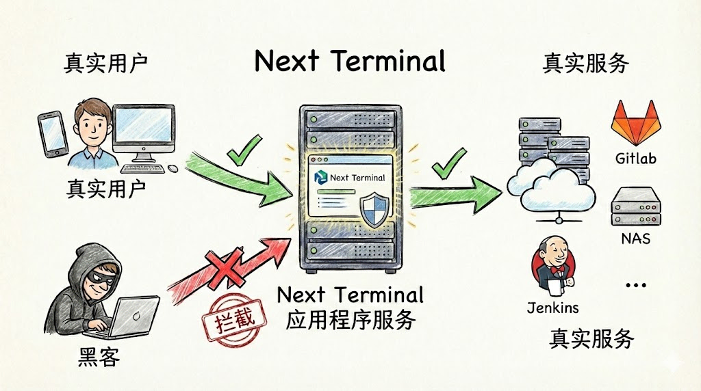

# 别再裸奔了：如何优雅且安全地暴露内网服务？

## 1. 现状：你的内网服务在公网“裸奔”吗？

如果你手里有几台云服务器或家里的 NAS，大概率折腾过内网穿透。但你去翻翻 `auth.log` 或者 SSH 日志，你会发现世界充满了“恶意”：

* **frp 转发 22 端口：** 刚开几分钟，就有成千上万个 IP 开始暴力破解。
* **Web 服务直出：** 暴露个 GitLab 或 Jenkins，只要有个未授权访问漏洞，全家桶就都没了。
* **VPN 的痛苦：** WireGuard 确实快，但给非技术同事开账号、教他们配客户端，简直是运维噩梦。

我们需要的其实很简单：**既要 frp 的便捷，又要 VPN 的安全，最好还能像访问正常网站一样，浏览器打开就能用。**

## 2. 为什么说传统方案让你很累？

### frp：它是通道，但不是防线

frp 的设计初衷是“连通性”，它只管把流量从 A 传到 B。

* **隐患：** 它把内网服务直接推到了公网的枪口下。改端口、加 `sk` 验证确实能挡住一部分，但无法解决**身份鉴权**和**审计**的问题。
* **现状：** 即使你改了端口，扫描器通过协议指纹依然能识别出你的服务。

### VPN：安全，但“摩擦力”太大

VPN 是一道厚重的围墙，但进出这道墙太麻烦了。

* **体验：** 手机、平板、电脑，每个设备都要装客户端。断线重连、路由冲突是常态。
* **风险：** 典型的“一处破，处处破”。一旦 VPN 账号泄露，攻击者就拿到了内网的整张入场券。

## 3. 更现代的方案：Next Terminal 的零信任实践

作为 Next Terminal 的开发者，我在设计 Web 资产代理时，参考了 **“零信任（Zero Trust）”** 的思路。

核心逻辑只有一句话：**先验证身份，再建立连接。**



### 它是如何工作的？

以往你访问 `gitlab.example.com`，请求是直接打到 GitLab 上的。现在，Next Terminal 充当了“安全网关”的角色：

1. **流量拦截**：所有指向内网 Web 服务的请求，先经过 Next Terminal。
2. **身份核验**：如果用户没登录 Next Terminal，直接被拦在门外，GitLab 根本感知不到任何请求。
3. **动态授权**：登录后，系统会检查：你是否有权限访问这个特定资产？
4. **无感转发**：验证通过后，你才能看到熟悉的 GitLab 界面。

## 4. 实战：3 分钟安全发布内网 GitLab

假设你内网 GitLab 跑在 `192.168.1.10:80`，你可以彻底告别 `6000` 这种奇怪的端口号。

### 第一步：开启反代

在 Next Terminal 配置文件中开启反代和 HTTPS（建议配合通配符证书）：

```yaml
App:
  ReverseProxy:
    Enabled: true
    HttpsEnabled: true
    SelfDomain: "nt.yourdomain.com"

```

### 第二步：添加 Web 资产

在 Web 界面点击“添加资产”，填写内部 IP 和你想要的域名（如 `gitlab.yourdomain.com`）。

### 第三步：授权与访问

把这个资产授权给指定的用户组。

**现在的体验是：** 你直接访问 `https://gitlab.yourdomain.com`。

* **没登录？** 跳转到 NT 统一登录页。
* **登录了？** 直接进入 GitLab。
* **想看谁访问了？** 后台审计日志一清二楚。

> **在线演示：** [https://baidu.typesafe.cn](https://baidu.typesafe.cn)
> *（注：此域名模拟内网环境，登录 test/test 后即可自动跳转，感受无感代理的流程）*

## 5. 进阶：多云、多机房的统一网关

如果你有多个机房（阿里云、腾讯云、家里、公司），传统的方案需要配置复杂的路由隧道。

**Next Terminal 提供了一个“安全网关（Agent）”模式：**

1. 在各个内网环境跑一个轻量级 Agent。
2. Agent 会自动建立反向隧道回到 NT 主站。
3. 你在主站配置资产时，选一下“所属网关”。

这样，无论服务在哪，你都只需要通过一个入口访问，而且**不需要在路由器上做任何端口映射**。

## 总结

| 需求 | frp | VPN | Next Terminal |
| --- | --- | --- | --- |
| **访问门槛** | 极低 (扫端口即入) | 高 (需客户端) | **极低 (浏览器即用)** |
| **安全性** | 弱 | 强 | **极强 (身份认证前置)** |
| **权限控制** | 无 | 粗粒度 (内网全通) | **精细 (按人/按资产授权)** |
| **管理成本** | 分散 | 复杂 | **统一控制台** |

如果你已经厌倦了每天看 SSH 被爆破的日志，或者不想再为 VPN 掉线发愁，欢迎尝试 **Next Terminal**。