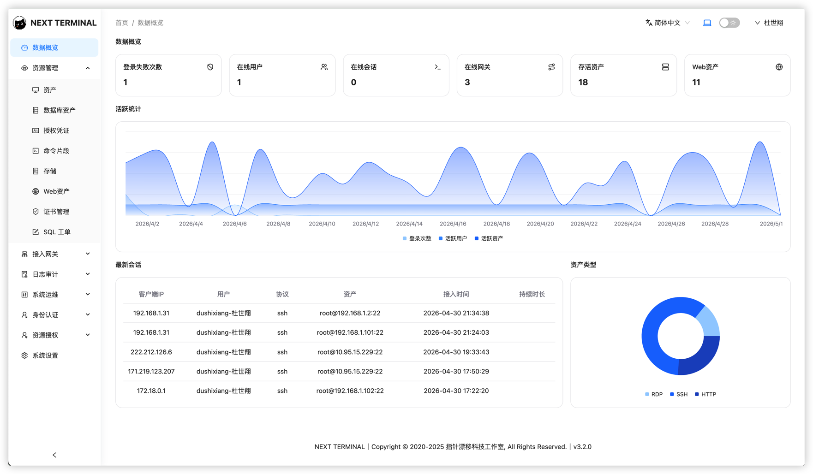
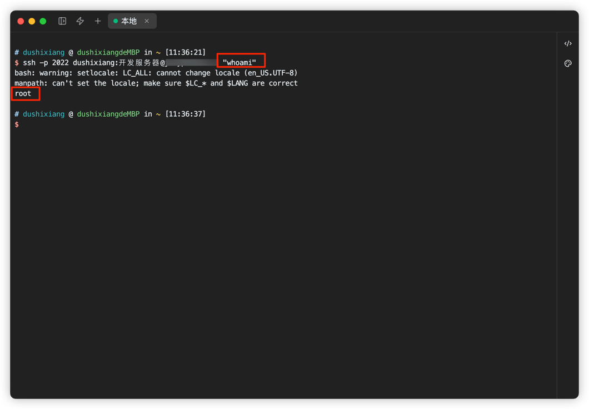
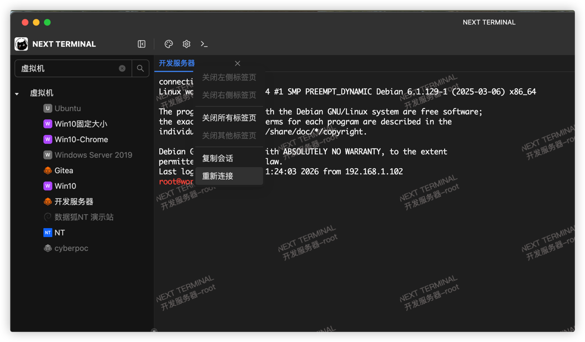
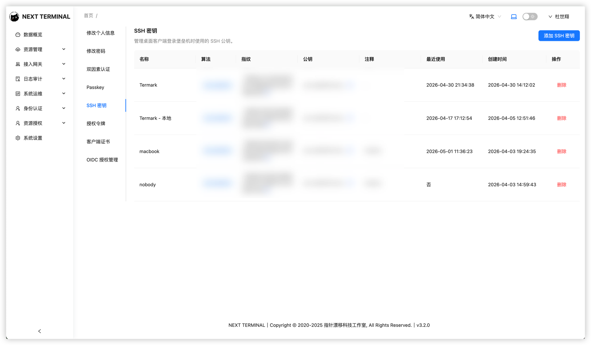
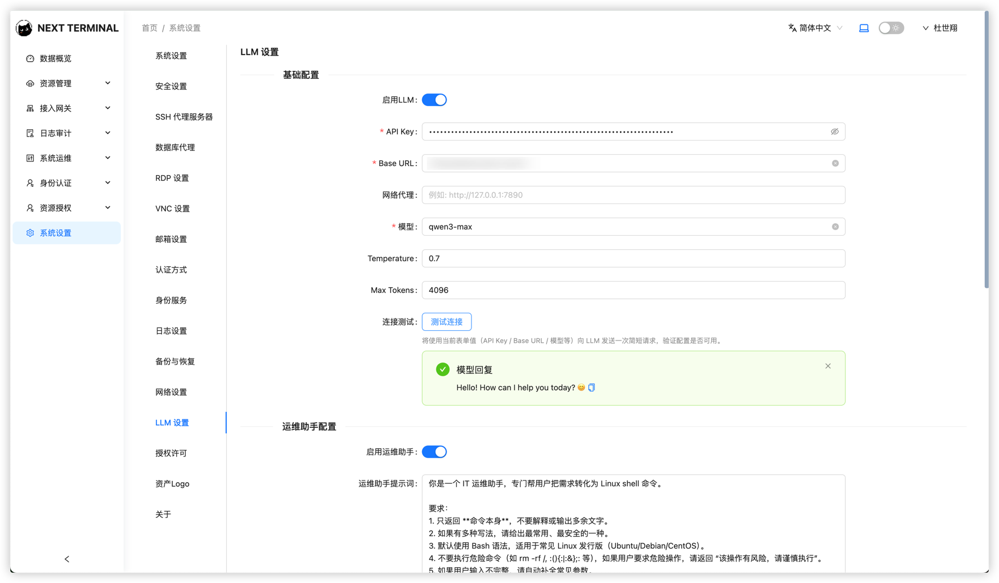
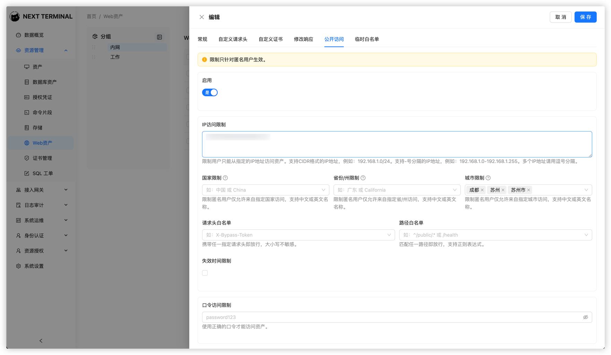
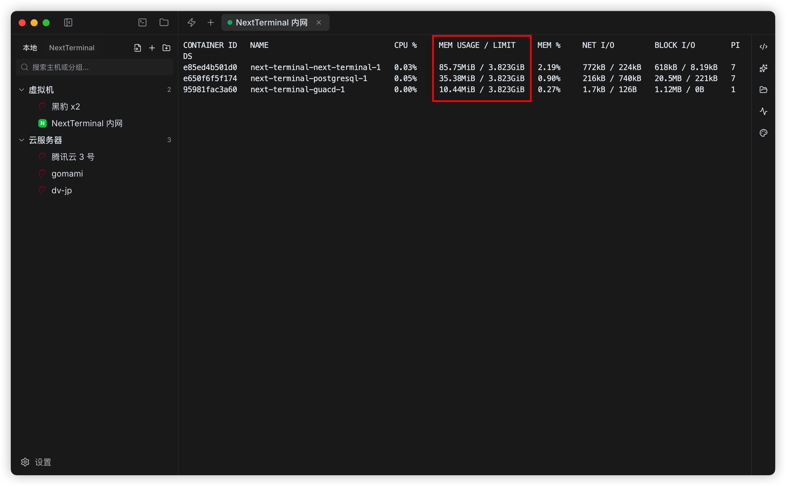
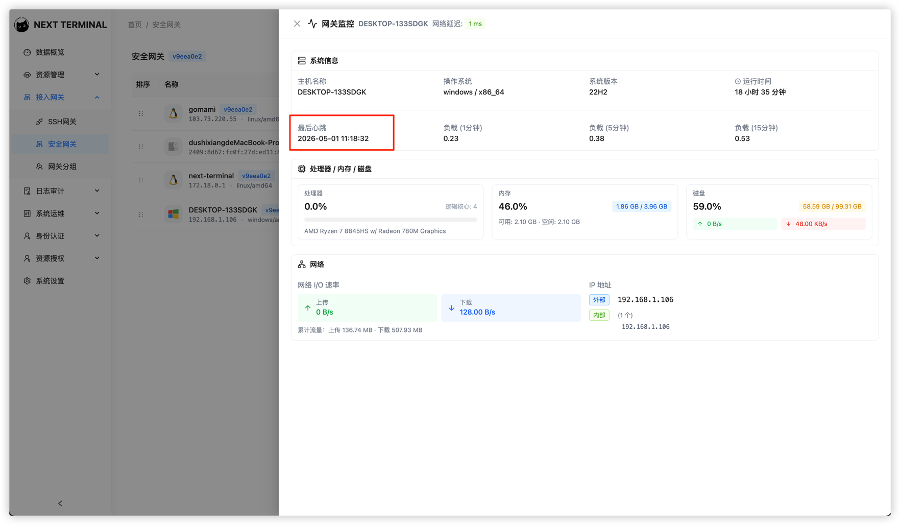
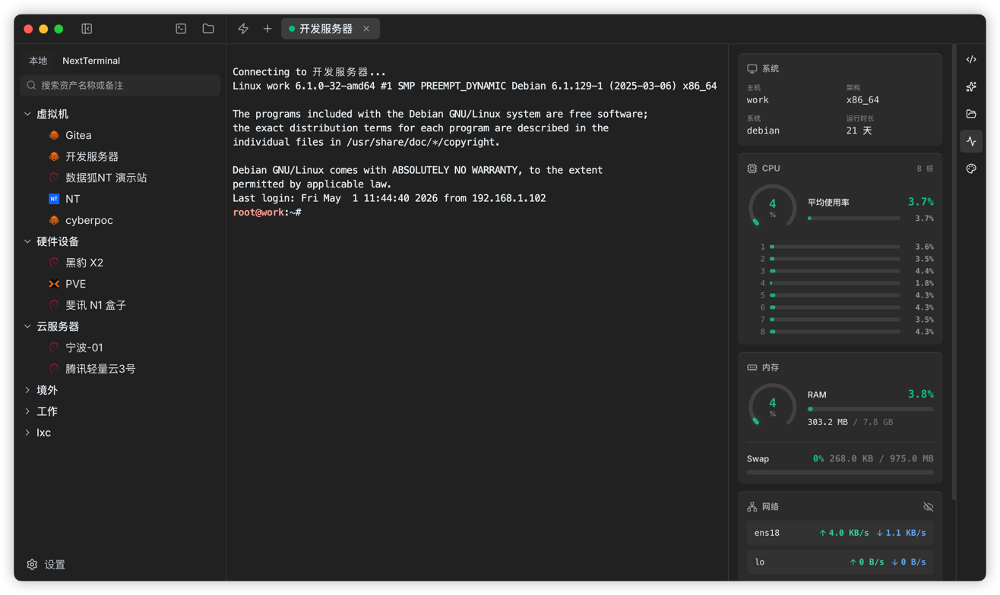

# Next Terminal v3.2.0 发布：更安全的认证，更顺手的终端体验

亲爱的用户，

Next Terminal v3.2.0 已经发布。

这个版本没有只堆叠功能点，而是继续围绕几个长期方向推进：**连接更安全、代理能力更完整、终端操作更顺手、访问控制更精细**。

如果你正在用 Next Terminal 管理 SSH、Telnet、数据库、Web 资产或安全网关，v3.2.0 会在日常使用中带来不少直接可感知的变化。



## 1. 更灵活：mTLS 客户端证书认证支持多种校验模式

在之前的版本中，Next Terminal 已经支持 HTTPS 双向认证（mTLS），可以为用户生成独立客户端证书，用来提升 Web 资产反向代理场景下的访问安全性。

v3.2.0 对 mTLS 的客户端证书校验策略做了进一步补充，在反向代理配置中新增 `MTLSClientCertAuthMode`，支持两种认证模式：

- `strict`：校验客户端证书指纹和证书有效期
- `ca_only`：只校验证书是否由同一个 CA 签发

简单来说，`strict` 更适合对访问身份要求非常明确的场景。它会检查客户端证书指纹，确保访问请求使用的是系统认可的那张证书。

`ca_only` 则更适合已经有统一证书签发体系的环境。只要客户端证书来自同一个受信任 CA，就可以通过 mTLS 校验，不再强绑定某一张具体证书的指纹。

这让 mTLS 在不同团队里的落地方式更灵活：

- 小团队可以继续使用更严格的证书指纹校验
- 企业内部如果已经有 CA 体系，可以使用 `ca_only` 降低证书维护成本
- 对外暴露的 Web 资产，可以在进入业务认证之前先完成一层 TLS 客户端证书校验

配置示例：

```yaml
ReverseProxy:
  MTLSClientCertAuthMode: "strict"
```

## 2. 更完整：SSH 代理服务器支持远程命令执行

很多用户使用 SSH 代理服务器，并不是只为了打开一个交互式终端。

实际运维中，我们经常会遇到这类需求：

- 通过 SSH 执行一条远程命令
- 在脚本里批量查询服务器状态
- 使用自动化工具通过 SSH 代理访问目标资产
- 执行一次性任务，而不是进入完整交互式会话

v3.2.0 中，SSH 代理服务器新增了 **远程命令执行** 支持。

这让 SSH 代理更接近标准 SSH 使用习惯，不再局限于“打开终端窗口”这一种模式。对于已经把 Next Terminal 作为统一 SSH 入口的团队来说，这个能力会让自动化场景更自然。

同时，本次更新还修复了 **SSH 代理服务器未转发环境变量** 的问题。对于依赖环境变量的命令、脚本或自动化工具来说，这个修复也会减少一些难以定位的异常行为。



## 3. 更顺手：终端体验继续优化

终端是 Next Terminal 里使用频率最高的功能之一，所以这个版本也继续优化了一些高频细节。

### macOS Option 键可作为 Meta 键

对于 macOS 用户来说，Option 键在终端里的行为经常影响编辑效率。

v3.2.0 支持将 **macOS Option 键作为 Meta 键**。如果你习惯在终端中使用 Meta 组合键进行光标移动、编辑或快捷操作，这个改动会让浏览器终端更接近本地终端体验。

### 终端标签支持固定宽度

当同时打开多个会话时，标签宽度如果跟着标题变化，会让界面不够稳定。

本次更新新增了 **终端标签固定宽度** 支持。多会话切换时，标签栏会更整齐，定位会话也更轻松。

### 右键菜单支持复制会话

终端标签右键菜单新增 **复制会话**。

当你需要快速打开一个相同上下文的新会话时，不必重新从资产树里查找、连接、输入参数。直接复制当前会话，就能继续处理并行任务。

### 资产树支持横向滚动

对于名称较长、层级较深的资产树，横向空间一直是一个细节问题。

v3.2.0 中，终端资产树支持 **横向滚动**。长名称、深分组、复杂路径会更容易查看，不需要再依赖猜测或反复调整窗口。



## 4. 更清晰：用户公钥拆分为独立设置页面

用户公钥现在拆分为独立设置页面。

这看起来是一个界面组织调整，但对长期使用来说很重要。

公钥是连接资产和身份认证里的关键配置。如果它混在其他用户信息里，配置入口不够明显，后续维护也容易混乱。拆成独立页面之后，用户可以更清楚地管理自己的 SSH 公钥，管理员也更容易向用户说明配置路径。

这类调整的目标不是增加功能复杂度，而是让常用能力出现在更符合直觉的位置。



## 5. 更可控：资产树支持分组搜索

资产数量变多之后，只搜索资产本身还不够。

很多团队会按环境、项目、机房、客户或业务线来组织资产分组。此时你要找的未必是一台具体机器，而是某一组资产。

v3.2.0 中，资产树支持 **分组搜索**。

这会让资产定位更直接：

- 想找某个项目下的所有服务器，可以搜项目分组
- 想进入某个机房资产，可以搜机房名称
- 想按业务线筛选资产，也可以从分组入口快速定位

对于资产规模较大的用户，这个优化会明显减少在树形结构里展开、折叠、再展开的操作。

> 【配图占位 7：资产树分组搜索效果图】

## 6. 更可靠：大模型与数据库连接支持连通性测试

v3.2.0 为 **大模型连接** 和 **数据库连接** 增加了连通性测试。

连接类配置最怕的问题是：保存时看起来没问题，真正使用时才发现地址、端口、账号、密钥或网络策略配置错了。

有了连通性测试之后，配置阶段就可以及时发现问题：

- 数据库地址是否可达
- 账号密码是否正确
- 网络策略是否放行
- 大模型服务地址或密钥是否可用

这可以减少很多“配置保存成功，但功能不可用”的排查时间。



## 7. 更精细：Web 资产公开访问策略优化

本次版本中，Web 资产公开访问（PublicAccess）策略也做了重要优化。

新的策略支持从四个维度进行规则评估：

- IP
- GEO
- 请求头
- 路径

这使得公开访问不再只是简单的“开”或“关”，而是可以根据访问来源、地区、请求特征和 URL 路径做更细粒度的判断。

策略逻辑也更加明确：

- 四项规则均未配置时，默认允许访问
- 如果设置了 Password，由调用方负责校验
- 任意规则命中时，直接放行并跳过口令验证

举个例子，你可以让某些固定办公出口 IP 直接访问，也可以让特定路径开放给外部系统回调，还可以通过请求头识别来自可信系统的请求。

这类规则适合处理一些不完全需要登录态、但又不希望彻底裸露的 Web 资产访问场景。



## 8. 更轻量：服务端内存占用明显降低

在之前的版本中，为了方便分发安全网关，Next Terminal 会把多种平台和架构的二进制程序通过 embed 的方式打包进服务端程序。

这样做部署简单，但代价也很明显：服务端程序体积和运行时内存占用都会被拉高。在一些环境中，Next Terminal 服务端内存占用会超过 **200MB**。

v3.2.0 对这部分进行了拆分，不再把多平台、多架构的网关二进制直接 embed 到服务端程序中。

调整之后，Next Terminal 服务端内存占用降低到了约 **80MB**。

对于部署在小规格云服务器、虚拟机、NAS 或其他资源有限环境中的用户来说，这个变化会更直接。Next Terminal 服务端本身应该尽可能轻量、稳定，安全网关也应该作为独立组件按需分发和运行，而不是让所有平台的二进制都长期占用服务端资源。



此外，安全网关监控详情页新增了 **最后心跳时间**。

这可以帮助管理员更快判断网关当前状态：

- 网关是否仍然在线
- 最近一次心跳是什么时候
- 异常断开是刚发生，还是已经持续一段时间

在排查跨网络、跨机房访问问题时，这个时间点会非常有用。




## 9. 新 SSH 客户端：直接访问 Next Terminal SSH 资产

除了服务端能力的持续完善，我们也新开发了一款 SSH 客户端。

这款客户端面向更高频的本地 SSH 使用场景。功能介绍可以查看：[我做了一个更顺手的 SSH 终端管理工具：Termark](https://mp.weixin.qq.com/s/mmPuyLIJ_ZAWjGlsDdNdAQ)

它不仅可以作为独立 SSH 客户端使用，也支持对接 Next Terminal 服务端。连接成功后，可以在客户端中直接访问 Next Terminal 中已经纳管和授权的 SSH 资产。

这带来的体验变化很直接：

- 在 Next Terminal 中统一管理 SSH 资产和权限
- 在本地客户端中直接发起 SSH 连接
- 不需要在本地重复维护一份服务器清单
- 团队成员拿到授权后，就能在客户端里访问对应资产

对于习惯本地终端或本地 SSH 客户端的用户来说，这会让 Next Terminal 的资产管理能力和本地操作体验结合得更自然。



## 10. 其他体验优化

除了上面这些重点改动，v3.2.0 还包含了一批细节优化。

### 文件编辑器显示完整文件路径

文件编辑器现在支持展示 **完整文件路径**。

当多个目录下存在同名文件时，只看文件名很容易误判。显示完整路径后，可以更清楚地确认当前编辑的是哪个文件。

### 禁用添加资产时的自动填充行为

添加资产时，浏览器自动填充有时会把账号、密码或其他字段填到不该填的位置，反而造成误操作。

本次更新禁用了添加资产时的自动填充行为，让表单输入更可控。

### 访问日志长字段展示优化

访问日志里经常会出现很长的 URL、请求头或其他字段。字段过长时，如果没有处理好，会影响整个页面阅读。

v3.2.0 优化了访问日志字段过长导致的展示问题，让日志页面更稳定、更容易浏览。

### Web 资产 Logo 校验逻辑优化

Web 资产 Logo 校验逻辑也做了优化，减少因为 Logo 地址或格式问题带来的异常体验。

### Passkey 文案统一

Passkey 相关文案进行了统一，降低不同页面表述不一致带来的理解成本。

### SSH / Telnet 协议命令解析优化

SSH / Telnet 协议命令解析能力继续优化。对于审计、记录和后续分析来说，更准确的命令解析是基础能力。

## 11. 问题修复

v3.2.0 也修复了一些影响稳定性和一致性的问题：

- 修复管理员修改用户密码后，未更新“密码修改时间”的问题
- 修复 SSH 代理服务器未转发环境变量的问题
- 修复反向代理 HTTP 连接可能存在的资源泄露问题
- 修复模块启动失败影响后续模块初始化的问题，现在会仅记录错误日志，不再阻断后续模块启动

其中，反向代理 HTTP 连接资源泄露和模块初始化逻辑属于稳定性修复。它们不一定会在界面上直接体现，但会影响服务长期运行时的可靠性。

## 总结

Next Terminal v3.2.0 是一次偏实用的版本更新。

如果用一句话概括，就是：

**安全认证更强，代理能力更完整，终端操作更顺手，服务端更轻量，也开始补齐本地 SSH 客户端体验。**

对于个人用户来说，终端标签、复制会话、资产树搜索、连接测试以及新的 SSH 客户端，会让日常使用更舒服。

对于团队和企业用户来说，mTLS 客户端证书认证支持 `strict` / `ca_only` 两种校验模式、PublicAccess 策略优化、服务端内存占用从 200MB+ 降到约 80MB、安全网关最后心跳时间、SSH 代理远程命令执行，以及 SSH 客户端对接 Next Terminal 服务端等能力，会让 Next Terminal 更适合作为统一的安全运维入口。

欢迎升级体验 v3.2.0。

如果你在使用过程中遇到问题，或者有新的功能建议，也欢迎继续反馈。
