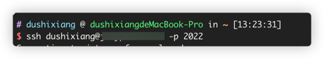
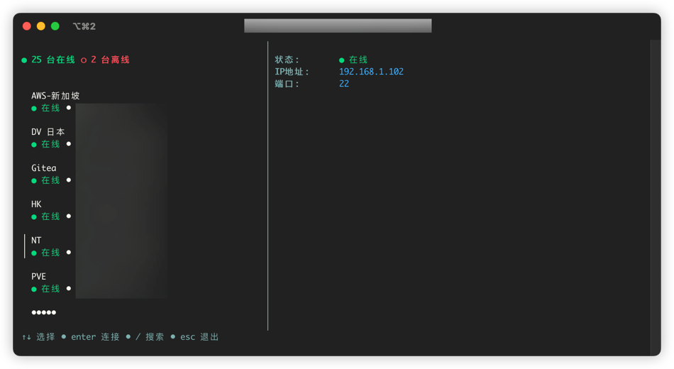
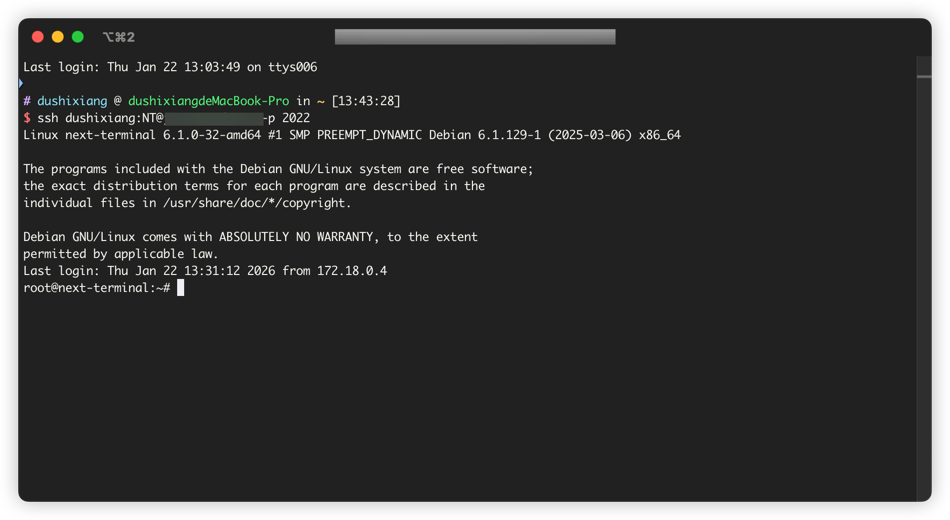
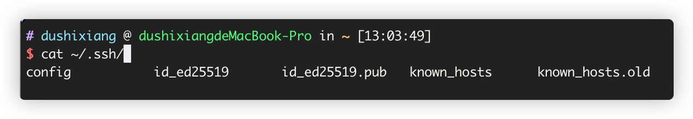

# SSH 代理服务器

SSH 代理服务器是 Next Terminal 提供的一个便捷功能,允许用户通过标准的 SSH 客户端连接到 Next Terminal,进而访问管理的各类资产。无需安装专用客户端,即可使用熟悉的 SSH 工具完成远程运维工作。

## 主要特性

- **标准 SSH 协议**: 完全兼容标准 SSH 客户端,无需额外工具
- **两种连接模式**: 支持交互式选择和直连模式
- **公钥认证**: 支持 SSH 公钥免密登录
- **统一入口**: 通过一个代理服务器访问所有资产
- **安全审计**: 所有连接记录均被审计追踪

## 使用方式

### 步骤 1: 在系统设置开启 SSH 代理服务器


在系统设置中找到 SSH 代理服务器配置项:
- **监听地址**: 设置 SSH 代理服务器监听的 IP 地址和端口,默认为 `0.0.0.0:2022`
- **认证私钥**: SSH Server 和 SSH 客户端认证过程中的必要参数,点击「生成私钥」按钮可自动生成

::: tip 提示
确保配置的端口没有被其他服务占用,并在防火墙中开放该端口。
:::

### 步骤 2: 使用 SSH 命令连接代理服务器

Next Terminal 的 SSH 代理服务器支持两种连接模式:

#### 方式一: 代理模式 (交互式选择)

使用标准 SSH 命令连接:

```bash
ssh username@host -p port
```

- `username`: Next Terminal 的用户名
- `host`: Next Terminal 服务器的地址
- `port`: SSH 代理服务器配置的端口 (默认 2022)

连接成功后会进入 Next Terminal 的交互式界面,可以通过菜单选择要访问的目标资产:




#### 方式二: 直连模式

如果已知要访问的资产名称,可以使用直连模式一步到位:

```bash
ssh username:asset-name@host -p port
```

- `username`: Next Terminal 的用户名
- `asset-name`: 目标资产的名称
- `host`: Next Terminal 服务器的地址
- `port`: SSH 代理服务器配置的端口

直连模式会跳过交互式菜单,直接连接到指定的资产:



::: tip 使用场景
- **代理模式**: 适合不确定资产名称,需要浏览和选择的场景
- **直连模式**: 适合已知资产名称,需要快速连接的场景,也便于在脚本中使用
:::

### 步骤 3: 配置免密码登录 (可选)

为了提升使用体验,避免每次连接都输入密码,可以配置 SSH 公钥认证。

#### 3.1 获取本地公钥

在本地终端执行以下命令查看公钥:

```bash
cat ~/.ssh/id_rsa.pub
```

如果提示文件不存在,需要先生成 SSH 密钥对:

```bash
ssh-keygen -t rsa -b 4096
```

复制公钥内容 (以 `.pub` 结尾的文件):



#### 3.2 在 Next Terminal 中添加公钥

登录 Next Terminal,进入个人中心,将公钥内容粘贴到公钥配置中:


配置完成后,再次使用 SSH 连接时将无需输入密码。

## 常见问题

### 连接失败排查

如果无法连接到 SSH 代理服务器,请检查:

1. **端口是否开放**: 确认防火墙已开放配置的端口
2. **服务是否启动**: 检查 Next Terminal 服务运行状态
3. **认证信息**: 确认用户名和密码正确
4. **网络连通性**: 使用 `telnet` 或 `nc` 测试端口连通性

```bash
# 测试端口连通性
telnet host 2022
# 或
nc -zv host 2022
```

### 与 SSH 网关的区别

- **SSH 代理服务器**: Next Terminal 本身提供的 SSH 服务,用于通过 SSH 客户端访问 Next Terminal 管理的资产
- **SSH 网关**: 一个独立的跳板服务器,通过 SSH 隧道转发流量到内网资产


