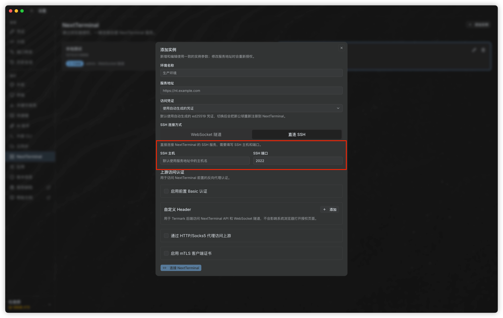

# 使用 Termark 接入 NextTerminal SSH 资产

**Termark** 是 NextTerminal 配套的本地 SSH 客户端，可以把 NextTerminal 中已授权的 SSH 资产同步到本地使用。配置完成后，可以像使用 XShell、MobaXterm 等客户端一样，从本地直接打开堡垒机资产。

::: tip 版本要求
使用 WebSocket 隧道接入时，NextTerminal 版本需要大于 `v3.2.2`。
:::

## 使用前准备

开始配置前，请先确认以下条件：

- 已安装 Termark。中文下载地址：[https://www.termark.app/zh-cn/](https://www.termark.app/zh-cn/)。
- NextTerminal 中已经添加 SSH 资产，并且当前账号已获得访问授权。
- Termark 能访问 NextTerminal 的 Web 服务地址。
- 如果使用直连 SSH，Termark 还需要能访问 NextTerminal 的 SSH 代理服务器监听地址。

## 1. 开启 NextTerminal SSH 代理服务器

登录 NextTerminal，进入「系统设置」>「SSH 代理服务器」，按下面的方式配置：

- **SSH 服务**：开启。
- **监听地址**：推荐先填写 `127.0.0.1:2022`。该地址适合配合 WebSocket 隧道使用，不需要额外暴露 SSH 代理端口。
- **认证私钥**：点击「设置私钥」生成或配置 SSH 代理服务器私钥。
- **禁用密码认证**：建议开启，减少 SSH 代理服务器直接暴露后的密码登录风险。

配置完成后点击「保存」。

::: tip 说明
这里的「认证私钥」是 SSH 代理服务器用于标识自身身份的服务端私钥，不是资产登录凭据，也不是用户本地 SSH 私钥。
:::

## 2. 在 Termark 添加 NextTerminal 实例

打开 Termark，进入「设置」>「NextTerminal」，点击「添加实例」。

需要填写的基础信息：

- **环境名称**：用于在 Termark 中区分不同 NextTerminal 环境，例如 `生产环境`、`测试环境`。
- **服务地址**：填写 NextTerminal 的 Web 访问地址，例如 `https://nt.example.com`。
- **访问凭证**：默认使用自动生成的凭证。首次连接或切换凭证时，Termark 会按提示完成授权。

接下来根据网络环境选择 SSH 连接方式。

## 3. 选择连接方式

### 方案一：WebSocket 隧道

推荐优先使用 WebSocket 隧道。该方式通过 NextTerminal 的 Web 服务地址建立隧道访问 SSH 代理服务器，通常不需要单独开放 `2022` 端口，也更适合部署在反向代理、HTTPS 网关或内网穿透之后的场景。

在「SSH 连接方式」中选择「WebSocket 隧道」，然后点击「连接 NextTerminal」。

适合使用 WebSocket 隧道的场景：

- 只能访问 NextTerminal 的 Web 地址，无法直接访问 SSH 代理服务器端口。
- NextTerminal 部署在反向代理后面。
- 希望减少对外开放端口。

### 方案二：直连 SSH

如果 Termark 所在网络可以直接访问 NextTerminal 的 SSH 代理服务器，可以选择「直连 SSH」。直连方式比 WebSocket 隧道少一次转发，延迟更低，交互会更顺畅。

使用直连 SSH 前，需要确认 SSH 代理服务器监听地址对 Termark 可达：

- NextTerminal 通常部署在服务器或容器中，Termark 是用户电脑上的客户端程序，不能使用 `127.0.0.1:2022` 直连服务器上的 SSH 代理。
- 需要将 SSH 代理服务器监听地址改为客户端可访问的地址，例如 `0.0.0.0:2022` 或服务器内网 IP。
- 如果 NextTerminal 使用容器部署，需要确认容器已将 `2022` 端口映射到宿主机。
- 如果服务器启用了防火墙或云服务器安全组，需要放行对应端口。

在 Termark 中选择「直连 SSH」，填写：

- **SSH 主机**：NextTerminal SSH 代理服务器所在主机。默认可使用服务地址中的主机名。
- **SSH 端口**：SSH 代理服务器端口，例如 `2022`。

填写完成后点击「连接 NextTerminal」。

::: warning 安全建议
如果把监听地址改为 `0.0.0.0:2022`，表示 SSH 代理服务器可能被外部网络访问。请同时配置防火墙、安全组或访问控制策略，只允许可信来源访问该端口。
:::

## 4. 查看并连接资产

连接成功后，返回 Termark 主页面，切换到对应的 NextTerminal 实例 Tab，即可看到当前账号已授权的 SSH 资产。

如果资产没有显示，请检查：

- 当前账号是否拥有该资产的访问权限。
- NextTerminal 中资产类型是否为 SSH，且连接信息配置正确。
- Termark 添加实例时使用的服务地址和访问凭证是否对应当前账号。
- SSH 代理服务器是否已开启并保存配置。

## 常见问题

### WebSocket 隧道连接失败

请按顺序检查：

1. Termark 中填写的服务地址是否可以在浏览器正常打开。
2. NextTerminal 版本是否大于 `v3.2.2`。
3. 反向代理是否支持 WebSocket 转发。
4. NextTerminal 的 SSH 代理服务器是否已开启。

### 直连 SSH 连接失败

请按顺序检查：

1. SSH 代理服务器监听地址是否对 Termark 所在机器可达。
2. SSH 端口是否与 NextTerminal 中配置的端口一致。
3. 容器部署时，SSH 代理服务器端口是否已映射到宿主机。
4. 防火墙或云服务器安全组是否放行该端口。
5. 如果监听地址仍是 `127.0.0.1:2022`，Termark 客户端无法从用户电脑直连该端口，请改用 WebSocket 隧道或调整监听地址。

### 看不到资产

Termark 只会展示当前 NextTerminal 账号已授权的 SSH 资产。请先在 NextTerminal 中确认资产存在、授权有效，并确认当前登录 Termark 的访问凭证属于正确账号。
