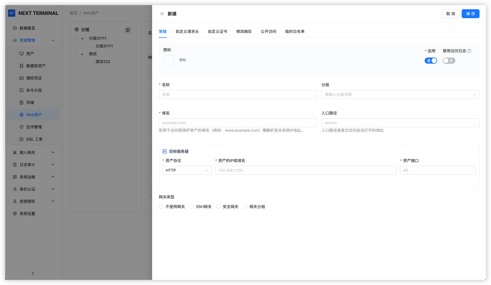
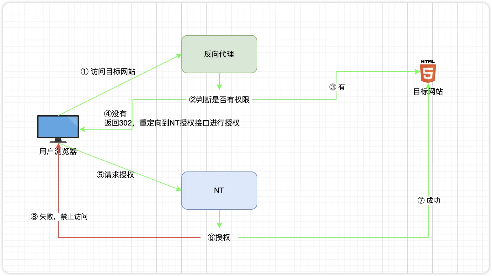

# Web 资产

Web 资产用于把内部网站或受限网站接入 NextTerminal。用户不再直接访问目标网站，而是访问 NextTerminal 的反向代理入口，由 NextTerminal 完成登录校验、权限校验，再把请求转发到真正的网站。

典型链路：

```text
用户浏览器
  → 访问 https://gitlab.example.com
  → DNS 指向 NextTerminal 服务器
  → NextTerminal 校验登录状态和 Web 资产授权
  → 转发到内部网站 http://192.168.1.10:80
```

## 容易混淆的两个地址

| 名称 | 示例 | 说明 |
| --- | --- | --- |
| **Web 资产域名** | `gitlab.example.com` | 用户在浏览器里访问的域名。**必须解析到 NextTerminal 服务器**，不是内网网站本身。 |
| **资产地址（资产 IP + 端口）** | `192.168.1.10:80` | NextTerminal 在后端实际转发到的内部网站地址。 |

::: warning
Web 资产里填的"域名"是反向代理入口域名，不是内部网站的真实地址。
新建 Web 资产时，填错这一点是最常见的故障原因。
:::

## 内置反向代理 vs 外部反向代理

本文中的"反向代理"指 **NextTerminal 内置的 Web 资产反向代理**——它接收 `gitlab.example.com`、`wiki.example.com` 这类 Web 资产域名的请求，并转发到对应的内部网站。

它和 Nginx、CDN、负载均衡这类**外部反向代理**不是同一回事：

| 类型 | 链路示例 | 用途 |
| --- | --- | --- |
| 内置反向代理 | 用户 → NextTerminal → 内部网站 | Web 资产访问控制 |
| 外部反向代理 | 用户 → Nginx/CDN/负载均衡 → NextTerminal | 给 NextTerminal 加统一入口、TLS 终止、负载均衡等 |

如果你的链路只有 **用户 → NextTerminal → 内部网站**，本文的配置就够了。

如果还有 **用户 → Nginx/CDN/负载均衡 → NextTerminal → 内部网站**，请额外阅读 [获取真实客户端 IP](../install/real-ip)，否则访问日志、IP 限制等功能会显示错误的 IP。

## 适用场景

### 限制公网网站的访问

某个网站本身有公网 IP，但不想让任何人访问。把目标网站配置为**只允许 NextTerminal 服务器访问**，再把它接入 Web 资产，用户必须先登录 NextTerminal、获得授权才能访问。

### 统一访问多云或多内网环境

内部网站分布在多个云、多个机房或不同内网中。在每个网络部署一个安全网关并注册到 NextTerminal，添加 Web 资产时选择对应网关，即可通过统一入口访问所有内部网站。

### 访问互联网隔离区服务

政务云、专线网络、隔离区等环境中，内部服务器无法直接暴露到公网。在能访问内部网站的跳板机或网关主机上部署安全网关，再通过 NextTerminal 统一访问 SSH、Web 等服务。

## 前提条件

- NextTerminal 已成功部署并能正常访问后台。
- 拥有一个**可控制 DNS 解析**的域名。
- 目标网站已正常运行。
- NextTerminal 服务器（或选定的安全网关）能访问目标网站。
- NextTerminal 服务器的 `80` 或 `443` 端口可被用户访问。

## 视频教程

<div style="position: relative; padding-bottom: 56.25%; height: 0; overflow: hidden; max-width: 100%; height: auto; margin-bottom: 1.5rem;">
    <iframe src="//player.bilibili.com/player.html?isOutside=true&aid=115360288214738&bvid=BV1vb4uzBEea&cid=33014547884&p=1" scrolling="no" border="0" frameborder="no" framespacing="0" allowfullscreen="true" style="position: absolute; top: 0; left: 0; width: 100%; height: 100%;"></iframe>
</div>

## 5 分钟最小可运行示例

下面演示如何通过 `gitlab.example.com` 访问内网 GitLab。完成后，用户在浏览器输入 `https://gitlab.example.com` 即可登录 NextTerminal 并访问内网 GitLab。

### 示例环境

| 项目 | 示例值 |
| --- | --- |
| NextTerminal 服务器公网 IP | `1.2.3.4` |
| NextTerminal 管理后台域名 | `nt.example.com` |
| Web 资产访问域名 | `gitlab.example.com` |
| 内部 GitLab 地址 | `http://192.168.1.10:80` |

### 1. 配置 DNS

在 DNS 服务商处添加解析：

| 主机记录 | 记录类型 | 记录值 |
| --- | --- | --- |
| `nt` | A | `1.2.3.4` |
| `gitlab` | A | `1.2.3.4` |

效果：

```text
nt.example.com      → 1.2.3.4
gitlab.example.com  → 1.2.3.4
```

::: tip 泛域名解析
Web 资产较多时可以配置泛域名解析（例如 `*.example.com → 1.2.3.4`）。以后新增 `wiki.example.com`、`jenkins.example.com` 等无需再改 DNS。
:::

### 2. 修改 config.yaml 启用反向代理

打开 `config.yaml`，在 `App` 下添加或修改 `ReverseProxy`：

```yaml
App:
  ReverseProxy:
    Enabled: true
    HttpEnabled: true
    HttpAddr: ":80"
    HttpRedirectToHttps: true
    HttpsEnabled: true
    HttpsAddr: ":443"
    SelfProxyEnabled: true
    SelfDomain: "nt.example.com"
    Root: ""
    IpExtractor: "direct"
    IpTrustList: []
```

字段说明：

| 字段 | 示例 | 说明 |
| --- | --- | --- |
| `Enabled` | `true` | 启用 Web 资产反向代理 |
| `HttpEnabled` | `true` | 启用 HTTP 监听 |
| `HttpAddr` | `":80"` | HTTP 监听地址 |
| `HttpRedirectToHttps` | `true` | HTTP 请求自动跳转到 HTTPS |
| `HttpsEnabled` | `true` | 启用 HTTPS 监听 |
| `HttpsAddr` | `":443"` | HTTPS 监听地址 |
| `SelfProxyEnabled` | `true` | 让 NextTerminal 管理后台也通过反向代理域名访问 |
| `SelfDomain` | `nt.example.com` | NextTerminal 管理后台域名 |
| `Root` | `""` | `SelfProxyEnabled: true` 时留空 |
| `IpExtractor` | `direct` | 默认值，详见 [获取真实客户端 IP](../install/real-ip) |
| `IpTrustList` | `[]` | 留空表示使用默认信任的内网网段 |

::: tip 真实 IP 配置
如果 NextTerminal 前面有 Nginx、CDN、WAF、负载均衡等外部代理，`IpExtractor` 不能用 `direct`，否则访问日志里看到的将是上一跳代理的 IP。具体怎么填请看 [获取真实客户端 IP](../install/real-ip)。
:::

### 3. 配置 HTTPS 证书

`HttpsEnabled: true` 后，NextTerminal 内置反向代理会用证书来处理 `https://gitlab.example.com` 等请求。证书在后台管理：

进入 NextTerminal 后台 → **证书管理** → 新增证书。证书支持三种类型：

- **自签名**：用于内网测试，浏览器会提示不安全。
- **导入**：上传你已有的 PEM 格式证书和私钥。
- **自动申请**：通过 ACME（Let's Encrypt 等）自动申请并续签。

证书的「通用名称（CN）」需要包含 `nt.example.com` 和 `gitlab.example.com`，或使用泛域名证书 `*.example.com`。

### 4. 映射 80 / 443 端口

如果使用 Docker Compose 部署，需要在 `docker-compose.yml` 中映射端口：

```yaml
services:
  next-terminal:
    ports:
      - "8088:8088" # NextTerminal 管理后台
      - "2022:2022" # SSH Server 端口（可选）
      - "80:80"     # Web 资产 HTTP 反向代理
      - "443:443"   # Web 资产 HTTPS 反向代理
```

保存后重启服务：

```shell
docker compose down
docker compose up -d
```

### 5. 添加 Web 资产

进入 NextTerminal 后台，添加新的 Web 资产。



按下表填写：

| 字段 | 示例值 | 说明 |
| --- | --- | --- |
| 名称 | `内部 GitLab` | 资产名称，方便识别 |
| 域名 | `gitlab.example.com` | 用户访问 Web 资产时使用的域名，必须解析到 NextTerminal 服务器 |
| 入口路径 | `/` | 网站入口路径，通常 `/` 或留空 |
| 资产协议 | `HTTP` | 内部网站自身使用的协议 |
| 资产 IP | `192.168.1.10` | 内部网站 IP，或 NextTerminal 可解析的内部域名 |
| 资产端口 | `80` | 内部网站端口 |
| 安全网关 | 不选择 | 仅当 NextTerminal 服务器无法直接访问内部网站时再选择网关 |

::: warning
- Web 资产域名必须**唯一**，不能和 `SelfDomain` 重复，也不能和其他 Web 资产域名重复。
- 例如 `nt.example.com` 给管理后台用，`gitlab.example.com` 给 GitLab 用，**两者不能填反**。
:::

### 6. 授权并访问

为用户或用户组授权访问刚创建的 Web 资产。

授权完成后，用户在浏览器中访问：

```text
https://gitlab.example.com
```

未登录时 NextTerminal 会跳转到登录页面；登录并通过授权检查后，请求被转发到内部 GitLab。

## SelfProxyEnabled、SelfDomain 和 Root 详解

这三个字段决定**用户访问 Web 资产但尚未登录时**，NextTerminal 把用户重定向到哪里登录。



### 推荐：SelfProxyEnabled = true

```yaml
App:
  ReverseProxy:
    SelfProxyEnabled: true
    SelfDomain: "nt.example.com"
    Root: ""
```

NextTerminal 管理后台也通过内置反向代理访问。用户访问受保护的 Web 资产但未登录时，被重定向到 `https://nt.example.com` 登录。

适合场景：

- 已经为 NextTerminal 准备了域名。
- 希望管理后台和 Web 资产都走统一域名入口。
- 希望登录跳转流程简单一致。

::: tip 真实 IP 注意
启用 `SelfProxyEnabled: true` 后，NextTerminal 管理后台请求会先经过内置反向代理再 dispatch 给后台逻辑。如果**管理后台**的登录日志、安全审计中显示的 IP 是 `127.0.0.1` 或容器网关地址，参考 [获取真实客户端 IP - 场景二](../install/real-ip#场景二-仅启用-selfproxyenabled-无外部代理)。
:::

### 备用：SelfProxyEnabled = false

```yaml
App:
  ReverseProxy:
    SelfProxyEnabled: false
    SelfDomain: ""
    Root: "https://1.2.3.4:8088"
```

NextTerminal 管理后台仍通过 `Root` 中的地址访问。用户访问受保护的 Web 资产但未登录时，被重定向到 `Root` 指定的地址登录。

适合场景：

- 暂时没有为 NextTerminal 管理后台配置域名。
- 仍希望通过 IP+端口访问管理后台。

## 使用安全网关访问内网

NextTerminal 服务器无法直接访问目标网站时（例如目标网站在另一个云、另一个机房、隔离内网中），需要通过安全网关。

链路：

```text
用户浏览器
  → NextTerminal
  → 安全网关
  → 内部网站
```

配置步骤：

1. 在能访问内部网站的网络中部署安全网关。
2. 确认安全网关已注册到 NextTerminal 并保持在线。
3. 添加 Web 资产时，"安全网关"字段选择对应网关。
4. "资产 IP"和"资产端口"填写**安全网关所在网络中**可访问的内部网站地址。

例如某内部网站只能从安全网关访问，地址为 `10.10.0.20:8080`：

| 字段 | 示例值 |
| --- | --- |
| 资产协议 | `HTTP` |
| 资产 IP | `10.10.0.20` |
| 资产端口 | `8080` |
| 安全网关 | 选择对应网关 |

## 高级功能

### 修改响应

某些网站在页面、接口、跳转地址中写死了原始域名、IP 或路径，经过反向代理后可能出现样式丢失、接口请求失败、跳转到内网地址等问题。


常见用途：

- 把页面里的 `http://192.168.1.10` 替换为 `https://gitlab.example.com`。
- 把接口返回中的内网域名替换为 Web 资产域名。
- 修正目标网站写死的重定向地址。

### 公开访问策略

对于确实需要公网访问、又不想完全裸露的 Web 资产，可以使用公开访问策略，结合 IP 地址、地理位置、口令等条件限制访问范围。


### 临时白名单

针对没有固定 IP 的客户端，可以使用临时白名单。在 Web 资产的「公开访问」配置页生成临时白名单链接发给用户，用户点击一次即可加入白名单，过期后自动失效；持续访问时会自动延长有效期。


## 常见问题

### 访问 Web 资产域名没有响应

逐项检查：

- Web 资产域名是否解析到 NextTerminal 服务器公网 IP。
- NextTerminal 服务器安全组、防火墙是否放行 `80` / `443`。
- Docker Compose 是否映射了 `80:80` 和 `443:443`。
- `config.yaml` 中 `ReverseProxy.Enabled` 是否为 `true`。
- `HttpEnabled` 或 `HttpsEnabled` 是否启用。
- 修改完 `config.yaml` 后是否重启了 NextTerminal。

### 访问后进入了错误的网站

通常是域名填写或 DNS 配置错误：

- `SelfDomain` 只用于 NextTerminal 管理后台，例如 `nt.example.com`。
- Web 资产域名用于具体资产，例如 `gitlab.example.com`。
- Web 资产域名不能和 `SelfDomain` 重复。
- 多个 Web 资产不能使用同一域名。

### 浏览器提示证书不安全

检查后台「证书管理」中是否已配置覆盖该 Web 资产域名的证书。如果用了自签证书，浏览器一定会提示——生产环境请使用 Let's Encrypt 或正式 CA 颁发的证书。

### 登录后提示无权限

检查是否已经给当前用户或用户组授权访问该 Web 资产。

### 页面能打开，但样式 / 接口 / 跳转异常

目标网站可能写死了内部地址、绝对路径或重定向地址。先用浏览器开发者工具看失败请求落在哪个地址，再用[修改响应](#修改响应)替换对应内容。

### NextTerminal 无法连接内部网站

在 NextTerminal 服务器上确认能直接访问目标网站的 IP 和端口（例如 `curl http://192.168.1.10:80`）。如果不能，需要部署[安全网关](#使用安全网关访问内网)。

### Web 资产访问日志中的客户端 IP 不正确

如果 NextTerminal 前面还有 Nginx、CDN、WAF 或负载均衡，参考 [获取真实客户端 IP](../install/real-ip) 配置 `config.yaml` 中的 `IpExtractor` 和 `IpTrustList`。

### 管理后台登录日志中的 IP 不正确

管理后台的真实 IP **不在 config.yaml 里配置**，而在 **后台 → 系统设置 → 网络设置**。详见 [获取真实客户端 IP](../install/real-ip)。
